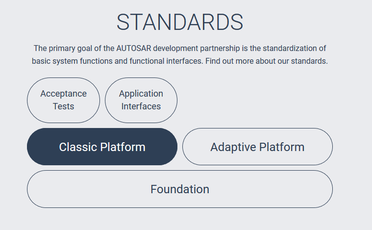
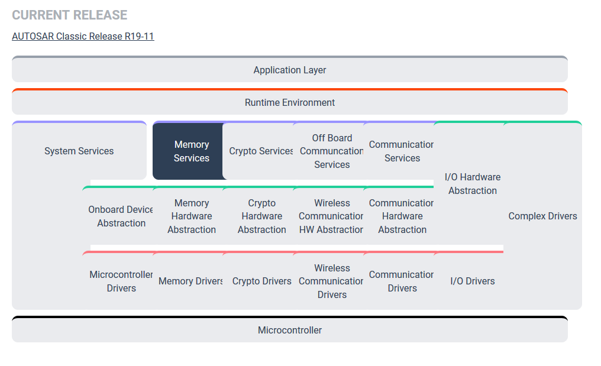
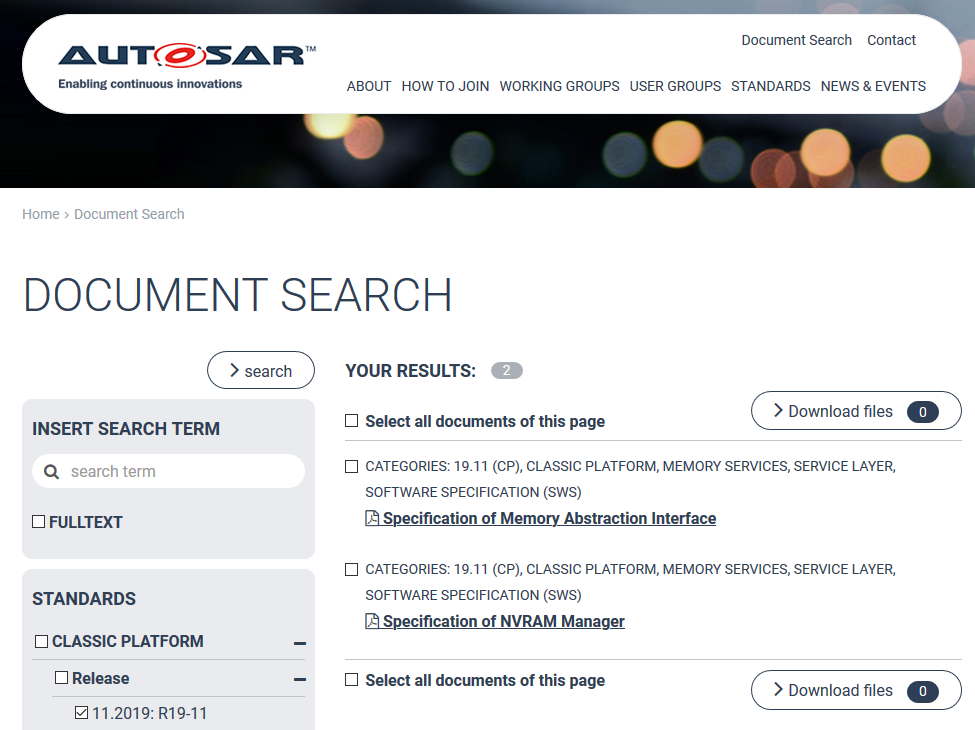
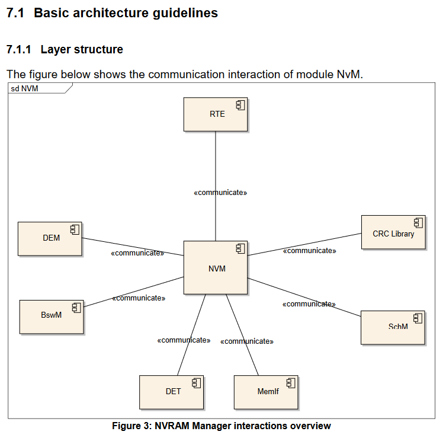
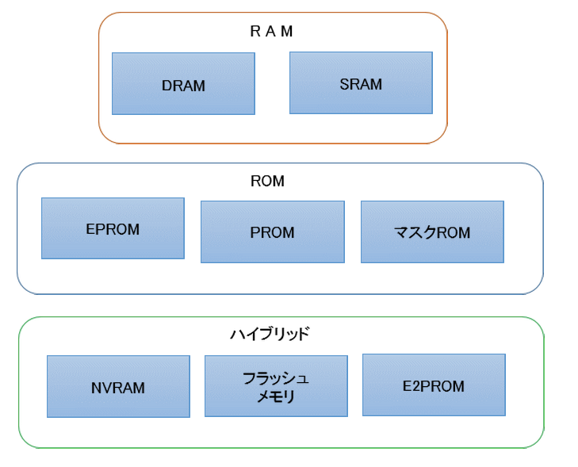

# main

https://www.autosar.org/
  
↓  
  
↓  
  

https://www.autosar.org/fileadmin/user_upload/standards/classic/19-11/AUTOSAR_SWS_NVRAMManager.pdf  
https://www.autosar.org/fileadmin/user_upload/standards/classic/19-11/AUTOSAR_SWS_MemoryAbstractionInterface.pdf  

NvM とその他  

  

## 用語

 - NVM  
    NVRAM Manager  
    https://www.autosar.org/fileadmin/user_upload/standards/classic/19-11/AUTOSAR_SWS_NVRAMManager.pdf  
  
 - MemIf  
    Memory  Abstraction  Interface  
    https://www.autosar.org/fileadmin/user_upload/standards/classic/19-11/AUTOSAR_SWS_MemoryAbstractionInterface.pdf  

 - RTE  
    Run-Time Environ-ment  
    https://www.autosar.org/fileadmin/user_upload/standards/classic/19-11/AUTOSAR_SWS_RTE.pdf  

 - DEM
    Diagnostic Event Manager  
    https://www.autosar.org/fileadmin/user_upload/standards/classic/19-11/AUTOSAR_SWS_DiagnosticEventManager.pdf  

 - BswM
    Basic Software Mode Manager / BSWMode Manager  
    https://www.autosar.org/fileadmin/user_upload/standards/classic/19-11/AUTOSAR_SWS_BSWModeManager.pdf  

 - DET  
    DefaultError Tracer  
    https://www.autosar.org/fileadmin/user_upload/standards/classic/19-11/AUTOSAR_SWS_DefaultErrorTracer.pdf  

 - SchM  
    BSW Scheduler  
    なぜか 11.2019: R19-11 のドキュメントに見当たらない  
    https://www.autosar.org/fileadmin/user_upload/standards/classic/3-0/AUTOSAR_SWS_BSW_Scheduler.pdf  
 - SRAM  
    Static RAM  
    CPU 内キャッシュメモリ用。 高速 & 高価  

 - DRAM  
    Dyanamic RAM  
    メインメモリ用 SRAM より安価

 - Mask ROM  
    チップの製造前に書き込むデータを準備する必要があり、一度製造すると、データを書き換えることができません。 

 - PROM  
    Programable ROM  
    デバイスプログラマというツールを使って、PROMのピンに電流を流すことで、データを書き込むことができます。  
    PROMは一度データを書き込むと、二度とデータを書き換えることができません。  

 - EPROM  
    Erasable Programmable ROM  
    チップについた窓に紫外線を当てることで、書き込んだデータを削除することができ、再びデータを書き込むことができます。  

 - E2PROM または EEPROM  
    Electrically Erasable Programmable ROM  
    EPROM は光を使い、EEPROM は電気を使って削除する。  
    
 - Flash Memory  
    EEPROMはデータをバイト単位で書き換えるが、フラッシュメモリは数十キロバイト程度のデータを「ブロック」の単位でまとめて扱う  

 - NVRAM  
    Non Volatile RAM  
    SRAMにバッテリーによる電力バックアップを搭載することで、RAMでありながら、電源オフ時においてもデータを保持できるようにしています。  
    基本はSRAMであるので、データの書き込みはE2PROMやフラッシュメモリよりもかなり高速になります。  
    しかし、バッテリー機能を有するため、値段はかなり高価です。

# おまけ

RAM, ROM
  
https://myenigma.hatenablog.com/entry/20150120/1421764708  

コンポーネント図チュートリアル | Lucidchart
https://www.lucidchart.com/pages/ja/uml-component-diagram  

クラス図の書きかた（集約とコンポジションの意味の違い）  
https://qiita.com/azuki8/items/49e1add6ea838cd13734  
