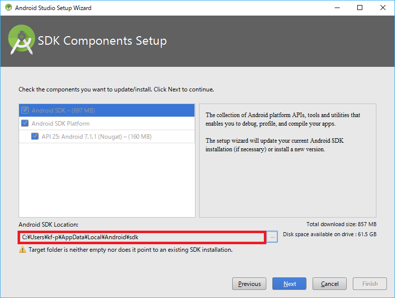
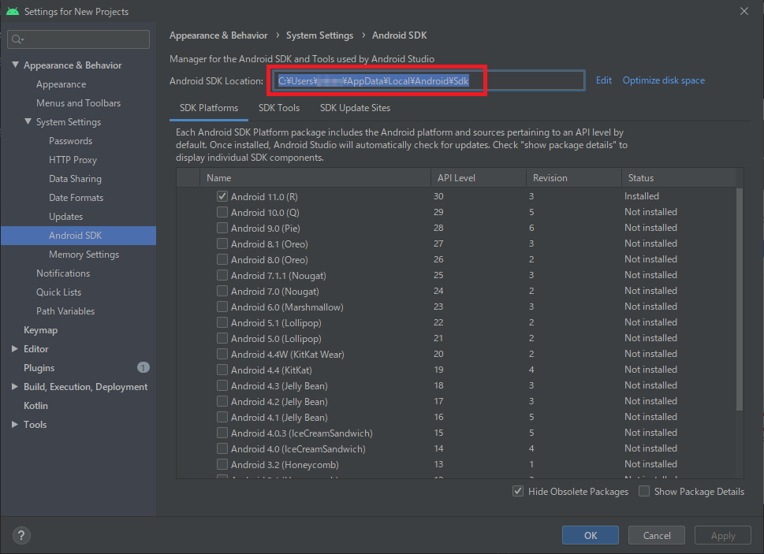
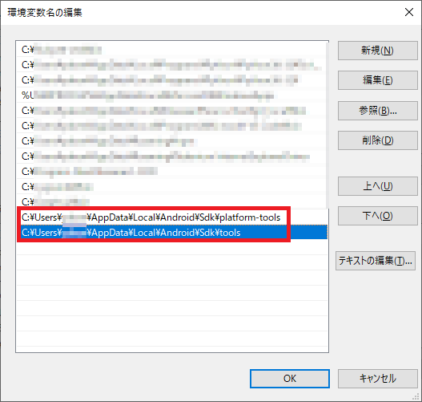

## Android Studio と `adb` コマンドを使えるようにする

android studio をインストールする  

https://developer.android.com/studio/install?hl=ja  

`<Note>`  

インストールする時に、SDK の保存先を聞かれるのでメモっておく  

　　

もしメモを忘れたら、Android Studio インストール完了後の起動画面から設定画面に行き以下を参照すれば確認できる。  

  

`</Note>`  

メモった SDK のインストールディレクトリに `\platform-tools` をつけたディレクトリと、
さらに、`\tools` をつけたディレクトリの 2 種類が、`adb` コマンドを実行するのに必要なパスとなる。
adb.exe の存在するパスとなる。　これを下図のように環境変数のパスに登録する。  

  

