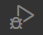

# 仮想環境の作成・Django のインストール

## Install Virtual Enviroment

インストール済みの python 環境を使って開発してもいいが、依存関係のあるパッケージなどが大量になると管理が面倒になるので、仮想環境にインストールした python を使用するのがおすすめ。  

`<CAUTION!>`  
DB に PostgreSQL を使用する場合は、Python のバージョンは 3.8 以下にする。Python -> PostgreSQL アクセスするために必要なパッケージ psycopg2-binary 2.8.6 が Python 3.8 までしか対応していないため。  
(`python manage.py migrate` 実行時に `django.core.exceptions.ImproperlyConfigured: Error loading psycopg2 module: DLL load failed while importing _psycopg: 指定されたモジュールが見つかりません。` となってしまう。(Windows10 環境で確認。Mac OS では再現しなかった))  
`</CAUTION!>`

terminal で `pip install virtualenv` する。  
以下は [readme.md](readme.md) に記載の `##  (仮想環境でない通常の) Python パッケージバージョン` の通り、バージョン 20.13.3 をインストールする例。  

```
***@***noMacBook-Pro ~ % which python3.8 # インストールされている pip のパスを調べるため、同ディレクトリに配置されているはずの python3.8 のパスを取得。
/Library/Frameworks/Python.framework/Versions/3.8/bin/python3.8
# finder で上記ディレクトリを開くと、/Library/Frameworks/Python.framework/Versions/3.8/bin/pip3 が存在することが確認できる。
***@***noMacBook-Pro ~ % /Library/Frameworks/Python.framework/Versions/3.8/bin/pip3 install virtualenv==20.13.3
Collecting virtualenv
  Downloading https://files.pythonhosted.org/packages/9b/f8/f0d32db111db20d82fd5ac94de1c0250f322237cfa6499031a81cf6b9379/virtualenv-20.13.3-py2.py3-none-any.whl (8.7MB)
    100% |████████████████████████████████| 8.7MB 3.3MB/s 
Collecting importlib-metadata>=0.12; python_version < "3.8" (from virtualenv)
  Downloading https://files.pythonhosted.org/packages/92/f2/c48787ca7d1e20daa185e1b6b2d4e16acd2fb5e0320bc50ffc89b91fa4d7/importlib_metadata-4.11.3-py3-none-any.whl
Collecting filelock<4,>=3.2 (from virtualenv)
  Downloading https://files.pythonhosted.org/packages/cd/f1/ba7dee3de0e9d3b8634d6fbaa5d0d407a7da64620305d147298b683e5c36/filelock-3.6.0-py3-none-any.whl
Collecting distlib<1,>=0.3.1 (from virtualenv)
  Downloading https://files.pythonhosted.org/packages/ac/a3/8ee4f54d5f12e16eeeda6b7df3dfdbda24e6cc572c86ff959a4ce110391b/distlib-0.3.4-py2.py3-none-any.whl (461kB)
    100% |████████████████████████████████| 471kB 12.0MB/s 
Collecting platformdirs<3,>=2 (from virtualenv)
  Downloading https://files.pythonhosted.org/packages/de/de/d8b9da351517c3dece273224522d4714cfdb9a89e2e6f7f7f054a340cc2b/platformdirs-2.5.1-py3-none-any.whl
Collecting six<2,>=1.9.0 (from virtualenv)
  Downloading https://files.pythonhosted.org/packages/d9/5a/e7c31adbe875f2abbb91bd84cf2dc52d792b5a01506781dbcf25c91daf11/six-1.16.0-py2.py3-none-any.whl
Collecting typing-extensions>=3.6.4; python_version < "3.8" (from importlib-metadata>=0.12; python_version < "3.8"->virtualenv)
  Downloading https://files.pythonhosted.org/packages/45/6b/44f7f8f1e110027cf88956b59f2fad776cca7e1704396d043f89effd3a0e/typing_extensions-4.1.1-py3-none-any.whl
Collecting zipp>=0.5 (from importlib-metadata>=0.12; python_version < "3.8"->virtualenv)
  Downloading https://files.pythonhosted.org/packages/52/c5/df7953fe6065185af5956265e3b16f13c2826c2b1ba23d43154f3af453bc/zipp-3.7.0-py3-none-any.whl
Installing collected packages: typing-extensions, zipp, importlib-metadata, filelock, distlib, platformdirs, six, virtualenv
Successfully installed distlib-0.3.4 filelock-3.6.0 importlib-metadata-4.11.3 platformdirs-2.5.1 six-1.16.0 typing-extensions-4.1.1 virtualenv-20.13.4 zipp-3.7.0
You are using pip version 20.2.3, however version 22.0.4 is available.
You should consider upgrading via the 'pip install --upgrade pip' command.
***@***noMacBook-Pro ~ % 
```
仮想環境を作成したいディレクトリに移動して、`virtualenv --python <インストールされている python のパス> <仮想環境名>` で仮想環境を作る。以下コマンドはホームディレクトリ配下に仮想環境を構築する例
```
***@***noMacBook-Pro ~ % /Library/Frameworks/Python.framework/Versions/3.8/bin/virtualenv --python /Library/Frameworks/Python.framework/Versions/3.8/bin/python3.8 pyvenv
created virtual environment CPython3.8.8.final.0-64 in 902ms
  creator CPython3Posix(dest=/Users/***/pyvenv, clear=False, no_vcs_ignore=False, global=False)
  seeder FromAppData(download=False, pip=bundle, setuptools=bundle, wheel=bundle, via=copy, app_data_dir=/Users/***/Library/Application Support/virtualenv)
    added seed packages: pip==22.0.4, setuptools==60.9.3, wheel==0.37.1
  activators BashActivator,CShellActivator,FishActivator,NushellActivator,PowerShellActivator,PythonActivator
***@***noMacBook-Pro ~ % 
```
## Install Packages

作成した仮想環境内の `bin/activate` が、仮想環境を開始するコマンドが記載されたファイル。  
この例では、ホームディレクトリ配下に `pyvenv` という名前で 仮想環境を作成したので、 `source ~pyvenv/bin/activate` を仮想環境を開始できる。が、仮想環境作成直後は `bin/activate` に実行権限が付与されていない。そのため実行権限を付与してから実行する。    
仮想環境を開始したら、`pip install xxx` で以下パッケージをインストールする。  
仮想環境を終了するには、`deactivate` を実行する。  

| Packages             |
| -------------------- |
| Django               |
| django-bootstrap5    |
| django-widget-tweaks |
| djangorestframework  |
| python-dateutil      |
| drf-spectacular      |
| coverage             |


以下は [readme.md](readme.md) の `## 仮想環境にインストールする Python パッケージバージョン` に合わせたバージョンをインストールする例。  

```terminal
***@***noMacBook-Pro ~ % cd ~/pyvenv/bin
***@***noMacBook-Pro bin % ls -la
total 120
drwxr-xr-x  20 ***  staff   640  3 19 07:23 .
drwxr-xr-x   6 ***  staff   192  3 19 07:23 ..
-rw-r--r--   1 ***  staff  2142  3 19 07:23 activate # <- 実行権限が無い
-rw-r--r--   1 ***  staff  1434  3 19 07:23 activate.csh
-rw-r--r--   1 ***  staff  3019  3 19 07:23 activate.fish
-rw-r--r--   1 ***  staff  1283  3 19 07:23 activate.nu
-rw-r--r--   1 ***  staff  1754  3 19 07:23 activate.ps1
-rw-r--r--   1 ***  staff  1199  3 19 07:23 activate_this.py
~~~~~~~~~~~~~~~~~~~~~~~~~~~~Omitting~~~~~~~~~~~~~~~~~~~~~~~~~~~~~
***@***noMacBook-Pro bin % chmod 744 activate
***@***noMacBook-Pro bin % ls -la
total 120
drwxr-xr-x  20 ***  staff   640  3 19 07:23 .
drwxr-xr-x   6 ***  staff   192  3 19 07:23 ..
-rwxr--r--   1 ***  staff  2142  3 19 07:23 activate # <- 実行権限がついた
~~~~~~~~~~~~~~~~~~~~~~~~~~~~Omitting~~~~~~~~~~~~~~~~~~~~~~~~~~~~~
***@***noMacBook-Pro bin % source ./activate
(pyvenv) ***@***noMacBook-Pro bin % pip install django==4.0.3
Collecting django==4.0.3
Collecting django
  Downloading Django-4.0.3-py3-none-any.whl (8.0 MB)
     ━━━━━━━━━━━━━━━━━━━━━━━━━━━━━━━━━━━━━━━━ 8.0/8.0 MB 8.9 MB/s eta 0:00:00
Collecting asgiref<4,>=3.4.1
  Downloading asgiref-3.5.0-py3-none-any.whl (22 kB)
Collecting backports.zoneinfo
  Downloading backports.zoneinfo-0.2.1-cp38-cp38-macosx_10_14_x86_64.whl (35 kB)
Collecting sqlparse>=0.2.2
  Downloading sqlparse-0.4.2-py3-none-any.whl (42 kB)
     ━━━━━━━━━━━━━━━━━━━━━━━━━━━━━━━━━━━━━━━━ 42.3/42.3 KB 1.0 MB/s eta 0:00:00
Installing collected packages: sqlparse, backports.zoneinfo, asgiref, django
Successfully installed asgiref-3.5.0 backports.zoneinfo-0.2.1 django-4.0.3 sqlparse-0.4.2
zsh: command not found: Collecting
(pyvenv) ***@***noMacBook-Pro bin % pip install django-bootstrap5==21.3
Collecting django-bootstrap5==21.3
  Downloading django_bootstrap5-21.3-py3-none-any.whl (24 kB)
Collecting beautifulsoup4>=4.8.0
  Downloading beautifulsoup4-4.11.1-py3-none-any.whl (128 kB)
     ━━━━━━━━━━━━━━━━━━━━━━━━━━━━━━━━━━━━━━━ 128.2/128.2 KB 7.1 MB/s eta 0:00:00
Requirement already satisfied: Django>=2.2 in /Users/***/pyvenv/lib/python3.8/site-packages (from django-bootstrap5==21.3) (4.0.3)
Collecting soupsieve>1.2
  Downloading soupsieve-2.3.2-py3-none-any.whl (37 kB)
Requirement already satisfied: backports.zoneinfo in /Users/***/pyvenv/lib/python3.8/site-packages (from Django>=2.2->django-bootstrap5==21.3) (0.2.1)
Requirement already satisfied: sqlparse>=0.2.2 in /Users/***/pyvenv/lib/python3.8/site-packages (from Django>=2.2->django-bootstrap5==21.3) (0.4.2)
Requirement already satisfied: asgiref<4,>=3.4.1 in /Users/***/pyvenv/lib/python3.8/site-packages (from Django>=2.2->django-bootstrap5==21.3) (3.5.0)
Installing collected packages: soupsieve, beautifulsoup4, django-bootstrap5
Successfully installed beautifulsoup4-4.11.1 django-bootstrap5-21.3 soupsieve-2.3.2
(pyvenv) ***@***noMacBook-Pro bin % pip install django-widget-tweaks==1.4.12
Collecting django-widget-tweaks==1.4.12
  Downloading django_widget_tweaks-1.4.12-py3-none-any.whl (8.9 kB)
Installing collected packages: django-widget-tweaks
Successfully installed django-widget-tweaks-1.4.12
(pyvenv) ***@***noMacBook-Pro bin % pip install djangorestframework==3.13.1
Collecting djangorestframework==3.13.1
  Downloading djangorestframework-3.13.1-py3-none-any.whl (958 kB)
     ━━━━━━━━━━━━━━━━━━━━━━━━━━━━━━━━━━━━━━━ 958.3/958.3 KB 5.7 MB/s eta 0:00:00
Collecting pytz
  Downloading pytz-2022.1-py2.py3-none-any.whl (503 kB)
     ━━━━━━━━━━━━━━━━━━━━━━━━━━━━━━━━━━━━━━━ 503.5/503.5 KB 4.8 MB/s eta 0:00:00
Requirement already satisfied: django>=2.2 in /Users/***/pyvenv/lib/python3.8/site-packages (from djangorestframework==3.13.1) (4.0.3)
Requirement already satisfied: asgiref<4,>=3.4.1 in /Users/***/pyvenv/lib/python3.8/site-packages (from django>=2.2->djangorestframework==3.13.1) (3.5.0)
Requirement already satisfied: backports.zoneinfo in /Users/***/pyvenv/lib/python3.8/site-packages (from django>=2.2->djangorestframework==3.13.1) (0.2.1)
Requirement already satisfied: sqlparse>=0.2.2 in /Users/***/pyvenv/lib/python3.8/site-packages (from django>=2.2->djangorestframework==3.13.1) (0.4.2)
Installing collected packages: pytz, djangorestframework
Successfully installed djangorestframework-3.13.1 pytz-2022.1
(pyvenv) ***@***noMacBook-Pro bin % pip install python-dateutil==2.8.2
Collecting python-dateutil==2.8.2
  Downloading python_dateutil-2.8.2-py2.py3-none-any.whl (247 kB)
     ━━━━━━━━━━━━━━━━━━━━━━━━━━━━━━━━━━━━━━━ 247.7/247.7 KB 4.1 MB/s eta 0:00:00
Collecting six>=1.5
  Using cached six-1.16.0-py2.py3-none-any.whl (11 kB)
Installing collected packages: six, python-dateutil
Successfully installed python-dateutil-2.8.2 six-1.16.0
(pyvenv) ***@***noMBP bin % pip install drf-spectacular==0.22.0
Collecting drf-spectacular==0.22.0
  Downloading drf_spectacular-0.22.0-py3-none-any.whl (82 kB)
     ━━━━━━━━━━━━━━━━━━━━━━━━━━━━━━━━━━━━━━━━ 82.9/82.9 KB 1.0 MB/s eta 0:00:00
Collecting PyYAML>=5.1
  Downloading PyYAML-6.0-cp38-cp38-macosx_10_9_x86_64.whl (192 kB)
     ━━━━━━━━━━━━━━━━━━━━━━━━━━━━━━━━━━━━━━━ 192.2/192.2 KB 2.1 MB/s eta 0:00:00
Collecting uritemplate>=2.0.0
  Downloading uritemplate-4.1.1-py2.py3-none-any.whl (10 kB)
Collecting inflection>=0.3.1
  Downloading inflection-0.5.1-py2.py3-none-any.whl (9.5 kB)
Requirement already satisfied: djangorestframework>=3.10 in /Users/***/pyvenv/lib/python3.8/site-packages (from drf-spectacular==0.22.0) (3.13.1)
Requirement already satisfied: Django>=2.2 in /Users/***/pyvenv/lib/python3.8/site-packages (from drf-spectacular==0.22.0) (4.0.3)
Collecting jsonschema>=2.6.0
  Downloading jsonschema-4.4.0-py3-none-any.whl (72 kB)
     ━━━━━━━━━━━━━━━━━━━━━━━━━━━━━━━━━━━━━━━━ 72.7/72.7 KB 3.7 MB/s eta 0:00:00
Requirement already satisfied: asgiref<4,>=3.4.1 in /Users/***/pyvenv/lib/python3.8/site-packages (from Django>=2.2->drf-spectacular==0.22.0) (3.5.0)
Requirement already satisfied: sqlparse>=0.2.2 in /Users/***/pyvenv/lib/python3.8/site-packages (from Django>=2.2->drf-spectacular==0.22.0) (0.4.2)
Requirement already satisfied: backports.zoneinfo in /Users/***/pyvenv/lib/python3.8/site-packages (from Django>=2.2->drf-spectacular==0.22.0) (0.2.1)
Requirement already satisfied: pytz in /Users/***/pyvenv/lib/python3.8/site-packages (from djangorestframework>=3.10->drf-spectacular==0.22.0) (2022.1)
Collecting attrs>=17.4.0
  Downloading attrs-21.4.0-py2.py3-none-any.whl (60 kB)
     ━━━━━━━━━━━━━━━━━━━━━━━━━━━━━━━━━━━━━━━━ 60.6/60.6 KB 3.0 MB/s eta 0:00:00
Collecting importlib-resources>=1.4.0
  Downloading importlib_resources-5.7.0-py3-none-any.whl (28 kB)
Collecting pyrsistent!=0.17.0,!=0.17.1,!=0.17.2,>=0.14.0
  Downloading pyrsistent-0.18.1-cp38-cp38-macosx_10_9_universal2.whl (81 kB)
     ━━━━━━━━━━━━━━━━━━━━━━━━━━━━━━━━━━━━━━━━ 81.4/81.4 KB 3.6 MB/s eta 0:00:00
Collecting zipp>=3.1.0
  Downloading zipp-3.8.0-py3-none-any.whl (5.4 kB)
Installing collected packages: zipp, uritemplate, PyYAML, pyrsistent, inflection, attrs, importlib-resources, jsonschema, drf-spectacular
Successfully installed PyYAML-6.0 attrs-21.4.0 drf-spectacular-0.22.0 importlib-resources-5.7.0 inflection-0.5.1 jsonschema-4.4.0 pyrsistent-0.18.1 uritemplate-4.1.1 zipp-3.8.0
(pyvenv) ***@***noMBP bin % pip install coverage==6.3.2
Collecting coverage==6.3.2
  Downloading coverage-6.3.2-cp38-cp38-macosx_10_9_x86_64.whl (183 kB)
     ━━━━━━━━━━━━━━━━━━━━━━━━━━━━━━━━━━━━━━━━ 183.1/183.1 KB 838.9 kB/s eta 0:00:00
Installing collected packages: coverage
Successfully installed coverage-6.3.2
(pyvenv) ***@***noMacBook-Pro bin % deactivate
***@***noMacBook-Pro bin % 
```

# Project の作成

仮想環境に入った状態で、Project を作成したいディレクトリに移動して、`django-admin startproject <PJ名>` を実行する。以下は `~/sourcetree-local` 配下に `main` を作成する例。  

```
***@***noMacBook-Pro ~ % source ~/pyvenv/bin/activate
(pyvenv) ***@***noMacBook-Pro ~ % cd ~/sourcetree-local
(pyvenv) ***@***noMacBook-Pro sourcetree-local % django-admin startproject main
(pyvenv) ***@***noMacBook-Pro sourcetree-local % deactivate
***-no-MacBook-Pro:sourcetree-local ***$ 
```

## [TIPS] Visual Studio Code に仮想環境を認識させるには

F1 キーを押して `JSON` とタイプして `Preferences: Open Settings (JSON)` を選択。  

  

Setting 内容一覧が表示されるので、`"python.venvPath":"<仮想環境のパス>"` を追加して保存する。  
以下はホームディレクトリ配下に作成した `pyvenv` を指定する例。
```
    "python.venvPath":"~/pyvenv"
```

作成した PJ の manage.py が配置されたディレクトリで VS Code を開き、manage.py を開く。  

<CAUTION!>  
VS Code の Extension `Python` をインストールしておく。  
</CAUTION!>  

画面右下の Python のバージョンが書かれた部分をクリックすると、Python インタープリターを選択する画面が現れるので、`~/pyenv` 配下の Python を選択する。  

  


## settings.py の編集

main/settings.py を以下の様に変更する

 - 変更前  
```
# Internationalization
# https://docs.djangoproject.com/en/3.0/topics/i18n/

LANGUAGE_CODE = 'en-us'

TIME_ZONE = 'UTC'
```
 - 変更後  
```
# Internationalization
# https://docs.djangoproject.com/en/3.0/topics/i18n/

LANGUAGE_CODE = 'ja'

TIME_ZONE = 'Asia/Tokyo'
```

# ユーザーの作成

作成した Project 内の manage.py が配置してあるディレクトリで、以下のように実行する。  
この PJ ではユーザー名を `admin`、パスワードに `administrator1` で登録したものとして説明をしていく。 

```
***@***noMacBook-Pro main % ~/pyvenv/bin/python3.8 manage.py createsuperuser
ユーザー名 (leave blank to use '***'): admin
メールアドレス: foo@bar.com
Password:
Password (again):
Superuser created successfully.
***@***noMacBook-Pro main % 
```

## 起動確認

作成した Project 内の manage.py が配置してあるディレクトリで、以下のように実行する。

```
***@***noMacBook-Pro main % ~/pyvenv/bin/python3.8 manage.py runserver
Watching for file changes with StatReloader
Performing system checks...

System check identified no issues (0 silenced).
March 22, 2022 - 11:19:05
Django version 3.2.12, using settings 'main.settings'
Starting development server at http://127.0.0.1:8000/
Quit the server with CONTROL-C.

```

ブラウザで `http://127.0.0.1:8000/` にアクセスすると、初期ページが表示される。  

  

終了するには、ターミナルで ctrl + c する。  

## [TIPS] Visual Studio Code でデバックモードで起動するには

作成した PJ の manage.py が配置されたディレクトリで VS Code を開き、Python インタープリターに仮想環境の python を設定しておく。  
その状態で、画面左のアクティビティバーの  をクリック。  
サイドバーに表示される `create a launch.json file` をクリック。  

  

`Select a debug configuration` ダイアログが表示されるので、`Django` を選択。  

  

`▷` ボタンを押下すると、デバックモードで起動する。  
後は好きなポイントにブレークポイントをはることができる。  
終了するには `□` ボタンを押下する

  
