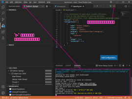

# 仮想環境の作成・Django のインストール

## Install Virtual Enviroment

インストール済みの python 環境を使って開発してもいいが、依存関係のあるパッケージなどが大量になると管理が面倒になるので、仮想環境にインストールした python を使用するのがおすすめ。  

`<CAUTION!>`  
DB に PostgreSQL を使用する場合は、Python のバージョンは 3.8 以下にする。Python -> PostgreSQL アクセスするために必要なパッケージ psycopg2-binary 2.8.6 が Python 3.8 までしか対応していないため。  
(`python manage.py migrate` 実行時に `django.core.exceptions.ImproperlyConfigured: Error loading psycopg2 module: DLL load failed while importing _psycopg: 指定されたモジュールが見つかりません。` となってしまう。(Windows10 環境で確認。Mac OS X では再現しなかった))  
`</CAUTION!>`

コマンドプロンプトで `pip install virtualenv` する。
以下は [readme.md](readme.md) に記載の `##  (仮想環境でない通常の) Python パッケージバージョン` の通り、バージョン 20.13.3 をインストールする例。 

```terminal
D:\>"C:\Users\***\AppData\Local\Programs\Python\Python38\Scripts\pip3.exe" install virtualenv==20.13.3
Collecting virtualenv==20.13.3
  Downloading virtualenv-20.13.3-py2.py3-none-any.whl (8.7 MB)
     |████████████████████████████████| 8.7 MB 3.3 MB/s
Collecting six<2,>=1.9.0
  Using cached six-1.16.0-py2.py3-none-any.whl (11 kB)
Collecting platformdirs<3,>=2
  Using cached platformdirs-2.5.1-py3-none-any.whl (14 kB)
Collecting filelock<4,>=3.2
  Using cached filelock-3.6.0-py3-none-any.whl (10.0 kB)
Collecting distlib<1,>=0.3.1
  Using cached distlib-0.3.4-py2.py3-none-any.whl (461 kB)
Installing collected packages: six, platformdirs, filelock, distlib, virtualenv
  WARNING: The script virtualenv.exe is installed in 'c:\users\***\appdata\local\programs\python\python38\Scripts' which is not on PATH.
  Consider adding this directory to PATH or, if you prefer to suppress this warning, use --no-warn-script-location.
Successfully installed distlib-0.3.4 filelock-3.6.0 platformdirs-2.5.1 six-1.16.0 virtualenv-20.13.3
WARNING: You are using pip version 20.2.3; however, version 22.0.4 is available.
You should consider upgrading via the 'c:\users\***\appdata\local\programs\python\python38\python.exe -m pip install --upgrade pip' command.

D:\>
```
仮想環境を作成したいディレクトリに移動して、`virtualenv <仮想環境名>` で仮想環境を作る。以下コマンドは pip のパスを通しておらず、`D:\pyvenv` に仮想環境を作成する場合の実行例。
```terminal
D:\>"C:\Users\***\AppData\Local\Programs\Python\Python38\Scripts\virtualenv.exe" pyvenv
created virtual environment CPython3.8.8.final.0-64 in 5344ms
  creator CPython3Windows(dest=D:\pyvenv, clear=False, no_vcs_ignore=False, global=False)
  seeder FromAppData(download=False, pip=bundle, setuptools=bundle, wheel=bundle, via=copy, app_data_dir=C:\Users\***\AppData\Local\pypa\virtualenv)
    added seed packages: pip==22.0.4, setuptools==60.9.3, wheel==0.37.1
  activators BashActivator,BatchActivator,FishActivator,NushellActivator,PowerShellActivator,PythonActivator

D:\>"D:\pyvenv\Scripts\activate.bat"

(pyvenv) D:\>
```

## Install Packages

作成した仮想環境内の `Scripts\activate.bat` を実行すると、仮想環境が開始される。  
仮想環境を開始したら、`pip install xxx` で以下パッケージをインストールする。  
仮想環境を終了するには、作成した仮想環境内の `Scripts\deactivate.bat` を実行する。  

| Packages             |
| -------------------- |
| Django               |
| django-bootstrap5    |
| django-widget-tweaks |
| djangorestframework  |
| python-dateutil      |
| drf-spectacular      |
| coverage             |


以下は [readme.md](readme.md) の `## 仮想環境にインストールする Python パッケージバージョン` に合わせたバージョンをインストールする例。  

```terminal
D:\>"D:\pyvenv\Scripts\activate.bat"

(pyvenv) D:\>pip install django==4.0.3
Collecting django==4.0.3
  Using cached Django-4.0.3-py3-none-any.whl (8.0 MB)
Collecting asgiref<4,>=3.4.1
  Using cached asgiref-3.5.0-py3-none-any.whl (22 kB)
Collecting sqlparse>=0.2.2
  Using cached sqlparse-0.4.2-py3-none-any.whl (42 kB)
Collecting tzdata
  Using cached tzdata-2022.1-py2.py3-none-any.whl (339 kB)
Collecting backports.zoneinfo
  Using cached backports.zoneinfo-0.2.1-cp38-cp38-win_amd64.whl (38 kB)
Installing collected packages: tzdata, sqlparse, backports.zoneinfo, asgiref, django
Successfully installed asgiref-3.5.0 backports.zoneinfo-0.2.1 django-4.0.3 sqlparse-0.4.2 tzdata-2022.1

(pyvenv) D:\>pip install django-bootstrap5==21.3
Collecting django-bootstrap5==21.3
  Using cached django_bootstrap5-21.3-py3-none-any.whl (24 kB)
Collecting beautifulsoup4>=4.8.0
  Downloading beautifulsoup4-4.11.1-py3-none-any.whl (128 kB)
     ---------------------------------------- 128.2/128.2 KB 755.9 kB/s eta 0:00:00
Requirement already satisfied: Django>=2.2 in d:\pyvenv\lib\site-packages (from django-bootstrap5==21.3) (4.0.3)
Collecting soupsieve>1.2
  Downloading soupsieve-2.3.2-py3-none-any.whl (37 kB)
Requirement already satisfied: sqlparse>=0.2.2 in d:\pyvenv\lib\site-packages (from Django>=2.2->django-bootstrap5==21.3) (0.4.2)
Requirement already satisfied: asgiref<4,>=3.4.1 in d:\pyvenv\lib\site-packages (from Django>=2.2->django-bootstrap5==21.3) (3.5.0)
Requirement already satisfied: backports.zoneinfo in d:\pyvenv\lib\site-packages (from Django>=2.2->django-bootstrap5==21.3) (0.2.1)
Requirement already satisfied: tzdata in d:\pyvenv\lib\site-packages (from Django>=2.2->django-bootstrap5==21.3) (2022.1)
Installing collected packages: soupsieve, beautifulsoup4, django-bootstrap5
Successfully installed beautifulsoup4-4.11.1 django-bootstrap5-21.3 soupsieve-2.3.2

(pyvenv) D:\>pip install django-widget-tweaks==1.4.12
Collecting django-widget-tweaks==1.4.12
  Using cached django_widget_tweaks-1.4.12-py3-none-any.whl (8.9 kB)
Installing collected packages: django-widget-tweaks
Successfully installed django-widget-tweaks-1.4.12

(pyvenv) D:\>pip install djangorestframework==3.13.1
Collecting djangorestframework==3.13.1
  Downloading djangorestframework-3.13.1-py3-none-any.whl (958 kB)
     ---------------------------------------- 958.3/958.3 KB 1.9 MB/s eta 0:00:00
Collecting pytz
  Using cached pytz-2022.1-py2.py3-none-any.whl (503 kB)
Requirement already satisfied: django>=2.2 in d:\pyvenv\lib\site-packages (from djangorestframework==3.13.1) (4.0.3)
Requirement already satisfied: tzdata in d:\pyvenv\lib\site-packages (from django>=2.2->djangorestframework==3.13.1) (2022.1)
Requirement already satisfied: sqlparse>=0.2.2 in d:\pyvenv\lib\site-packages (from django>=2.2->djangorestframework==3.13.1) (0.4.2)
Requirement already satisfied: asgiref<4,>=3.4.1 in d:\pyvenv\lib\site-packages (from django>=2.2->djangorestframework==3.13.1) (3.5.0)
Requirement already satisfied: backports.zoneinfo in d:\pyvenv\lib\site-packages (from django>=2.2->djangorestframework==3.13.1) (0.2.1)
Installing collected packages: pytz, djangorestframework
Successfully installed djangorestframework-3.13.1 pytz-2022.1

(pyvenv) D:\>pip install python-dateutil==2.8.2
Collecting python-dateutil==2.8.2
  Downloading python_dateutil-2.8.2-py2.py3-none-any.whl (247 kB)
     ---------------------------------------- 247.7/247.7 KB 1.7 MB/s eta 0:00:00
Collecting six>=1.5
  Using cached six-1.16.0-py2.py3-none-any.whl (11 kB)
Installing collected packages: six, python-dateutil
Successfully installed python-dateutil-2.8.2 six-1.16.0

(pyvenv) PS D:\> pip install drf-spectacular==0.22.0
Collecting drf-spectacular==0.22.0
  Downloading drf_spectacular-0.22.0-py3-none-any.whl (82 kB)
     ━━━━━━━━━━━━━━━━━━━━━━━━━━━━━━━━━━━━━━━━ 82.9/82.9 KB ? eta 0:00:00
Collecting inflection>=0.3.1
  Downloading inflection-0.5.1-py2.py3-none-any.whl (9.5 kB)
Requirement already satisfied: djangorestframework>=3.10 in d:\pyvenv\lib\site-packages (from drf-spectacular==0.22.0) (3.13.1)
Collecting jsonschema>=2.6.0
  Downloading jsonschema-4.4.0-py3-none-any.whl (72 kB)
     ━━━━━━━━━━━━━━━━━━━━━━━━━━━━━━━━━━━━━━━━ 72.7/72.7 KB ? eta 0:00:00
Collecting uritemplate>=2.0.0
  Downloading uritemplate-4.1.1-py2.py3-none-any.whl (10 kB)
Requirement already satisfied: Django>=2.2 in d:\pyvenv\lib\site-packages (from drf-spectacular==0.22.0) (4.0.3)
Collecting PyYAML>=5.1
  Downloading PyYAML-6.0-cp38-cp38-win_amd64.whl (155 kB)
     ━━━━━━━━━━━━━━━━━━━━━━━━━━━━━━━━━━━━━━━━ 155.4/155.4 KB 9.1 MB/s eta 0:00:00
Requirement already satisfied: backports.zoneinfo in d:\pyvenv\lib\site-packages (from Django>=2.2->drf-spectacular==0.22.0) (0.2.1)
Requirement already satisfied: tzdata in d:\pyvenv\lib\site-packages (from Django>=2.2->drf-spectacular==0.22.0) (2022.1)
Requirement already satisfied: asgiref<4,>=3.4.1 in d:\pyvenv\lib\site-packages (from Django>=2.2->drf-spectacular==0.22.0) (3.5.0)
Requirement already satisfied: sqlparse>=0.2.2 in d:\pyvenv\lib\site-packages (from Django>=2.2->drf-spectacular==0.22.0) (0.4.2)
Requirement already satisfied: pytz in d:\pyvenv\lib\site-packages (from djangorestframework>=3.10->drf-spectacular==0.22.0) (2022.1)
Collecting pyrsistent!=0.17.0,!=0.17.1,!=0.17.2,>=0.14.0
  Downloading pyrsistent-0.18.1-cp38-cp38-win_amd64.whl (61 kB)
     ━━━━━━━━━━━━━━━━━━━━━━━━━━━━━━━━━━━━━━━━ 61.7/61.7 KB 3.2 MB/s eta 0:00:00
Collecting importlib-resources>=1.4.0
  Downloading importlib_resources-5.6.0-py3-none-any.whl (28 kB)
Collecting attrs>=17.4.0
  Downloading attrs-21.4.0-py2.py3-none-any.whl (60 kB)
     ━━━━━━━━━━━━━━━━━━━━━━━━━━━━━━━━━━━━━━━━ 60.6/60.6 KB 3.1 MB/s eta 0:00:00
Collecting zipp>=3.1.0
  Downloading zipp-3.8.0-py3-none-any.whl (5.4 kB)
Installing collected packages: zipp, uritemplate, PyYAML, pyrsistent, inflection, attrs, importlib-resources, jsonschema, drf-spectacular
Successfully installed PyYAML-6.0 attrs-21.4.0 drf-spectacular-0.22.0 importlib-resources-5.6.0 inflection-0.5.1 jsonschema-4.4.0 pyrsistent-0.18.1 uritemplate-4.1.1 zipp-3.8.0

(pyvenv) D:\>pip install coverage==6.3.2
Collecting coverage==6.3.2
  Downloading coverage-6.3.2-cp38-cp38-win_amd64.whl (187 kB)
     ---------------------------------------- 187.1/187.1 KB 3.8 MB/s eta 0:00:00
Installing collected packages: coverage
Successfully installed coverage-6.3.2

(pyvenv) D:\>"D:\pyvenv\Scripts\deactivate.bat"
D:\>

```

# Project の作成

仮想環境に入った状態で、Project を作成したいディレクトリに移動して、`django-admin startproject <PJ名>` を実行する。以下は `D:\yakenohara\KnowHow\Django\example\02-basic` 配下に `main` を作成する例。  

```
D:\>cd D:\yakenohara\KnowHow\Django\example\02-basic

D:\yakenohara\KnowHow\Django\example\02-basic>"D:\pyvenv\Scripts\activate.bat"

# note
# PJ 名は PJ ディレクトリ配下に、指定した PJ 名でパッケージを自動で構成する。  
# そのため、パッケージの命名規則は PEP 8 に従い、すべて小文字で作成するのが一般的
# PEP 8
# https://peps.python.org/pep-0008/#package-and-module-names
(pyvenv) D:\yakenohara\KnowHow\Django\example\02-basic>django-admin startproject main

(pyvenv) D:\yakenohara\KnowHow\Django\example\02-basic>"D:\pyvenv\Scripts\deactivate.bat"
D:\yakenohara\KnowHow\Django\example\02-basic>
```

## [TIPS] Visual Studio Code に仮想環境を認識させるには

作成した PJ の manage.py が配置されたディレクトリで VS Code を開き、manage.py を開く。  
画面右下の Python のバージョンが書かれた部分をクリックすると、Python インタープリターを選択する画面が現れるので、仮想環境の python.exe を選択する。  

  

## settings.py の編集

main\settings.py を以下の様に変更する

 - 変更前  
```
# Internationalization
# https://docs.djangoproject.com/en/3.0/topics/i18n/

LANGUAGE_CODE = 'en-us'

TIME_ZONE = 'UTC'
```
 - 変更後  
```
# Internationalization
# https://docs.djangoproject.com/en/3.0/topics/i18n/

LANGUAGE_CODE = 'ja'

TIME_ZONE = 'Asia/Tokyo'
```

# マイグレーション

Project 内で .py ファイル内に定義したテーブル定義、カラム定義を DB に反映させる。この作業の事を "マイグレートする" または "マイグレーションをかける" という。  

作成した Project 内の manage.py が配置してあるディレクトリで、以下のように実行する。  
```
D:\yakenohara\KnowHow\Django\example\02-basic>cd main

D:\yakenohara\KnowHow\Django\example\02-basic\main>"D:\pyvenv\Scripts\python.exe" manage.py migrate
Operations to perform:
  Apply all migrations: admin, auth, contenttypes, sessions
Running migrations:
  Applying contenttypes.0001_initial... OK
  Applying auth.0001_initial... OK
  Applying admin.0001_initial... OK
  Applying admin.0002_logentry_remove_auto_add... OK
  Applying admin.0003_logentry_add_action_flag_choices... OK
  Applying contenttypes.0002_remove_content_type_name... OK
  Applying auth.0002_alter_permission_name_max_length... OK
  Applying auth.0003_alter_user_email_max_length... OK
  Applying auth.0004_alter_user_username_opts... OK
  Applying auth.0005_alter_user_last_login_null... OK
  Applying auth.0006_require_contenttypes_0002... OK
  Applying auth.0007_alter_validators_add_error_messages... OK
  Applying auth.0008_alter_user_username_max_length... OK
  Applying auth.0009_alter_user_last_name_max_length... OK
  Applying auth.0010_alter_group_name_max_length... OK
  Applying auth.0011_update_proxy_permissions... OK
  Applying sessions.0001_initial... OK

D:\yakenohara\KnowHow\Django\example\02-basic\main>
```

# ユーザーの作成

作成した Project 内の manage.py が配置してあるディレクトリで、以下のように実行する。  
この PJ ではユーザー名を `admin`、パスワードに `administrator1` で登録したものとして説明をしていく。 

```
D:\yakenohara\KnowHow\Django\example\02-basic\main>"D:\pyvenv\Scripts\python.exe" manage.py createsuperuser
ユーザー名 (leave blank to use '***'): admin
メールアドレス: foo@bar.com
Password:
Password (again):
Superuser created successfully.

D:\yakenohara\KnowHow\Django\example\02-basic\main>
```

## 起動確認

作成した Project 内の manage.py が配置してあるディレクトリで、以下のように実行する。  

```
D:\yakenohara\KnowHow\Django\example\02-basic\main>"D:\pyvenv\Scripts\python.exe" manage.py runserver
Watching for file changes with StatReloader
Performing system checks...

System check identified no issues (0 silenced).
March 16, 2022 - 16:59:17
Django version 3.0.2, using settings 'main.settings'
Starting development server at http://127.0.0.1:8000/
Quit the server with CTRL-BREAK.
```

ブラウザで `http://127.0.0.1:8000/` にアクセスすると、初期ページが表示される。  

  

終了するには、ターミナルで Ctrl + Break する。  

## [TIPS] Visual Studio Code でデバックモードで起動するには

作成した PJ の manage.py が配置されたディレクトリで VS Code を開き、Python インタープリターに仮想環境の python.exe を設定しておく。  
その状態で、画面左のアクティビティバーの  をクリック。  
サイドバーに表示される `create a launch.json file` をクリック。  

  

`Select a debug configuration` ダイアログが表示されるので、`Django` を選択。  

  

`▷` ボタンを押下すると、デバックモードで起動する。  
後は好きなポイントにブレークポイントをはることができる。  
終了するには `□` ボタンを押下する

  
