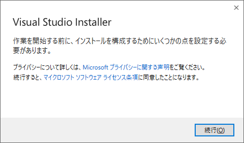
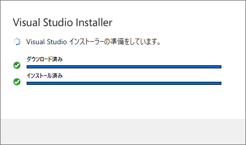

# Django から Postgresql にアクセスする

## Install psycopg2

作成した仮想環境で `pip install psycopg2-binary==2.8.6` する。(2.9.x 系だと `python manage.py migrate` で失敗するので注意。`2.8.6` をインストールする。)  

`<CAUTION!>`  
`error: Microsoft Visual C++ 14.0 or greater is required. Get it with "Microsoft C++ Build Tools": https://visualstudio.microsoft.com/visual-cpp-build-tools/` といわれるので、以下からダウンロードしてインストールしておく。

Visual Studio Tools のダウンロード - Windows、Mac、Linux 用の無料インストール  
https://visualstudio.microsoft.com/ja/downloads/  

  
  
  
  
  
  

`</CAUTION!>`  

```
D:\yakenohara\KnowHow\Django\example>"D:\pyvenv\Scripts\activate.bat"

(pyvenv) D:\yakenohara\KnowHow\Django\example>pip install psycopg2-binary==2.8.6
Collecting psycopg2-binary==2.8.6
  Downloading psycopg2_binary-2.8.6-cp38-cp38-win_amd64.whl (1.1 MB)
     ---------------------------------------- 1.1/1.1 MB 8.0 MB/s eta 0:00:00
Installing collected packages: psycopg2-binary
Successfully installed psycopg2-binary-2.8.6

(pyvenv) D:\yakenohara\KnowHow\Django\example>"D:\pyvenv\Scripts\deactivate.bat"
D:\yakenohara\KnowHow\Django\example>
```

## PostgreSQL DB の作成

Windows スタートメニューから`SQL Shell (psql)` を選択して起動。  

```
Port [5432]:
Username [postgres]:
Client Encoding [SJIS]:
ユーザー postgres のパスワード: # <- PostgreSQL インストール時に設定したパスワード
psql (14.2)
"help"でヘルプを表示します。

postgres=# \l
                                        データベース一覧
   名前    |  所有者  | エンコーディング | 照合順序 | Ctype(変換演算子) |     アクセス権限
-----------+----------+------------------+----------+-------------------+-----------------------
 postgres  | postgres | UTF8             | C        | C                 |
 template0 | postgres | UTF8             | C        | C                 | =c/postgres          +
           |          |                  |          |                   | postgres=CTc/postgres
 template1 | postgres | UTF8             | C        | C                 | =c/postgres          +
           |          |                  |          |                   | postgres=CTc/postgres
(3 行)


postgres=# CREATE DATABASE my_django_db; # <- 大文字を指定しても、小文字に変換されて DB が作成されるので注意
CREATE DATABASE
postgres=# CREATE USER my_django_user WITH PASSWORD 'my_django_pass';
ALTER ROLE
postgres=# ALTER ROLE my_django_user SET client_encoding TO 'utf8';
ALTER ROLE
postgres=# ALTER ROLE my_django_user SET default_transaction_isolation TO 'read committed';
ALTER ROLE
postgres=# ALTER ROLE my_django_user SET timezone TO 'UTC';
ALTER ROLE
postgres=# GRANT ALL PRIVILEGES ON DATABASE my_django_db TO my_django_user;
GRANT
postgres=# \l
                                            データベース一覧
     名前     |  所有者  | エンコーディング | 照合順序 | Ctype(変換演算子) |        アクセス権限
--------------+----------+------------------+----------+-------------------+-----------------------------
 my_django_db | postgres | UTF8             | C        | C                 | =Tc/postgres               +
              |          |                  |          |                   | postgres=CTc/postgres      +
              |          |                  |          |                   | my_django_user=CTc/postgres
 postgres     | postgres | UTF8             | C        | C                 |
 template0    | postgres | UTF8             | C        | C                 | =c/postgres                +
              |          |                  |          |                   | postgres=CTc/postgres
 template1    | postgres | UTF8             | C        | C                 | =c/postgres                +
              |          |                  |          |                   | postgres=CTc/postgres
(4 行)


postgres=# \q
続行するには何かキーを押してください . . .
```

## settings.py の編集

 - 変更前  
```
# Database
# https://docs.djangoproject.com/en/3.0/ref/settings/#databases

DATABASES = {
    'default': {
        'ENGINE': 'django.db.backends.sqlite3',
        'NAME': os.path.join(BASE_DIR, 'db.sqlite3'),
    }
}
```
 - 変更後  
```
# Database
# https://docs.djangoproject.com/en/3.0/ref/settings/#databases

DATABASES = {
    'default': {
        'ENGINE': 'django.db.backends.postgresql_psycopg2',
        'NAME': 'my_django_db', #  SQL Shell で `CREATE DATABASE ***;` で設定した DB 名
        'USER': 'my_django_user', # SQL Shell で `CREATE USER ***` で設定したユーザー名を指定
        'PASSWORD': 'my_django_pass', # SQL Shell で `CREATE USER ***  WITH PASSWORD '***';` で設定したパスワード
        'HOST': '',
        'PORT': '',
    }
}
```