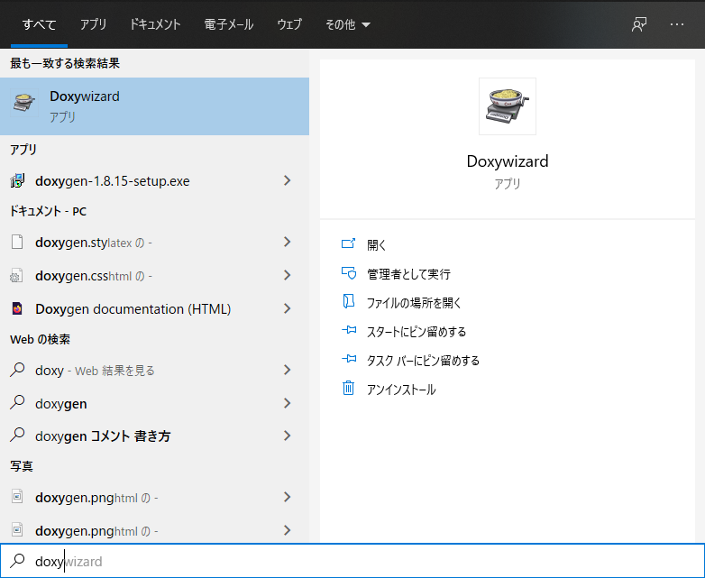
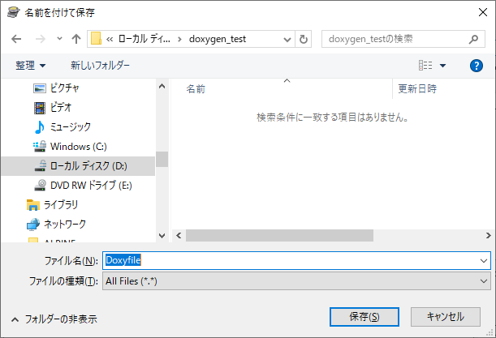
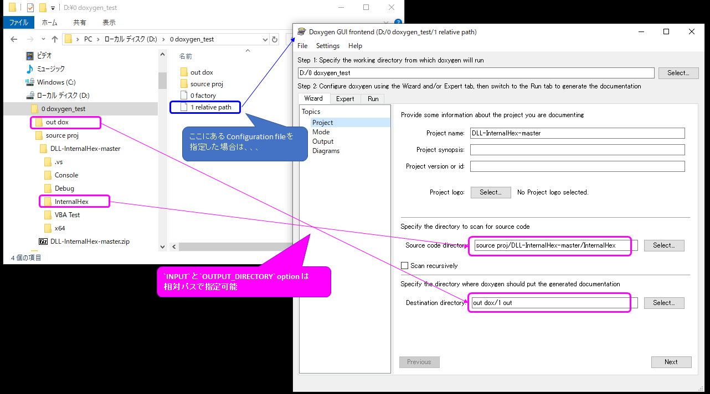

## Install

インストーラーをたたくだけ。  
パスは自動で環境変数に追加される。

## 起動

`スタート` -> `Doxywizard`

## 設定内容を Configuration file として保存

`File` -> `Save as...` で保存するのがおすすめ。  
※拡張子の指定は無い。  
  実態はテキストファイル。Makefile のように、テキストエディタで開いて編集できる  
※`Run` タブ -> `Show configuration` で 表示された設定内容をテキストファイルとして保存してもいい。  

## Configuration file を指定して generate する

Doxywizard をを起動して `File` -> `Open...` で Configuration file を指定する。  
※こうすると、
Configuration file のあるディレクトリが working directory になる。  
`INTPUT` option と `OUTPUT_DIRECTORY` option は相対パスで指定可能  

※ generate するだけなら、コマンドプロンプトで、`doxygen (Configuration file)` でもいい。

## Graphviz オプション

Graphviz オプションを使用する場合は、 `HAVE_DOT` を `YES` にする。  
Graphviz の パスを環境変数に追加している場合は、 `DOT_PATH` の指定は不要。  

# Example

[yakenohara/Node.js-dots2d3](https://github.com/yakenohara/Node.js-dots2d3) で
[yakenohara/DLL-InternalHex](https://github.com/yakenohara/DLL-InternalHex) を解析する例を説明している。  
`# Example` -> `1. Gererate DOT files` 参照

# あるある

## 解析された形跡がない  
生成された `index.html` の メニューバーに `Files▼` が現れない  

ログで、 `Parsing files` の下に各ファイルのリストが出てこない時は、`INPUT` option が空の可能性大。  
※GUI でちゃんと設定したのに この様になることがある。(Ver 1.8.15 で確認。不具合?)  

`Run` タブ -> `Show configuration` して、`INPUT` が空になっていないかどうか確認する  

## `EXTRACT_ALL` 

このオプションがデフォルト(=`NO`) の場合は、  
有効なソースコードドキュメント※が見つからないとドキュメントは生成されない。  
コード解析目的なら、このオプションは常に `YES` がおすすめ

※有効なソースコードドキュメントは、↓ここ↓ に定義されている  
http://www.doxygen.nl/manual/docblocks.html

## `EXTRACT_STATIC`

このオプションがデフォルト(=`NO`) の場合は、  
static 関数のドキュメントは生成されない。  
コード解析目的なら、このオプションは常に `YES` がおすすめ
