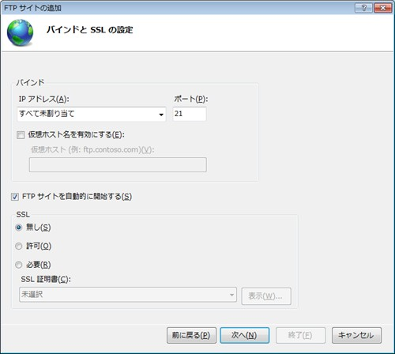

# Windows 10/8/7 で FTP サービス を使う

## １．FTP サービス機能の有効化

※ Windows 10 の場合は、  
`スタート` -> `Windows の機能の有効化または無効化` を選択

※ Windows 8/7 の場合は、  
`スタート`  -> `コントロールパネル` -> `プログラム` `Windows の機能の有効化または無効化` を選択

以下にチェック。  

```
インターネット インフォメーション サービス
┣FTP サーバー
┃┗FTP サービス
┃  
┗Web管理ツール
  ┗IIS管理コンソール
```


## ２．FTP サーバーの設定

### ２－１．

`スタート` -> `インターネット インフォメーション サービス（IIS）マネージャー`  
左パネルのサーバーアイコンを右クリックして、`FTP サイトの追加` を選択  


### ２－２．

`FTP サイトの追加` の設定ウィザードが開始される。  

`FTP サイト名` はお好みで。  
`コンテンツディレクトリ` に公開対象のディレクトリを設定する  


### ２－３．

`バインド` はデフォルトのまま。  
`SSL` は `無し`   



### ２－４．

#### 認証が必要な場合

`認証` は `基本` にチェック  
`アクセスの許可` は、`指定されたユーザー` を選択。作成しておいたユーザー名を入力。  
`アクセス許可` は、`読み取り`、`書き込み`の両方にチェック。  


#### 認証が不要な場合

`認証` は `匿名`にチェック  
`アクセスの許可` は、`匿名ユーザー` を選択。  
`アクセス許可` は、`読み取り`、`書き込み`の両方にチェック。  


### ２－５．

作成した FTP サイトを選択して、右クリックをして、`仮想ディレクトリの追加` を選択。


### ２－６．

`仮想ディレクトリの追加` のダイアログが表示される。  
`エイリアス` はお好みで。  
`物理パス` はWebサーバーの物理パスを入力。


### ２－７．

FTP のサイトを選択。  
中央の機能一覧でで `FTPのディレクトリの参照` をクリック。  
以下のような画面で、`ディレクトリの表示オプション` -> `仮想ディレクトリ` にチェック。


### ２－９． FTP サーバーが正常に動作しているか確認する

コマンドプロンプトを起動して、`ftp localhost`  
`ftp localhost` で接続できない場合は、`ftp 127.0.0.1`  

```
>ftp localhost
DESKTOP-ANF92J3 に接続しました。
220 Microsoft FTP Service
200 OPTS UTF8 command successful - UTF8 encoding now ON.
ユーザー (DESKTOP-ANF92J3:(none)):
```

## 3．ファイアーウォールの設定

`コントロール パネル` -> `システムとセキュリティ` -> `Windows ファイアウォール` -> `詳細設定` -> `セキュリティが強化された Windows ファイアウォール`  

左メニューで `受信の規則` を選択  
`FTP サーバー（FTP トラフィック）` を右クリックして、`規則の有効化` を選択  
`FTP Server Passive（FTP Passive Traffic-In）`も有効化する。  
(※うまく有効化ができない場合は、`管理ツール` -> `サービス` で Microsoft FTP Service を再起動)  


## 4. 接続

エクスプローラーでアドレスを入力する。  

```
※標準のFTPアクセス
ftp://＜FTPサーバ名＞/

※ユーザー名とパスワードを指定したFTPアクセス
ftp://＜ユーザー名＞:＜パスワード＞@＜FTPサーバ名＞/
```
