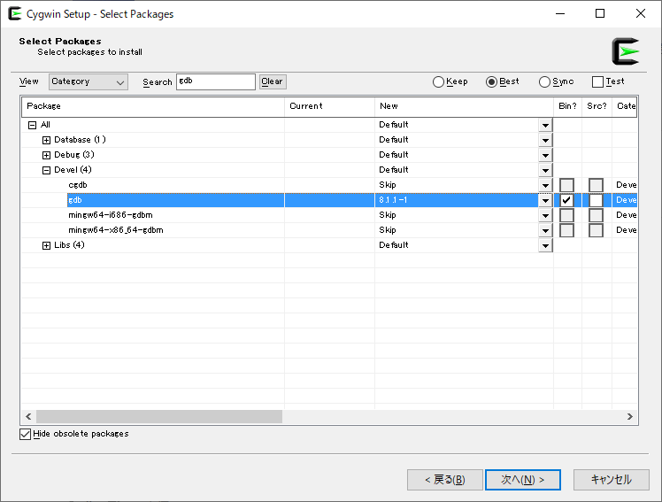

# Installation

## Cygwin の場合

[公式ページ](https://www.cygwin.com/) から インストーラーをダウンロードして、  
以下に気をつけてインストーラーを実行。

### Choose A Download Site 画面

好きなものを選択。  
迷ったら [http://ftp.jaist.ac.jp](http://ftp.jaist.ac.jp) を選択。

### Select Packages 画面

ここで、GCC と GDB を選択する。

#### GCC

`Search` 欄に `gcc` と入力してから、以下いずれかを選択する(選択するには `Skip` のトグルボタンを押して、好きなバージョンを指定する)


 - `Devel` -> `gcc-core`  
    32bit, 64bit アプリ両方つくれる。  
    作ったアプリを実行するには、`cygwin1.dll` が必要。(このファイルは Cygwin インストール時に同封される。逆に言えば、Cygwin をインストールしていない環境では実行できない)  
    後述の GDB を使用する場合は、これを選択する。

 - `Devel` -> `mingw64-i686-gcc-core`  
    32bit アプリをつくれる。  
    `gcc-core` で作ったアプリの実行には `cygwin1.dll` が必要だけど、これで作ったアプリはそれが不要。Cygwin をインストールしていない環境でも実行可能なアプリを作りたい場合に選択する。

 - `Devel` -> `mingw64-x86_64-gcc-core`  
    `mingw64-i686-gcc-core` の 64bit アプリをつくれる版。  

#### GDB

`Search` 欄に `gdb` と入力してから、`Devel` -> `gdb`  を選択する  
(なぜか mingw 用の gdb は存在しない。cygwin 環境で gdb をインストールするには以下しか選択肢がない)



### パスを通す

インストール時のインストール先を特に変更していなければ、  
`C:\cygwin64\bin` を環境変数に追加する

## MSYS2 の場合

[公式ページ](https://www.msys2.org/) から インストーラーをダウンロードして実行。

### Mintty の起動

スタートメニューから、  
32bit 環境の場合は `MSYS2 MinGW 32-bit`  
64bit 環境の場合は `MSYS2 MinGW 64-bit`  
を叩くと、Mintty が起動する。


以降 Mintty 内のコマンドでセットアップをしていく。

### MSYS2 内　のデータベースを更新する

`pacman -Sy`

```
$ pacman -Sy
:: パッケージデータベースの同期中...
 mingw32                  554.2 KiB   407K/s 00:01 [#####################] 100%
 mingw32.sig              119.0   B   116K/s 00:00 [#####################] 100%
 mingw64                  556.0 KiB   368K/s 00:02 [#####################] 100%
 mingw64.sig              119.0   B  0.00B/s 00:00 [#####################] 100%
 msys                     185.3 KiB   305K/s 00:01 [#####################] 100%
 msys.sig                 119.0   B  0.00B/s 00:00 [#####################] 100%

```

### インストール済みパッケージのアップデート

`pacman -Su`   

※ `警告: terminate MSYS2 without returning to shell and check for updates again` が出たら、  
  Mintty 右上　✕ ボタンで Mintty を閉じる。  
  再度 Mintty を起動して、 `pacman -Su` する。  
  これを警告が出なくなるまで繰り返す。

```
$ pacman -Su
:: Starting core system upgrade...
警告: terminate other MSYS2 programs before proceeding
依存関係を解決しています...
衝突するパッケージがないか確認しています...

パッケージ (3) mintty-1~3.0.2-1  msys2-runtime-3.0.7-6  pacman-5.1.3-3

合計ダウンロード容量:  17.33 MiB
合計インストール容量:  60.77 MiB
最終的なアップグレード容量:   0.77 MiB

:: インストールを行いますか？ [Y/n] y
:: パッケージを取得します...
 msys2-runtime-3.0.7...     2.6 MiB   393K/s 00:07 [#####################] 100%
 mintty-1~3.0.2-1-x86_64  655.4 KiB   601K/s 00:01 [#####################] 100%
エラー: ファイル 'pacman-5.1.3-3-x86_64.pkg.tar.xz' を repo.msys2.org から取得するのに失敗しました : Operation too slow. Less than 1 bytes/sec transferred the last 10 seconds
 pacman-5.1.3-3-x86_64      8.4 MiB  4.72M/s 00:02 [#####################] 100%
(3/3) キーリングのキーを確認                       [#####################] 100%
(3/3) パッケージの整合性をチェック                 [#####################] 100%
(3/3) パッケージファイルのロード                   [#####################] 100%
(3/3) ファイルの衝突をチェック                     [#####################] 100%
(3/3) 空き容量を確認                               [#####################] 100%
:: パッケージの変更を処理しています...
(1/3) 更新 msys2-runtime                           [#####################] 100%
(2/3) 更新 mintty                                  [#####################] 100%
(3/3) 更新 pacman                                  [#####################] 100%
警告: terminate MSYS2 without returning to shell and check for updates again
警告: for example close your terminal window instead of calling exit
```

### GCC

`pacman -Ssq gcc`  
インストール可能な GCC パッケージの一覧を取得する。

```
$ pacman -Ssq gcc
mingw-w64-i686-gcc
mingw-w64-i686-gcc-ada
mingw-w64-i686-gcc-fortran
mingw-w64-i686-gcc-libgfortran
mingw-w64-i686-gcc-libs
mingw-w64-i686-gcc-objc
mingw-w64-i686-lcov
mingw-w64-i686-perl
mingw-w64-x86_64-gcc
mingw-w64-x86_64-gcc-ada
mingw-w64-x86_64-gcc-fortran
mingw-w64-x86_64-gcc-libgfortran
mingw-w64-x86_64-gcc-libs
mingw-w64-x86_64-gcc-objc
mingw-w64-x86_64-lcov
mingw-w64-x86_64-perl
gcc
gcc-fortran
gcc-libs
mingw-w64-cross-gcc
```

この中で、以下 いずれかを選ぶ

 - `gcc`  
    32bit, 64bit アプリ両方つくれる。  
    作ったアプリを実行するには、`msys-2.0.dll` が必要。(このファイルは MSYS2 インストール時に同封される。逆に言えば、MSYS2 をインストールしていない環境では実行できない)  

 - `mingw-w64-i686-gcc`  
    32bit アプリをつくれる。  
    `gcc` で作ったアプリの実行には `msys-2.0.dll` が必要だけど、これで作ったアプリはそれが不要。MSYS2 をインストールしていない環境でも実行可能なアプリを作りたい場合に選択する。  
    Cygwin 環境の場合と違い、後述の GDB のインストールで、対応する GDB `mingw-w64-i686-gdb` をインストールできる

 - `mingw-w64-x86_64-gcc`  
    `mingw-w64-i686-gcc` の 64bit アプリをつくれる版。 
    これも Cygwin 環境の場合と違い、後述の GDB のインストールで、対応する GDB `mingw-w64-x86_64-gdb` をインストールできる

選んだパッケージを指定して、 `pacman -S`  
↓ `mingw-w64-x86_64-gcc` を選択した例 ↓
```
$ pacman -S mingw-w64-x86_64-gcc
依存関係を解決しています...
衝突するパッケージがないか確認しています...

パッケージ (14) mingw-w64-x86_64-binutils-2.32-3
                mingw-w64-x86_64-crt-git-7.0.0.5524.2346384e-1
                mingw-w64-x86_64-gcc-libs-9.2.0-2  mingw-w64-x86_64-gmp-6.1.2-1
                mingw-w64-x86_64-headers-git-7.0.0.5524.2346384e-1
                mingw-w64-x86_64-isl-0.21-1  mingw-w64-x86_64-libiconv-1.16-1
                mingw-w64-x86_64-libwinpthread-git-7.0.0.5522.977a9720-1
                mingw-w64-x86_64-mpc-1.1.0-1  mingw-w64-x86_64-mpfr-4.0.2-2
                mingw-w64-x86_64-windows-default-manifest-6.4-3
                mingw-w64-x86_64-winpthreads-git-7.0.0.5522.977a9720-1
                mingw-w64-x86_64-zlib-1.2.11-7  mingw-w64-x86_64-gcc-9.2.0-2

合計ダウンロード容量:   58.53 MiB
合計インストール容量:  428.12 MiB

:: インストールを行いますか？ [Y/n] y
:: パッケージを取得します...
 mingw-w64-x86_64-li...   623.0 KiB   969K/s 00:01 [#####################] 100%
 mingw-w64-x86_64-zl...   102.1 KiB   642K/s 00:00 [#####################] 100%
 mingw-w64-x86_64-bi...    14.5 MiB   187K/s 01:19 [#####################] 100%
 mingw-w64-x86_64-he...     5.1 MiB   170K/s 00:30 [#####################] 100%
 mingw-w64-x86_64-cr...     3.1 MiB   531K/s 00:06 [#####################] 100%
 mingw-w64-x86_64-is...   612.5 KiB   549K/s 00:01 [#####################] 100%
 mingw-w64-x86_64-gm...   486.0 KiB   437K/s 00:01 [#####################] 100%
 mingw-w64-x86_64-mp...   345.9 KiB   433K/s 00:01 [#####################] 100%
 mingw-w64-x86_64-mp...    78.9 KiB   490K/s 00:00 [#####################] 100%
 mingw-w64-x86_64-li...    45.2 KiB  8.83M/s 00:00 [#####################] 100%
 mingw-w64-x86_64-gc...   692.4 KiB   256K/s 00:03 [#####################] 100%
 mingw-w64-x86_64-wi...    12.9 KiB  0.00B/s 00:00 [#####################] 100%
 mingw-w64-x86_64-wi...    54.1 KiB   338K/s 00:00 [#####################] 100%
 mingw-w64-x86_64-gc...    32.9 MiB   235K/s 02:24 [#####################] 100%
(14/14) キーリングのキーを確認                     [#####################] 100%
(14/14) パッケージの整合性をチェック               [#####################] 100%
(14/14) パッケージファイルのロード                 [#####################] 100%
(14/14) ファイルの衝突をチェック                   [#####################] 100%
(14/14) 空き容量を確認                             [#####################] 100%
:: パッケージの変更を処理しています...
( 1/14) インストール mingw-w64-x86_64-libiconv     [#####################] 100%
( 2/14) インストール mingw-w64-x86_64-zlib         [#####################] 100%
( 3/14) インストール mingw-w64-x86_64-binutils     [#####################] 100%
( 4/14) インストール mingw-w64-x86_64-headers-git  [#####################] 100%
( 5/14) インストール mingw-w64-x86_64-crt-git      [#####################] 100%
( 6/14) インストール mingw-w64-x86_64-isl          [#####################] 100%
( 7/14) インストール mingw-w64-x86_64-gmp          [#####################] 100%
( 8/14) インストール mingw-w64-x86_64-mpfr         [#####################] 100%
( 9/14) インストール mingw-w64-x86_64-mpc          [#####################] 100%
(10/14) インストール mingw-w64-x86_64-libwinpt...  [#####################] 100%
(11/14) インストール mingw-w64-x86_64-gcc-libs     [#####################] 100%
(12/14) インストール mingw-w64-x86_64-windows-...  [#####################] 100%
(13/14) インストール mingw-w64-x86_64-winpthre...  [#####################] 100%
(14/14) インストール mingw-w64-x86_64-gcc          [#####################] 100%

```
### GDB

`pacman -Ssq gdb`  
インストール可能な GDB パッケージの一覧を取得する。

```
$ pacman -Ssq gdb
mingw-w64-i686-gdb
mingw-w64-i686-gdbm
mingw-w64-i686-perl
mingw-w64-i686-ruby
mingw-w64-x86_64-gdb
mingw-w64-x86_64-gdbm
mingw-w64-x86_64-perl
mingw-w64-x86_64-ruby
cgdb
gdb
gdbm
libgdbm
libgdbm-devel

```
この中で、以下 いずれかを選ぶ

 - `gdb`  
   `gcc`に対応する GDB
 - `mingw-w64-i686-gdb`  
   `mingw-w64-i686-gcc`に対応する GDB
 - `mingw-w64-x86_64-gdb`  
   `mingw-w64-x86_64-gcc`に対応する GDB

↓ `mingw-w64-x86_64-gdb` を選択した例 ↓
```
$ pacman -S mingw-w64-x86_64-gdb
依存関係を解決しています...
衝突するパッケージがないか確認しています...

パッケージ (20) mingw-w64-x86_64-bzip2-1.0.8-1
                mingw-w64-x86_64-ca-certificates-20180409-1
                mingw-w64-x86_64-expat-2.2.7-1
                mingw-w64-x86_64-gettext-0.19.8.1-8
                mingw-w64-x86_64-libffi-3.2.1-4
                mingw-w64-x86_64-libsystre-1.0.1-4
                mingw-w64-x86_64-libtasn1-4.14-1
                mingw-w64-x86_64-libtre-git-r128.6fb7206-2
                mingw-w64-x86_64-mpdecimal-2.4.2-1
                mingw-w64-x86_64-ncurses-6.1.20190630-1
                mingw-w64-x86_64-openssl-1.1.1.c-1
                mingw-w64-x86_64-p11-kit-0.23.16.1-1
                mingw-w64-x86_64-python3-3.7.4-7
                mingw-w64-x86_64-readline-8.0.000-4
                mingw-w64-x86_64-sqlite3-3.29.0-2  mingw-w64-x86_64-tcl-8.6.9-2
                mingw-w64-x86_64-termcap-1.3.1-5  mingw-w64-x86_64-tk-8.6.9.1-1
                mingw-w64-x86_64-xz-5.2.4-1  mingw-w64-x86_64-gdb-8.3-9

合計ダウンロード容量:   42.21 MiB
合計インストール容量:  278.34 MiB

:: インストールを行いますか？ [Y/n] y
:: パッケージを取得します...
 mingw-w64-x86_64-ex...   137.0 KiB   457K/s 00:00 [#####################] 100%
 mingw-w64-x86_64-ge...     3.1 MiB   757K/s 00:04 [#####################] 100%
 mingw-w64-x86_64-li...    84.2 KiB   536K/s 00:00 [#####################] 100%
 mingw-w64-x86_64-li...    24.0 KiB  23.4M/s 00:00 [#####################] 100%
 mingw-w64-x86_64-nc...  1784.7 KiB   367K/s 00:05 [#####################] 100%
 mingw-w64-x86_64-bz...    88.6 KiB   583K/s 00:00 [#####################] 100%
 mingw-w64-x86_64-li...    44.9 KiB  11.0M/s 00:00 [#####################] 100%
 mingw-w64-x86_64-mp...   254.2 KiB   388K/s 00:01 [#####################] 100%
 mingw-w64-x86_64-li...   174.0 KiB   382K/s 00:00 [#####################] 100%
 mingw-w64-x86_64-p1...   300.1 KiB   329K/s 00:01 [#####################] 100%
 mingw-w64-x86_64-ca...   356.3 KiB   296K/s 00:01 [#####################] 100%
 mingw-w64-x86_64-op...     4.8 MiB   538K/s 00:09 [#####################] 100%
 mingw-w64-x86_64-te...    33.1 KiB  0.00B/s 00:00 [#####################] 100%
 mingw-w64-x86_64-re...   371.9 KiB   832K/s 00:00 [#####################] 100%
 mingw-w64-x86_64-tc...     3.0 MiB   613K/s 00:05 [#####################] 100%
 mingw-w64-x86_64-sq...     6.5 MiB   212K/s 00:32 [#####################] 100%
 mingw-w64-x86_64-tk...  1897.4 KiB   189K/s 00:10 [#####################] 100%
 mingw-w64-x86_64-xz...   297.7 KiB   245K/s 00:01 [#####################] 100%
 mingw-w64-x86_64-py...    15.6 MiB   226K/s 01:11 [#####################] 100%
 mingw-w64-x86_64-gd...     3.5 MiB   164K/s 00:22 [#####################] 100%
(20/20) キーリングのキーを確認                     [#####################] 100%
(20/20) パッケージの整合性をチェック               [#####################] 100%
(20/20) パッケージファイルのロード                 [#####################] 100%
(20/20) ファイルの衝突をチェック                   [#####################] 100%
(20/20) 空き容量を確認                             [#####################] 100%
:: パッケージの変更を処理しています...
( 1/20) インストール mingw-w64-x86_64-expat        [#####################] 100%
( 2/20) インストール mingw-w64-x86_64-gettext      [#####################] 100%
( 3/20) インストール mingw-w64-x86_64-libtre-git   [#####################] 100%
( 4/20) インストール mingw-w64-x86_64-libsystre    [#####################] 100%
( 5/20) インストール mingw-w64-x86_64-ncurses      [#####################] 100%
( 6/20) インストール mingw-w64-x86_64-bzip2        [#####################] 100%
( 7/20) インストール mingw-w64-x86_64-libffi       [#####################] 100%
( 8/20) インストール mingw-w64-x86_64-mpdecimal    [#####################] 100%
( 9/20) インストール mingw-w64-x86_64-libtasn1     [#####################] 100%
(10/20) インストール mingw-w64-x86_64-p11-kit      [#####################] 100%
(11/20) インストール mingw-w64-x86_64-ca-certi...  [#####################] 100%
(12/20) インストール mingw-w64-x86_64-openssl      [#####################] 100%
(13/20) インストール mingw-w64-x86_64-termcap      [#####################] 100%
(14/20) インストール mingw-w64-x86_64-readline     [#####################] 100%
(15/20) インストール mingw-w64-x86_64-tcl          [#####################] 100%
(16/20) インストール mingw-w64-x86_64-sqlite3      [#####################] 100%
(17/20) インストール mingw-w64-x86_64-tk           [#####################] 100%
(18/20) インストール mingw-w64-x86_64-xz           [#####################] 100%
(19/20) インストール mingw-w64-x86_64-python3      [#####################] 100%
(20/20) インストール mingw-w64-x86_64-gdb          [#####################] 100%
```

## パスを通す

インストール時のインストール先を特に変更していなければ、  
`C:\msys64\mingw64\bin` を環境変数に追加する

# Compile & Build with GCC

ターミナルで、`gcc` コマンドの引数にコンパイル対象のファイル名を指定する。  
以下は同封の `ex.c` に対する例。(`-o` オプションに出力ファイル名を指定できる)  

※Cygwin 環境で `mingw64-i686-gcc-core` か `mingw64-x86_64-gcc-core` をインストールしている場合  
  `gcc` コマンドの代わりに、  
  `mingw64-i686-gcc-core` の場合は `i686-w64-mingw32-gcc`  
  `mingw64-x86_64-gcc-core` の場合は `x86_64-w64-mingw32-gcc`  
  と指定する。

↓ コマンドプロンプト or PowerShell Terminal ↓  
```
> gcc ex.c -o ex.exe
```

GDB でデバッグしたい場合は、以下のようにする

↓ コマンドプロンプト or PowerShell Terminal ↓  
```
> gcc ex.c -o ex.exe -g -O0
```

# Debugging with GDB

## 起動

`gcc` コマンドでデバッグ用ビルドをアプリを使って、以下のように起動する。  

同封の `ex.c` をビルドした `ex.exe` を使用した例  

↓ コマンドプロンプト or PowerShell Terminal ↓  
```
> gdb ex.exe
GNU gdb (GDB) (Cygwin 8.1.1-1) 8.1.1
Copyright (C) 2018 Free Software Foundation, Inc.
License GPLv3+: GNU GPL version 3 or later <http://gnu.org/licenses/gpl.html>
This is free software: you are free to change and redistribute it.
There is NO WARRANTY, to the extent permitted by law.  Type "show copying"
and "show warranty" for details.
This GDB was configured as "x86_64-pc-cygwin".
Type "show configuration" for configuration details.
For bug reporting instructions, please see:
<http://www.gnu.org/software/gdb/bugs/>.
Find the GDB manual and other documentation resources online at:
<http://www.gnu.org/software/gdb/documentation/>.
For help, type "help".
Type "apropos word" to search for commands related to "word"...
Reading symbols from ex.exe...done.
(gdb) 

```

## Run(アプリの開始), Step, Continue(Break Point から再開)
`main` 関数に break point を設定する例  

↓ コマンドプロンプト or PowerShell Terminal ↓  
```
Reading symbols from ex.exe...done.
(gdb) break main
Breakpoint 1 at 0x100401088
(gdb) run
Starting program: /***/GCC, GDB/example/ex.exe
[New Thread 13076.0x5c0]
[New Thread 13076.0x2b04]
[New Thread 13076.0x2908]
[New Thread 13076.0x242c]

Thread 1 "ex" hit Breakpoint 1, 0x0000000100401088 in main ()
(gdb) step
Single stepping until exit from function main,
which has no line number information.
number of argments 1
argment 0:"/***/GCC, GDB/example/ex"
0x000000018004a816 in _cygwin_exit_return () from /usr/bin/cygwin1.dll
(gdb) continue
Continuing.
[Thread 13076.0x2b04 exited with code 0]
[Thread 13076.0x242c exited with code 0]
[Inferior 1 (process 13076) exited normally]
(gdb) 
```

## 終了

`quit` を入力するか、キーボードショートカット `ctrl` + `D` で終了できる。  


## アプリ起動時の引数を指定する

`run` コマンドの引数に 直接指定する  

文字列 `arg01` と `arg02` を指定する例  

↓ コマンドプロンプト or PowerShell Terminal ↓  
```
Reading symbols from ex.exe...done.
(gdb) run arg01 arg02
Starting program: /***/GCC, GDB/example/ex.exe arg01 arg02
[New Thread 12440.0x1574]
[New Thread 12440.0x1270]
[New Thread 12440.0x1940]
[New Thread 12440.0x1a4c]
number of argments 3
argment 0:"/***/GCC, GDB/example/ex"
argment 1:"arg01"
argment 2:"arg02"
[Thread 12440.0x1940 exited with code 0]
[Thread 12440.0x1270 exited with code 0]
[Inferior 1 (process 12440) exited normally]
(gdb)
```

## GDB 内で Python を使用する

**Caution!!**  
GDB 内で使用する Python は、GDB 内だけで起動する代物。  
GDB インストール時は、事前に自前で Python をインストールしていたとしても、  
GDB 内だけで起動する Python が別途自動でインストールされる。  
この Python は、少なくとも以下の環境で確認した限り、`pip` が付属されていないなど制限が多い。  

 - Cygwin 環境版 gdb 8.1.1-1  
   -> 自動でインストールされる Python は ver 2.7.16 (default, Mar 20 2019, 12:15:19)
 - MSYS2 環境版 mingw-w64-x86_64-gdb-8.3-9  
   -> 自動でインストールされる Python は ver 3.7.4 (default, Aug 15 2019, 18:17:27)  

**/Caution!!**  

### Python interactive shell の起動と終了

GDB 起動後に `pi`  
終了する場合は キーボードショートカット `ctrl` + `D`  
`exit()` でも終了できるけど、GDB ごと終了するので注意  

↓ コマンドプロンプト or PowerShell Terminal ↓  
```
For help, type "help".
Type "apropos word" to search for commands related to "word".
(gdb) pi
>>> import sys
>>> sys.version
'2.7.16 (default, Mar 20 2019, 12:15:19) \n[GCC 7.4.0]'
>>>
(gdb) pi
>>> exit()
>
```

他の方法は ↓ をチェック  
[https://sourceware.org/gdb/onlinedocs/gdb/Python-Commands.html#Python-Commands](https://sourceware.org/gdb/onlinedocs/gdb/Python-Commands.html#Python-Commands)  

Python script として使用できる API は ↓ をチェック  
[https://sourceware.org/gdb/onlinedocs/gdb/Python-API.html#Python-API](https://sourceware.org/gdb/onlinedocs/gdb/Python-API.html#Python-API)  

### GDB 起動時に Python script file を実行させる

同封の `ex.c` をビルドした `ex.exe` を、同封の `ex1_basic.py` に処理させる例  

↓ コマンドプロンプト or PowerShell Terminal ↓  

```
> gdb ex.exe -x ex1_basic.py
GNU gdb (GDB) (Cygwin 8.1.1-1) 8.1.1
.....中略.....
For help, type "help".
Type "apropos word" to search for commands related to "word"...
Reading symbols from ex.exe...done.
Breakpoint 1 at 0x100401094: file ex.c, line 7.
[New Thread 15872.0x3410]
[New Thread 15872.0x257c]
[New Thread 15872.0x31a4]
[New Thread 15872.0x3504]
[New Thread 15872.0x1868]

Thread 1 "ex" hit Breakpoint 1, main (argc=1, argv=0xffffcc30) at ex.c:7
7           printf("number of argments %d\n", argc);
number of argments 1
argment 0:"/cygdrive/d/KnowHow-master/GCC, GDB/example/ex"
[Thread 15872.0x31a4 exited with code 0]
[Thread 15872.0x257c exited with code 0]
[Thread 15872.0x1868 exited with code 0]
[Inferior 1 (process 15872) exited normally]
>
```

### Python script に引数を渡す

Convenience Variable ※1 と GDB へのファイル指定オプション※2 を組み合わせて、Python に渡す

同封の `ex.c` をビルドした `ex.exe` をデバッグ対象ファイルにして、
同封の `ex2_args.py` 文字列 `string with spaces` を渡してに処理させる例  

**caution!!**  
commant prompt と PowerShell terminal では文字列指定方法が違うので注意。  
`-ex` オプション内文字列で `\"` を使用するためのエスケープ方法が異なる為。  
詳しい理由は `ex2_args.py` 参照  
**/caution!!**  

↓ コマンドプロンプト ↓  

```
> gdb "ex.exe" -ex "set $arg0 = \"string with spaces\"" -x "ex2_args.py"
GNU gdb (GDB) (Cygwin 8.1.1-1) 8.1.1
.....中略.....
For help, type "help".
Type "apropos word" to search for commands related to "word"...
Reading symbols from ex.exe...done.
argment string is:string with spaces

> 
```

↓ PowerShell terminal ↓
```
> gdb "ex.exe" -ex 'set $arg0 = \"string with spaces\"' -x "ex2_args.py"
GNU gdb (GDB) (Cygwin 8.1.1-1) 8.1.1
.....中略.....
For help, type "help".
Type "apropos word" to search for commands related to "word"...
~.exe: No such file or directory.
argment string is:string with spaces
> 
```

※1 Convenience Variable  
[https://sourceware.org/gdb/onlinedocs/gdb/Convenience-Vars.html#Convenience-Vars](https://sourceware.org/gdb/onlinedocs/gdb/Convenience-Vars.html#Convenience-Vars)  

※2 GDB へのファイル指定オプション  
[https://sourceware.org/gdb/onlinedocs/gdb/File-Options.html#File-Options](https://sourceware.org/gdb/onlinedocs/gdb/File-Options.html#File-Options)  
