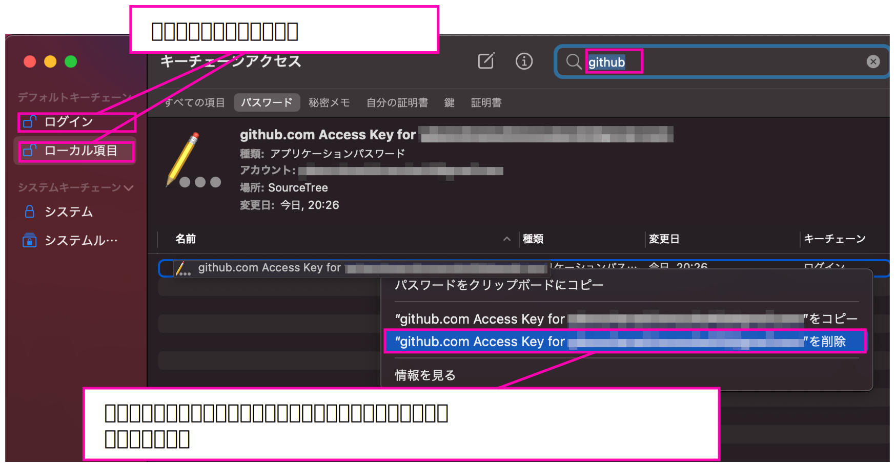

# Mac OS X で push 出来きなくなった時

Mac OS X で push しようとした時、以下のようなエラーが出た

```
Support for password authentication was removed on August 13, 2021. Please use a personal access token instead.
remote: Please see https://github.blog/2020-12-15-token-authentication-requirements-for-git-operations/ for more information.
fatal: unable to access 'https://******@github.com/******/foo-repository.git/': The requested URL returned error: 403
```

## Sourcetree 内のアカウントの削除

Sourcetree の `環境設定` -> `アカウント` でアカウント管理画面を開き、アカウントを削除する。  

## 既存のアクセスキーの削除

`command` + `space` で `Keychain Access` と入力し、キーチェーンアクセスを起動。 
`github` に関わるアクセスキーを下図のようにして削除する。



## Personal access token の生成

GitHub にアクセスして、下図のようにして Personal access token を生成する。

  
  

`Generate token` をクリックすると下図のように Developer settings の画面にもどる。  
この画面で生成された Personal access token がコピーできるので、メモしておく。  

<CAUTION!>  
生成された Personal access token がコピーできるのはこの画面だけで、再度 Personal access token のページに来てもコピーできなくなる。なので忘れずにメモしておく。  
</CAUTION!>

  

## Sourcetree アカウントの追加

Sourcetree の `環境設定` -> `アカウント` でアカウント管理画面を開き、アカウントを追加。  
パラメーターは下図のように設定する。  

  

## 再度 push

Sourcetree で再度 push すると、下図のようにパスワードを聞かれるので、メモしたPersonal access token を入力する。  


