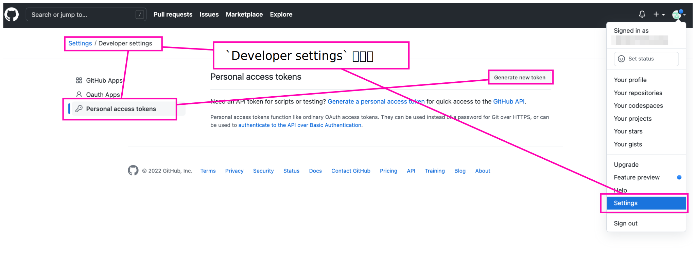

# Mac OS X 環境での Personal access token 認証 & SSH 接続

## Generate Personal access tokens

  
  

`Generate token` をクリックすると下図のように Developer settings の画面にもどる。  
この画面で生成された Personal access token がコピーできるので、メモしておく。  

<CAUTION!>  
生成された Personal access token がコピーできるのはこの画面だけで、再度 Personal access token のページに来てもコピーできなくなる。なので忘れずにメモしておく。  
</CAUTION!>

  


## Gererate SSH Key

ターミナルを開いて、以下のように進める。

```
# ↓ 公開鍵と秘密鍵の作成
$ ssh-keygen
Generating public/private rsa key pair.
Enter file in which to save the key (/Users/XXX/.ssh/id_rsa): # ←　変更の必要がなければ、このまま Enter 
Created directory '/Users/XXX/.ssh'.
Enter passphrase (empty for no passphrase): # ←ここに適当なパスフレーズ
Enter same passphrase again: # ←設定したパスフレーズを再入力
Your identification has been saved in /Users/******/.ssh/id_rsa.
Your public key has been saved in /Users/******/.ssh/id_rsa.pub.
The key fingerprint is:
SHA256:******************************************* ******@******
The key's randomart image is:
+---[RSA 3072]----+
|*****************|
|*****************|
|*****************|
|*****************|
|*****************|
|*****************|
|*****************|
|*****************|
|*****************|
+----[SHA256]-----+

# ↓ キーチェーンに登録
$ ssh-add ~/.ssh/id_rsa
Enter passphrase for /Users/******/.ssh/id_rsa:  # ←設定したパスフレーズを入力
Identity added: /Users/******/.ssh/id_rsa (******@******)

$ touch ~/.ssh/config
$ vi  ~/.ssh/config
```
`i` キーで INSERT モードに変更して、以下内容を記載
```
Host github.com
  HostName github.com
  IdentityFile ~/.ssh/id_rsa
  User git
```
`esc` で INSERT モードを終了して、`:wq` で保存して vi を終了


## Login using Personal Access token

適当なリポジトリを作成して push する。すると下図のようにパスワードを聞かれるので、

  