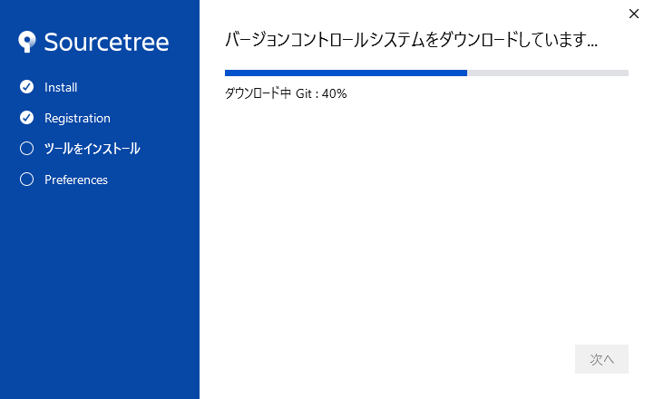

# GitHub Setting

## GitHubの公開リポジトリでメールアドレスを公開しないようにする

GitHub の `Settings` -> `Emails` -> `Keep my email addresses private`  にチェックを入れる。


`~@users.noreply.github.com`  の内容を以下のように Source Tree の `ツール` -> `オプション` -> `全般` -> `デフォルトユーザー情報` -> `メールアドレス` に反映する。  

  

## 新規リポジトリ作成時のブランチ名は、`master` が無難

既存のブランチの多くが `master` ブランチをメインとしている。  
なので、それを参照する submodule を含むリポジトリの場合、参照名が変わってしまうと不都合がでる。以下を編集して `master` にしておくのが無難。  

  

# Sourcetree Setting

## 1st Launch of Sourcetree

  
  
  
  

  
  

### 認証の追加

`<CAUTION>`事前に、OS のデフォルトのウェブブラウザで GitHub にアクセスして、ログインしておく。ウェブブラウザ画面は開いたままにしておく。`</CAUTION>`

  

`Oauth トークンを読み込み` を押すと、ウェブブラウザがフォアグラウンドとなり、以下画面が表示されるはずだ。  

  

Sourcetree 側の画面は以下の様になり、`認証に成功` と表示されるはずだ。  

  

### テストコミット

`<CAUTION!>`  
Mac OS X の場合は、[Mac OS X で push 出来なくなった時](./Mac%20OS%20X%20で%20push%20出来なくなった時.md) の設定を実施しておく。  
`</CAUTION!>`

試しに Github 側でテストリポジトリを作って、そのリポジトリにプッシュ可能かどうかを確認する。  
(リポジトリの作成 -> クローン -> ローカルでコミットするまでの手順は省略)  
初回のプッシュ時は以下画面が表示される。

  

`<TIPS>`  
`CredentialHelper` にはいくつか種類があり、概ね以下のような意味がある。

 - `no helper` -> helper を使わない = プッシュ毎にユーザー名、パスワードを入力する
 - `manager` -> Git Credential Manager for Windows を使う
 - `store` -> git-credential-store を使う
 - `wincred` -> git-credential-wincred を使う

`store` はパスワードを平文で保存するので勧められない。  
`manager` と `wincred` は普通に使う分にはあまり違いはないどちらも Windows の資格情報に暗号化されて保存される。(`manager` のほうが少し高機能らしい)  

パスワードをどこにも保存したくなければ、`no helper` 楽をしたいなら、`manager` を選ぶ程度の感覚。  

`</TIPS>`

### ユーザーを変更したいときは

`<CAUTION>`事前に、OS のデフォルトのウェブブラウザで GitHub にアクセスして、ログインしておく。ウェブブラウザ画面は開いたままにしておく。`</CAUTION>`

  
  
  
  

# Setting

## アプリの文字コードはUTF-8のままが無難

  

## gitの改行コード自動変更はfalseが無難

適当な PJ のターミナルを開いて、以下 2つを入力する。

### 1. For global configuration
```
git config --global core.autocrlf false
```

### 2. For system configuration
```
git config --system core.autocrlf false
# MAC OSX の場合は `sudo` を付加しないと `Permission denied` となってしまった
```

`<TIPS>`

configuratin ファイルの在り処が分かっているなら、直接テキストエディタで編集してもいい。  
例えば筆者の環境では、global 用、system 用それぞれ以下のように変更した

### 1. For global configuration

configuratin ファイルの在り処は、  
`C:\Users\<user-name>\.gitconfig`  
※ MAC OSX の場合は、  
`/Users/<username>/.gitconfig`  

以下のように変更した(左が変更前、右が変更後)  
  

### 2. For system configuration
   
configuratin ファイルの在り処は、  

`C:\Users\<user-name>\AppData\Local\Atlassian\SourceTree\git_local\etc\gitconfig`  
もしくは  
`C:\Users\<user-name>\AppData\Local\Atlassian\SourceTree\git_local\mingw32\etc\gitconfig`  
※ MAC OSX の場合は、  
`/private/etc/gitconfig`  

以下のように変更した(左が変更前、右が変更後)  
  


`</TIPS>`

## ファイル単位でwinmergeを使った差分比較

以下のように設定するだけ  

  

差分を表示する時は以下のようにする  

  


## コミット間でWinmergeを使った差分比較

### 1 system 用 configuration ファイル設定

以下内容をsystem 用 configuration ファイル内に貼り付ける  

`<CAUTION!>`  

 - `WinMergeU.exe` のパスは環境によって異なる。以下は筆者の環境の例。  
 - `path = ` に指定する文字列はスペースを含んでいても、`"` で囲うなどしなくていい。  
  
`</CAUTION!>`  

```
[diff]
	tool = WinMerge
[difftool "WinMerge"]
	path = C:/Program Files (x86)/WinMerge/WinMergeU.exe
	cmd = \"C:/Program Files (x86)/WinMerge/WinMergeU.exe\" -f \"*.*\" -e -u -r \"$LOCAL\" \"$REMOTE\"
[merge]
	tool = WinMerge
[mergetool "WinMerge"]
	path = C:/Program Files (x86)/WinMerge/WinMergeU.exe
	cmd = \"C:/Program Files (x86)/WinMerge/WinMergeU.exe\" -e -u \"$LOCAL\" \"$REMOTE\" \"$MERGED\"
[alias]
	windiff = difftool -y -d -t WinMerge
	winmerge = mergetool -y -t WinMerge
```
### git のパスを通す

環境変数に `git.exe` が存在するパスを設定する。  

筆者の環境では、`git.exe` は以下に存在した  
`C:\Users\<user-name>\AppData\Local\Atlassian\SourceTree\git_local\bin\git.exe`  

このパス(`~\bin` まで)を以下のように登録する  

  

### カスタム操作を定義

同封の `GetDirDiff.bat` を PC 内の好きな場所に配置する。  
この例では、以下に配置したこととして説明を続ける。  
`C:\Utility\GetDirDiff.bat`  

その後、

`オプション` -> `カスタム操作` タブ -> `追加` -> `カスタム操作を編集` で以下のように設定する。  

  

以上でコミット間でWinmergeを使った差分比較の設定は終了。  
差分を表示する時は以下のようにする  

`<NOTE>`  
筆者の環境では、なぜか Source Tree を再起動してからでないと `GetDirDiff.bat` が叩かれなかった。  
(Source Tree ver 3.3.8 , git version 2.24.1.windows.2, Windows10 64bit 環境)  
`</NOTE>`

  


## Force push 可能にする

`<TIPS>`  
[Author と Comitter を間違ってコミットした場合に後で修正](./change-author.md) できるように、この設定をしておく。  
`</TIPS>`

  
