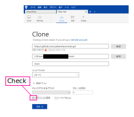
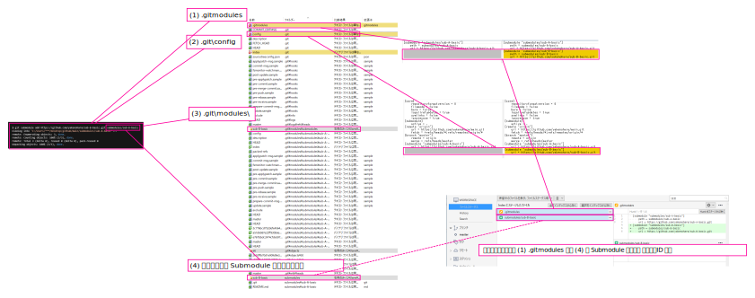

# Submodule を含むリポジトリのクローン

クローン時に `サブモジュールに再帰` にチェックを入れるだけ

  


# クローン後に Submodule を追加する

```
# format
git submodule add (repository) (local-path)
# e.g.
git submodule add https://github.com/twbs/bootstrap.git bootstrap
```

`<TIPS>`

`git submodule add` したリポジトリもまたサブモジュールを含んでいるなら、  
そのサブモジュールのターミナルを開いて `git submodule update --init --recursive` する

`</TIPS>`

`<CAUTION!>`  

空のリポジトリはダメ  

`</CAUTION!>`  

## `<TIPS>`  Submodule を削除する場合は

`git submodule add` では config 以外にも複数の管理情報が更新される。  
下図は `sub-B-basic` というリポジトリを `submodules/sub-B-basic` に `git submodule add` した例。  
図中に記した (1)~(4) の変更点は、後にこのサブモジュールを削除する必要が発生した際、手作業で削除する必要がある。※ サブモジュールを削除する方法として `git submodule deinit` を使う方法があるが、この方法は 下図の内の `(2) .git\config` しか削除してくれない。なので手作業で削除するしかない。  
  

`</TIPS>`

# すべての Submodule の...

## ローカルの master にチェックアウト

```
git submodule foreach --recursive 'git checkout master > /dev/null 2>&1'
```

`<NOTE>` ` > /dev/null 2>&1` とは、「標準エラー出力 (`2`) の結果を標準出力 (`1`) にマージして、`/dev/null` に捨てる」という意味。`</NOTE>`  

## HEAD が origin/master にくらべてどれだけ遅れているか

```
git submodule foreach --recursive 'git fetch --all > /dev/null ; git log HEAD..origin/master --graph --oneline'
```

`<TIPS>`  
### ローカルの master が origin/master にくらべてどれだけ遅れているか
`<CAUTION!>`ローカルの master にチェックアウトするコマンドが入っている`</CAUTION!>`  
```
git submodule foreach --recursive 'git checkout master > /dev/null 2>&1 ; git fetch --all > /dev/null ; git log HEAD..origin/master --graph --oneline'
```
`</TIPS>`  

## origin/master をプル

```
git submodule foreach --recursive 'git pull origin master --no-rebase'
```

## HEAD からの変更点をチェック

```
git submodule foreach --recursive 'git status --short'
```

## HEAD からの変更点を破棄

```
git submodule foreach --recursive 'git reset . ; git clean --force -d ; git checkout .'
```

## リモートリポジトリに Submodule が追加されたら

```
.testA
┗sub/testA-A1
  ┗sub/testA1-a
```

```
# submodule の確認(左側の`-` は、submodule を pull したけれど、ローカルの PJ 配下のディレクトリ構成には反映していない状態を意味する)
> git submodule ; git submodule foreach --recursive 'git submodule'
-f8027fd91fbf2c7dcbdcae0afa7c7f99823c87d5 sub/testA-A1

# submodule を再帰的に update & init
> git submodule update --init ; git submodule foreach --recursive 'git submodule update --init'
Submodule 'sub/testA-A1' (https://github.com/yakenohara/testA-A1.git) registered for path 'sub/testA-A1'
Cloning into 'D:/testA/sub/testA-A1'...
Submodule path 'sub/testA-A1': checked out 'f8027fd91fbf2c7dcbdcae0afa7c7f99823c87d5'
Entering 'sub/testA-A1'
Submodule 'sub/testA-A1-a' (https://github.com/yakenohara/testA-A1-a.git) registered for path 'sub/testA-A1-a'
Cloning into 'D:/testA/sub/testA-A1/sub/testA-A1-a'...
Submodule path 'sub/testA-A1-a': checked out '23723481abab88541e823fcf2d03f6e5e9cfcb7a'
Entering 'sub/testA-A1/sub/testA-A1-a'

# ↓ `-` が無くなった
> git submodule ; git submodule foreach --recursive 'git submodule'
 f8027fd91fbf2c7dcbdcae0afa7c7f99823c87d5 sub/testA-A1 (heads/master)
Entering 'sub/testA-A1'
 23723481abab88541e823fcf2d03f6e5e9cfcb7a sub/testA-A1-a (heads/master)
Entering 'sub/testA-A1/sub/testA-A1-a'


```

## 特定のユーザー名によるコミットがされていないかどうか (複数指定 (AND 条件))

```
git submodule foreach --recursive 'git log --perl-regexp --author="^((?!yakenohara|Shinnosuke Yakenohara).*)$"'
```
