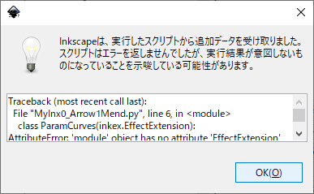
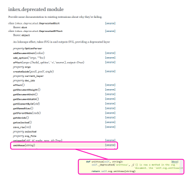

# ver 0.92 だと以下エラーが出る  

  


```
Traceback (most recent call last):
  File "MyInx0_Arrow1Mend.py", line 6, in <module>
    class ParamCurves(inkex.EffectExtension):
AttributeError: 'module' object has no attribute 'EffectExtension'
```

# unittouu

何をする method なのか不明。
スタイルに対して '??px' をプロパティ値として適用したい場合に、以下のようにすれば意図通りのピクセル数が適用される。  

```python
# `node` object は操作対象の svg node object
node_style = dict(inkex.Style.parse_str(node.get('style')))
node_style['stroke-width'] = self.svg.unittouu('5px') # <- here
node.set('style', str(inkex.Style(node_style)))
```
もともと存在した `index.unittouu` (<- この呼び方で正しいかどうか、ver 1.0 となった今となっては不明) deprecated な機能となったらしいが、代わりに使ってくれといっている `self.svg.unittouu(str)` のドキュメントが見つからない。  

https://inkscape.gitlab.io/extensions/documentation/inkex.html#inkex.deprecated.DeprecatedEffect.unittouu
  

