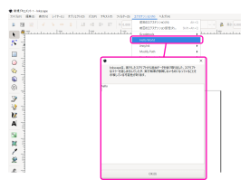
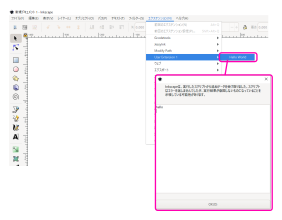
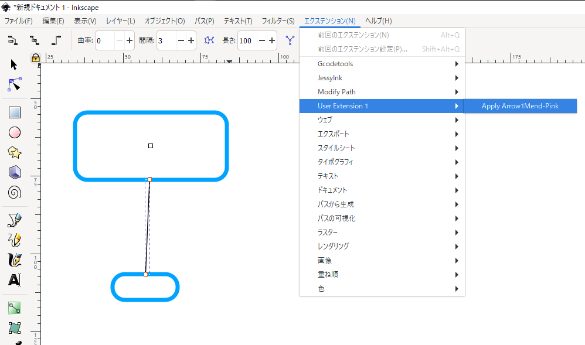
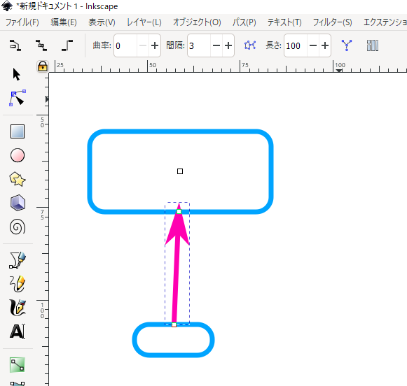

# Hello World

1. Place Extension  

Inkscape を起動する前に、`\examples\01-hello-world` 配下の以下2ファイルを `C:\Users\<username>\AppData\Roaming\inkscape\extensions` ※配下に配置する。  

 - hello_world.inx  
 - hello_world.py  

※ `C:\Program Files\Inkscape\share\inkscape\extensions` 配下でもいい。  

※ MAC OSX の場合は、`/Users/<username>/Library/Application Support/org.inkscape.Inkscape/config/inkscape/extensions`  

1. Run  

Inkscape を起動したら、`エクステンション` -> `Hello World` が選択できるようになっているはずだ。  
クリックするだけでいい。  

  

# Hierarchize Menu

1. Place Extension  
   以下ファイルを `Hello World` の時同様に配置する。(Inkscape を起動する前に配置する必要がある事を忘れずに。)  

`\examples\02-hierarchize-menu`  
 - hello_world.inx  
 - hello_world.py  

2. Run  
   Inkscape を起動したら、`エクステンション` -> `User Extension 1` -> `Hello World` が選択できるようになっているはずだ。  
クリックするだけでいい。  

  

# Apply Style, Marker

オブジェクトに style, marker を適用する例。  

1. Place Extension  

`\examples\03-apply-arrow-style` 配下の以下2つ。  

 - my_inx_01_apply_arrow1mend_pink.inx
 - my_inx_01_apply_arrow1mend_pink.py

2. Run  

Inkscape を起動したら、`エクステンション` -> `User Extension 1` -> `Apply Arrow1Mend-Pink` が選択できるようになっているはずだ。  

  

↓ クリックしたら、 選択状態の パス要素が 太さ'5px'、色はピンクで終端に矢印が適用される ↓  

  
