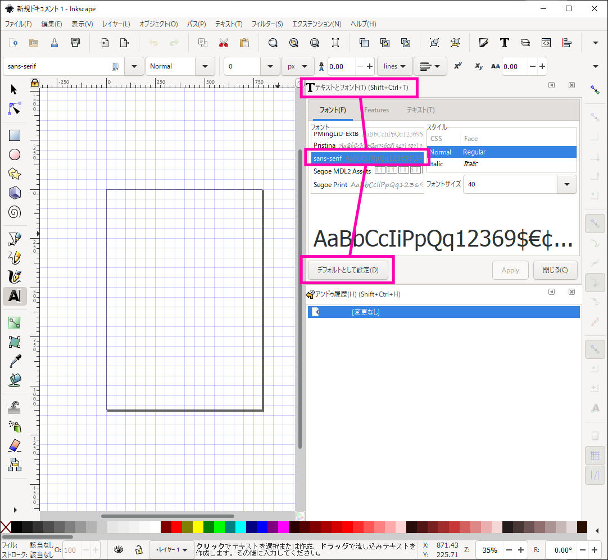

# テキストのデフォルトフォントは `sans-serif` が無難

Windows にインストールした Inkscape では、テキストのデフォルトフォントが `MS Gothic` になっている。MAC OSX でも編集可能なように、より一般的な `sans-serif` にしておいた方が無難。  

# 起動時のデフォルトのテンプレートを変更する

希望のテンプレートを作ったら、以下いずれかのパスとして保存する。

1. `C:\Users\<username>\AppData\Roaming\inkscape\templates\default.ja.svg`  
2. `C:\Program Files\Inkscape\share\inkscape\templates\default.ja.svg`  

※ 1. 2. 両方存在する場合は、1 のテンプレートが優先される。

※ MAC OSX の場合は、  

`/Users/<username>/Library/Application Support/org.inkscape.Inkscape/config/inkscape/templates/default.ja.svg`

※ `ファイル(F)` -> `名前を付けて保存(A)...` -> `ファイルの保存先の選択` ウィンドウで、画面左側の `templates` にマウスをフォーカスすると、`templates` ディレクトリのパスが表示される。
