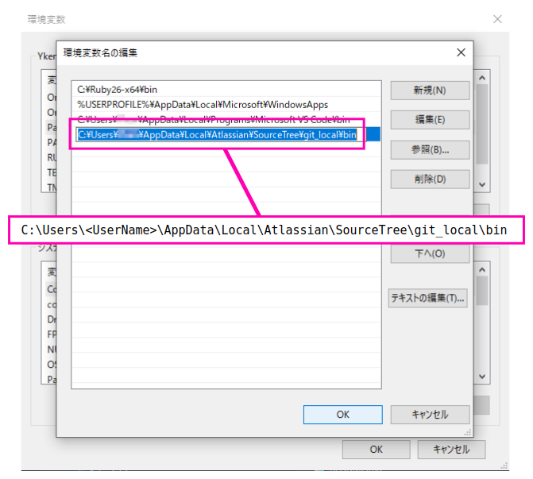

# プリインのテンプレートを使う

任意のディレクトリ配下で `jekyll new .` する。  
↓ C:/xxx/xxx 配下で実行した例。  

```
>jekyll new .
Running bundle install in C:/xxx/xxx...
  Bundler: Fetching gem metadata from https://rubygems.org/...........
  Bundler: Fetching gem metadata from https://rubygems.org/.
  Bundler: Resolving dependencies...
  Bundler: Using public_suffix 4.0.3
  Bundler: Using addressable 2.7.0
----------------------------Omitting----------------------------
  Bundler: Fetching wdm 0.1.1
  Bundler: Installing wdm 0.1.1 with native extensions
  Bundler: Bundle complete! 6 Gemfile dependencies, 34 gems now installed.
  Bundler: Use `bundle info [gemname]` to see where a bundled gem is installed.
New jekyll site installed in C:/xxx/xxx.
```

あとは `jekyll serve` すれば、ディレクトリ配下のマークダウンファイルを自動で html に変換してくれる。

```
>jekyll serve
Configuration file: C:/xxx/xxx/_config.yml
            Source: C:/xxx/xxx
       Destination: C:/xxx/xxx/_site
 Incremental build: disabled. Enable with --incremental
      Generating...
       Jekyll Feed: Generating feed for posts
                    done in 0.734 seconds.
 Auto-regeneration: enabled for 'C:/xxx/xxx'
    Server address: http://127.0.0.1:4000/
  Server running... press ctrl-c to stop.
```

この時点で、`Server address: ` に表示された `http://127.0.0.1:4000/` に、プラウザからアクセスできる。  
以降はディレクトリ配下は Jekyll に常に監視され、マークダウンファイルが 追加 / 変更 / 削除 される度にページが自動生成される。  

例えば、以下内容の index.md ファイルを作る。

```
---
layout: default
---
# title
hello world!

```
これをディレクトリ配下に配置すると、、、
```
      Regenerating: 1 file(s) changed at 2020-03-13 12:15:26
                    index.md
       Jekyll Feed: Generating feed for posts
                    ...done in 0.144922 seconds.
```
ブラウザをリロードすると、、
  

# ネットから入手した Jekyll PJ を使う

Github Pages がサポートするテーマ [Architect](https://github.com/pages-themes/architect) を使う例。

Clone もしくは DL した PJ の配下で、 `bundle install`。

```
>bundle install
fatal: not a git repository (or any of the parent directories): .git
Fetching gem metadata from https://rubygems.org/..........
Fetching gem metadata from https://rubygems.org/.
Resolving dependencies...
Using public_suffix 4.0.3
Using addressable 2.7.0
Fetching ast 2.4.0
Installing ast 2.4.0
Using bundler 2.1.4
Using colorator 1.1.0
Using concurrent-ruby 1.1.6
Using eventmachine 1.2.7 (x64-mingw32)
Using http_parser.rb 0.6.0
Using em-websocket 0.5.1
Using ffi 1.12.2 (x64-mingw32)
Fetching ethon 0.12.0
Installing ethon 0.12.0
---------------------------Omitting---------------------------
Fetching rubocop 0.80.1
Installing rubocop 0.80.1
Fetching w3c_validators 1.3.5
Installing w3c_validators 1.3.5
Bundle complete! 4 Gemfile dependencies, 46 gems now installed.
Use `bundle info [gemname]` to see where a bundled gem is installed.
Post-install message from nokogiri:
Nokogiri is built with the packaged libraries: libxml2-2.9.10, libxslt-1.1.34, zlib-1.2.11, libiconv-1.15.
```

`<TIPS>`  

## `No such file or directory - git ls-files -z.` となってしまう時は

以下の様に `No such file or directory - git ls-files -z.` となってしまう時は、git.exe のパスが通っているかどうかを確認するのがいい。  

```
D:\architect-master>bundle install

[!] There was an error parsing `Gemfile`:
[!] There was an error while loading `jekyll-theme-architect.gemspec`: No such file or directory - git ls-files -z. Bundler cannot continue.

 #  from D:/architect-master/jekyll-theme-architect.gemspec:12
 #  -------------------------------------------
 #    s.add_development_dependency 'w3c_validators', '~> 1.3'
 >  end
 #  # frozen_string_literal: true
 #  -------------------------------------------
. Bundler cannot continue.

 #  from D:/architect-master/Gemfile:5
 #  -------------------------------------------
 #
 >  gemspec
 #  # frozen_string_literal: true
 #  -------------------------------------------
```

下図は環境変数に git.exe のパスを追加する例。  
SourceTree のインストール時についてきた git.exe のパスを指定している。  


  

`</TIPS>`  

ここからは Try & Error。 まずは `jekyll serve` してみる。

```
>jekyll serve
fatal: not a git repository (or any of the parent directories): .git
Traceback (most recent call last):
        10: from C:/Ruby25-x64/bin/jekyll:23:in `<main>'
         9: from C:/Ruby25-x64/bin/jekyll:23:in `load'
         8: from C:/Ruby25-x64/lib/ruby/gems/2.5.0/gems/jekyll-4.0.0/exe/jekyll:11:in `<top (required)>'
         7: from C:/Ruby25-x64/lib/ruby/gems/2.5.0/gems/jekyll-4.0.0/lib/jekyll/plugin_manager.rb:52:in `require_from_bundler'
         6: from C:/Ruby25-x64/lib/ruby/gems/2.5.0/gems/bundler-2.1.4/lib/bundler.rb:149:in `setup'
         5: from C:/Ruby25-x64/lib/ruby/gems/2.5.0/gems/bundler-2.1.4/lib/bundler/runtime.rb:26:in `setup'
         4: from C:/Ruby25-x64/lib/ruby/gems/2.5.0/gems/bundler-2.1.4/lib/bundler/runtime.rb:26:in `map'
         3: from C:/Ruby25-x64/lib/ruby/gems/2.5.0/gems/bundler-2.1.4/lib/bundler/spec_set.rb:147:in `each'
         2: from C:/Ruby25-x64/lib/ruby/gems/2.5.0/gems/bundler-2.1.4/lib/bundler/spec_set.rb:147:in `each'
         1: from C:/Ruby25-x64/lib/ruby/gems/2.5.0/gems/bundler-2.1.4/lib/bundler/runtime.rb:31:in `block in setup'
C:/Ruby25-x64/lib/ruby/gems/2.5.0/gems/bundler-2.1.4/lib/bundler/runtime.rb:312:in `check_for_activated_spec!': You have already activated unicode-display_width 1.7.0, but your Gemfile requires unicode-display_width 1.6.1. Prepending `bundle exec` to your command may solve this. (Gem::LoadError)
```

```Prepending `bundle exec` to your command may solve this.``` とのことなので、    
`bundle exec jekyll serve` してみる。

```
>bundle exec jekyll serve
fatal: not a git repository (or any of the parent directories): .git
Configuration file: C:/PJ_dir/_config.yml
 Theme Config file: C:/PJ_dir/_config.yml
            Source: C:/PJ_dir
       Destination: C:/PJ_dir/_site
 Incremental build: disabled. Enable with --incremental
      Generating...
                    done in 0.771 seconds.
  Please add the following to your Gemfile to avoid polling for changes:
    gem 'wdm', '>= 0.1.0' if Gem.win_platform?
 Auto-regeneration: enabled for 'C:/PJ_dir'
    Server address: http://127.0.0.1:4000
  Server running... press ctrl-c to stop.
```
イケた。  
`http://127.0.0.1:4000` にアクセスすると、以下の通り。


# Jekyll Remote Theme

`Jekyll Remote Theme` とは、Github にある Jekyll PJ (Theme) を、Clone or DL することなく適用する方法の事。  
Github Pages がサポートするテーマ [Slate](https://github.com/pages-themes/slate) の例。

以下2点を準備する。  

1. Gemfile 設定
2. _config.yml 設定

## 1. Gemfile 設定

Gemfile に Remote Theme を使用する宣言を書く。  
以下内容を Gemfile 記載する。  
(Gemfile が存在しなければ、 `bundle init`すればいい。この記事に添付の /examples/Jekyll Remote Theme/Gemfile を使ってもいい。)
```
group :jekyll_plugins do
    gem 'github-pages'
end

gem 'jekyll-remote-theme'
```

## 2. _config.yml 設定

_config.yml Remote Theme を使用する Plugin 宣言と、適用する Theme の リポジトリ情報を記載する。  
以下内容を _config.yml に記載する。リポジトリは [Slate](https://github.com/pages-themes/slate) を指定する例。
```
plugins:
  - jekyll-remote-theme

remote_theme: pages-themes/slate
```

## 実行

まずは `bundle install` 

```
>bundle install
Fetching gem metadata from https://rubygems.org/...........
Fetching gem metadata from https://rubygems.org/.
Resolving dependencies...
Using concurrent-ruby 1.1.6
Fetching i18n 0.9.5
Installing i18n 0.9.5
---------------------------Omitting---------------------------
Fetching jekyll-remote-theme 0.4.2
Installing jekyll-remote-theme 0.4.2
Bundle complete! 2 Gemfile dependencies, 77 gems now installed.
Use `bundle info [gemname]` to see where a bundled gem is installed.
Post-install message from sass:

Ruby Sass has reached end-of-life and should no longer be used.

* If you use Sass as a command-line tool, we recommend using Dart Sass, the new
  primary implementation: https://sass-lang.com/install

* If you use Sass as a plug-in for a Ruby web framework, we recommend using the
  sassc gem: https://github.com/sass/sassc-ruby#readme

* For more details, please refer to the Sass blog:
  https://sass-lang.com/blog/posts/7828841

Post-install message from nokogiri:
Nokogiri is built with the packaged libraries: libxml2-2.9.10, libxslt-1.1.34, zlib-1.2.11, libiconv-1.15.
Post-install message from html-pipeline:
-------------------------------------------------
Thank you for installing html-pipeline!
You must bundle Filter gem dependencies.
See html-pipeline README.md for more details.
https://github.com/jch/html-pipeline#dependencies
-------------------------------------------------
```

ここからは Try & Error。  
`jekyll serve` してみる。  

```
>jekyll serve
Traceback (most recent call last):
        10: from C:/Ruby25-x64/bin/jekyll:23:in `<main>'
         9: from C:/Ruby25-x64/bin/jekyll:23:in `load'
         8: from C:/Ruby25-x64/lib/ruby/gems/2.5.0/gems/jekyll-4.0.0/exe/jekyll:11:in `<top (required)>'
         7: from C:/Ruby25-x64/lib/ruby/gems/2.5.0/gems/jekyll-4.0.0/lib/jekyll/plugin_manager.rb:52:in `require_from_bundler'
         6: from C:/Ruby25-x64/lib/ruby/gems/2.5.0/gems/bundler-2.1.4/lib/bundler.rb:149:in `setup'
         5: from C:/Ruby25-x64/lib/ruby/gems/2.5.0/gems/bundler-2.1.4/lib/bundler/runtime.rb:26:in `setup'
         4: from C:/Ruby25-x64/lib/ruby/gems/2.5.0/gems/bundler-2.1.4/lib/bundler/runtime.rb:26:in `map'
         3: from C:/Ruby25-x64/lib/ruby/gems/2.5.0/gems/bundler-2.1.4/lib/bundler/spec_set.rb:147:in `each'
         2: from C:/Ruby25-x64/lib/ruby/gems/2.5.0/gems/bundler-2.1.4/lib/bundler/spec_set.rb:147:in `each'
         1: from C:/Ruby25-x64/lib/ruby/gems/2.5.0/gems/bundler-2.1.4/lib/bundler/runtime.rb:31:in `block in setup'
C:/Ruby25-x64/lib/ruby/gems/2.5.0/gems/bundler-2.1.4/lib/bundler/runtime.rb:312:in `check_for_activated_spec!': You have already activated i18n 1.8.2, but your Gemfile requires i18n 0.9.5. Prepending `bundle exec` to your command may solve this. (Gem::LoadError)
```
``Prepending `bundle exec` to your command may solve this. `` とのことなので、  
`bundle exec jekyll serve` してみる

<CAUTION! これは プロキシ環境下で発生する>

```
>bundle exec jekyll serve
Configuration file: C:/PJ_dir/_config.yml
            Source: C:/PJ_dir
       Destination: C:/PJ_dir/_site
 Incremental build: disabled. Enable with --incremental
      Generating...
      Remote Theme: Using theme pages-themes/slate
jekyll 3.6.2 | Error:  407 "Proxy Authentication Required"
```
プロキシ設定は、環境変数にも、MSYS2 設定にも行っているのに、`Proxy Authentication Required` と出た。  
メッセージを見る限り、どうやらこのエラーは jekyll が吐いているらしい。
`jekyll --help` で実行オプションを確認すると、`-t` をつけると詳細なトレースができるらしい。
`bundle exec jekyll serve -t` してみる。

```
>bundle exec jekyll serve -t
Configuration file: C:/PJ_dir/_config.yml
            Source: C:/PJ_dir
       Destination: C:/PJ_dir/_site
 Incremental build: disabled. Enable with --incremental
      Generating...
      Remote Theme: Using theme pages-themes/slate
Traceback (most recent call last):
        24: from C:/Ruby25-x64/bin/jekyll:23:in `<main>'
        23: from C:/Ruby25-x64/bin/jekyll:23:in `load'
        22: from C:/Ruby25-x64/lib/ruby/gems/2.5.0/gems/jekyll-3.6.2/exe/jekyll:15:in `<top (required)>'
        21: from C:/Ruby25-x64/lib/ruby/gems/2.5.0/gems/mercenary-0.3.6/lib/mercenary.rb:19:in `program'
        20: from C:/Ruby25-x64/lib/ruby/gems/2.5.0/gems/mercenary-0.3.6/lib/mercenary/program.rb:42:in `go'
        19: from C:/Ruby25-x64/lib/ruby/gems/2.5.0/gems/mercenary-0.3.6/lib/mercenary/command.rb:220:in `execute'
        18: from C:/Ruby25-x64/lib/ruby/gems/2.5.0/gems/mercenary-0.3.6/lib/mercenary/command.rb:220:in `each'
        17: from C:/Ruby25-x64/lib/ruby/gems/2.5.0/gems/mercenary-0.3.6/lib/mercenary/command.rb:220:in `block in execute'
        16: from C:/Ruby25-x64/lib/ruby/gems/2.5.0/gems/jekyll-3.6.2/lib/jekyll/commands/serve.rb:42:in `block (2 levels) in init_with_program'
        15: from C:/Ruby25-x64/lib/ruby/gems/2.5.0/gems/jekyll-3.6.2/lib/jekyll/commands/serve.rb:42:in `each'
        14: from C:/Ruby25-x64/lib/ruby/gems/2.5.0/gems/jekyll-3.6.2/lib/jekyll/commands/serve.rb:42:in `block (3 levels) in init_with_program'
        13: from C:/Ruby25-x64/lib/ruby/gems/2.5.0/gems/jekyll-3.6.2/lib/jekyll/commands/build.rb:36:in `process'
        12: from C:/Ruby25-x64/lib/ruby/gems/2.5.0/gems/jekyll-3.6.2/lib/jekyll/commands/build.rb:65:in `build'
        11: from C:/Ruby25-x64/lib/ruby/gems/2.5.0/gems/jekyll-3.6.2/lib/jekyll/command.rb:28:in `process_site'
        10: from C:/Ruby25-x64/lib/ruby/gems/2.5.0/gems/jekyll-3.6.2/lib/jekyll/site.rb:70:in `process'
         9: from C:/Ruby25-x64/lib/ruby/gems/2.5.0/gems/jekyll-3.6.2/lib/jekyll/site.rb:104:in `reset'
         8: from C:/Ruby25-x64/lib/ruby/gems/2.5.0/gems/jekyll-3.6.2/lib/jekyll/hooks.rb:99:in `trigger'
         7: from C:/Ruby25-x64/lib/ruby/gems/2.5.0/gems/jekyll-3.6.2/lib/jekyll/hooks.rb:99:in `each'
         6: from C:/Ruby25-x64/lib/ruby/gems/2.5.0/gems/jekyll-3.6.2/lib/jekyll/hooks.rb:100:in `block in trigger'
         5: from C:/Ruby25-x64/lib/ruby/gems/2.5.0/gems/jekyll-remote-theme-0.4.2/lib/jekyll-remote-theme.rb:33:in `block in <top (required)>'
         4: from C:/Ruby25-x64/lib/ruby/gems/2.5.0/gems/jekyll-remote-theme-0.4.2/lib/jekyll-remote-theme.rb:27:in `init'
         3: from C:/Ruby25-x64/lib/ruby/gems/2.5.0/gems/jekyll-remote-theme-0.4.2/lib/jekyll-remote-theme/munger.rb:25:in `munge!'
         2: from C:/Ruby25-x64/lib/ruby/gems/2.5.0/gems/jekyll-remote-theme-0.4.2/lib/jekyll-remote-theme/downloader.rb:24:in `run'
         1: from C:/Ruby25-x64/lib/ruby/gems/2.5.0/gems/jekyll-remote-theme-0.4.2/lib/jekyll-remote-theme/downloader.rb:40:in `download'
C:/Ruby25-x64/lib/ruby/gems/2.5.0/gems/jekyll-remote-theme-0.4.2/lib/jekyll-remote-theme/downloader.rb:53:in `rescue in download': 407 "Proxy Authentication Required" (Jekyll::RemoteTheme::DownloadError)
```
`jekyll-remote-theme/downloader.rb:53` でコケているらしい。  
.rb ファイルはテキスト形式のファイルなので、エディタで開いてみる

```ruby
      def download
        Jekyll.logger.debug LOG_KEY, "Downloading #{zip_url} to #{zip_file.path}"
        Net::HTTP.start(zip_url.host, zip_url.port, :use_ssl => true) do |http|
          http.request(request) do |response|
            raise_unless_sucess(response)
            enforce_max_file_size(response.content_length)
            response.read_body do |chunk|
              zip_file.write chunk
            end
          end
        end
        @downloaded = true
      rescue *NET_HTTP_ERRORS => e
        raise DownloadError, e.message
      end
```
`raise DownloadError, e.message` が 53 行目。  
エラー内容が `Proxy Authentication Required` だったから、きっと `Net::HTTP.start` の実行でプロキシが指定できていないんだろう。  
[`Net::HTTP.start` の仕様](https://ruby-doc.org/stdlib-2.7.0/libdoc/net/http/rdoc/Net/HTTP.html#method-c-start) を見ると、引数にプロキシ設定を適用できるらしい。  
早速 `Net::HTTP.start(~` を以下の様に変更してみる。  

```ruby
        # Before
        # Net::HTTP.start(zip_url.host, zip_url.port, :use_ssl => true) do |http|

        # After
        Net::HTTP.start(zip_url.host, zip_url.port, '<proxyserver.domain>', <port>, '<ID>', '<password>', :use_ssl => true) do |http|
```

この状態で、再度 `bundle exec jekyll serve -t`  


```
>bundle exec jekyll serve -t
Configuration file: C:/PJ_dir/_config.yml
            Source: C:/PJ_dir
       Destination: C:/PJ_dir/_site
 Incremental build: disabled. Enable with --incremental
      Generating...
      Remote Theme: Using theme pages-themes/slate
                    done in 0.471 seconds.
  Please add the following to your Gemfile to avoid polling for changes:
    gem 'wdm', '>= 0.1.0' if Gem.win_platform?
 Auto-regeneration: enabled for 'C:/PJ_dir'
    Server address: http://127.0.0.1:4000
  Server running... press ctrl-c to stop.
```

イケた。  
どうやら、`bundle install` でインストールされた `jekyll-remote-theme-0.4.2` はプロキシ環境下を想定していないらしい。  
[jekyll-remote-theme の リポジトリ](https://github.com/benbalter/jekyll-remote-theme) にも プロキシに関する記載が見当たらないので、現状はこの方法が唯一の解決方法?

</CAUTION! これは プロキシ環境下で発生する>

```
>bundle exec jekyll serve
Configuration file: C:/PJ_dir/_config.yml
            Source: C:/PJ_dir
       Destination: C:/PJ_dir/_site
 Incremental build: disabled. Enable with --incremental
      Generating...
      Remote Theme: Using theme pages-themes/slate
                    done in 0.613 seconds.
  Please add the following to your Gemfile to avoid polling for changes:
    gem 'wdm', '>= 0.1.0' if Gem.win_platform?
 Auto-regeneration: enabled for 'C:/PJ_dir'
    Server address: http://127.0.0.1:4000
  Server running... press ctrl-c to stop.
```

この状態で、以下内容を index.md を作成する。

```
---
layout: default
---
# Title
body
```
PJ 配下にこのファイルを配置すると、コマンドプロンプトは以下の様になる
```
  Server running... press ctrl-c to stop.
      Regenerating: 1 file(s) changed at 2020-03-17 15:35:49       Remote Theme: Using theme pages-themes/slate
fatal: not a git repository (or any of the parent directories): .git
   GitHub Metadata: No GitHub API authentication could be found. Some fields may be missing or have incorrect data.
   GitHub Metadata: Error processing value 'title':
  Liquid Exception: No repo name found. Specify using PAGES_REPO_NWO environment variables, 'repository' in your configuration, or set up an 'origin' git remote pointing to your github.com repository. in /_layouts/default.html
...error:
             Error: No repo name found. Specify using PAGES_REPO_NWO environment variables, 'repository' in your configuration, or set up an 'origin' git remote pointing to your github.com repository.
             Error: Run jekyll build --trace for more information.
```
またエラーだ。  


`Error processing value 'title'` とある。 
テンプレートが参照しようとしている変数の `title` の事かもしれない。  
※Web ページの タイトルは 記事毎に定義されるべきであって、  
テンプレートの内部で定義されるべきものではないから、この `title` は remote-theme ではなく ローカル の _config.yml の `title` を探しているのかもしれない。  

_config.yml に `title: Remote Theme Test` を追記して `bundle exec jekyll serve` してみる。

```
>bundle exec jekyll serve
Configuration file: C:/PJ_dir/_config.yml
            Source: C:/PJ_dir
       Destination: C:/PJ_dir/_site
 Incremental build: disabled. Enable with --incremental
      Generating...
      Remote Theme: Using theme pages-themes/slate
fatal: not a git repository (or any of the parent directories): .git
   GitHub Metadata: No GitHub API authentication could be found. Some fields may be missing or have incorrect data.
   GitHub Metadata: Error processing value 'description':
  Liquid Exception: No repo name found. Specify using PAGES_REPO_NWO environment variables, 'repository' in your configuration, or set up an 'origin' git remote pointing to your github.com repository. in /_layouts/default.html
             ERROR: YOUR SITE COULD NOT BE BUILT:
                    ------------------------------------
                    No repo name found. Specify using PAGES_REPO_NWO environment variables, 'repository' in your configuration, or set up an 'origin' git remote pointing to your github.com repository.
```
`Error processing value 'title'` はなくなったけれど、今度は `Error processing value 'description'` と出た。  
_config.yml に `description: This is description of Remote Theme Test` を追記して `bundle exec jekyll serve` してみる。  

```
>bundle exec jekyll serve
Configuration file: C:/PJ_dir/_config.yml
            Source: C:/PJ_dir
       Destination: C:/PJ_dir/_site
 Incremental build: disabled. Enable with --incremental
      Generating...
      Remote Theme: Using theme pages-themes/slate
fatal: not a git repository (or any of the parent directories): .git
  Liquid Exception: No repo name found. Specify using PAGES_REPO_NWO environment variables, 'repository' in your configuration, or set up an 'origin' git remote pointing to your github.com repository. in /_layouts/default.html
             ERROR: YOUR SITE COULD NOT BE BUILT:
                    ------------------------------------
                    No repo name found. Specify using PAGES_REPO_NWO environment variables, 'repository' in your configuration, or set up an 'origin' git remote pointing to your github.com repository.
```

`Error processing value ~` 系のエラーはなくなったけれど、`No repo name found` エラーは残ったままだ。  
`bundle exec jekyll serve -t` してみる。
```
>bundle exec jekyll serve -t
Configuration file: C:/PJ_dir/_config.yml
            Source: C:/PJ_dir
       Destination: C:/PJ_dir/_site
 Incremental build: disabled. Enable with --incremental
      Generating...
      Remote Theme: Using theme pages-themes/slate
fatal: not a git repository (or any of the parent directories): .git
  Liquid Exception: No repo name found. Specify using PAGES_REPO_NWO environment variables, 'repository' in your configuration, or set up an 'origin' git remote pointing to your github.com repository. in /_layouts/default.html
             ERROR: YOUR SITE COULD NOT BE BUILT:
                    ------------------------------------
                    No repo name found. Specify using PAGES_REPO_NWO environment variables, 'repository' in your configuration, or set up an 'origin' git remote pointing to your github.com repository.
```

今回は、`-t` オプションでも詳細なエラーは取れないようだ。  


[ググってみる](https://github.com/github/pages-gem/issues/399) と、当初のエラーだった `No GitHub API authentication could be found` は _config.yml に `github: [metadata]` を記載する事で回避できるらしい。  
早速その記載をして、再度 `bundle exec jekyll serve` してみる。

```
>bundle exec jekyll serve
Configuration file: C:/PJ_dir/_config.yml
            Source: C:/PJ_dir
       Destination: C:/PJ_dir/_site
 Incremental build: disabled. Enable with --incremental
      Generating...
      Remote Theme: Using theme pages-themes/slate
                    done in 0.673 seconds.
  Please add the following to your Gemfile to avoid polling for changes:
    gem 'wdm', '>= 0.1.0' if Gem.win_platform?
 Auto-regeneration: enabled for 'C:/PJ_dir'
    Server address: http://127.0.0.1:4000
  Server running... press ctrl-c to stop.
```
イケた。
`http://127.0.0.1:4000` にアクセスすると、以下の通り。

 

## _config.yml の `github: [metadata]` はどんな時に記載が必要か

Clone or DL した [Slate](https://github.com/pages-themes/slate) の PJ 内を、_config.yml 追加した 変数 `github` で GREP すると、\_layouts\default.html 内に以下コードが見つかる。  

```
          
```

つまり、この Jekyll Theme で使われる テンプレートが、`github` という変数を参照しているという事。  

`github` という変数を参照しているテンプレートを使用している Jekyll PJ (Theme) を、直接 Clone or DL して `bundle install` -> `bundle exec jekyll serve` する場合は不要だけど、Remote Theme として動作させる場合は必要な定義という事らしい。  

ここにくるまでに作成した _config.yml, Gemfile, index.md は以下  

/examples/Jekyll Remote Theme/Gemfile
