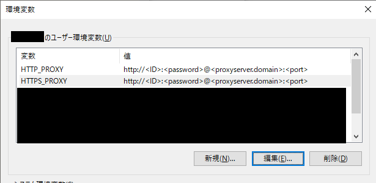

# Overview

Jekyll は Ruby 上で動作するもの。これを Ruby 用語的には、*Jekyll は Ruby で動作する gem である* という。  
※ `gem` とは、Ruby で扱われるライブラリ(`パッケージ` とか、 `モジュール` とか言われるもの)のこと。  
Ruby を Windows で動作させるためには、MSYS2 が必要。Cygwin ではNG。

そのため、Jeykyll を Windows で動作させる為には、以下3つが必要。

 - MSYS2
 - Ruby
 - Jekyll

[Jekyllの公式ページで書かれている `Requirements`](https://jekyllrb.com/docs/installation/#requirements) は、  
後述の Ruby のインストール手順の中で自動でインストールされるので、気にしなくていい。  

# Install MSYS2

[https://www.msys2.org/](https://www.msys2.org/) からインストーラーを DL 。

`msys2-x86_64-~.exe` が 64bit 用, `msys2-i686-~.exe` が 32bit 用。  
インストーラーを叩くだけ。特に迷う事はない。

# Install Ruby

<CAUTION!>  
この手順の最中に `RubyInstaller2` というインターネットからモジュールをダウンロード&インストールする機能が働く。  
プロキシ環境下では以下2つの設定を事前にやっておく。  

## 1of2 MSYS2 用設定

<MSYS2 インストールディレクトリ>/etc/profile.d/proxy.sh
```
export http_proxy=http://<ID>:<password>@<proxyserver.domain>:<port>/
export https_proxy=http://<ID>:<password>@<proxyserver.domain>:<port>/
export HTTP_PROXY=http://<ID>:<password>@<proxyserver.domain>:<port>/
export HTTPS_PROXY=http://<ID>:<password>@<proxyserver.domain>:<port>/
```

※ <MSYS2 インストールディレクトリ> は デフォルトのままなら `C:/msys64`  

## 2of2 コマンドプロンプト用設定

環境変数を以下のように追加する。(システム環境変数に設定してもいい。)  

  

</CAUTION!>  

以下ページからインストーラーを入手する。  

https://github.com/oneclick/rubyinstaller2/releases  

`~-x64.exe` が 64bit 用, `~-x86.exe` が 32bit 用。 

<CAUTION!>  

Ruby 2.7 は少なくとも執筆時点では Jekyll が使用する gem の `kogorigi 1.10.9` に非対応。  
確認結果は以下の通り。  

| Version                                                                                                        | OK/NG |
| -------------------------------------------------------------------------------------------------------------- | :---: |
| [rubyinstaller-2.7.0-1-x64.exe](https://github.com/oneclick/rubyinstaller2/releases/tag/RubyInstaller-2.7.0-1) |  NG   |
| [rubyinstaller-2.6.5-1-x64.exe](https://github.com/oneclick/rubyinstaller2/releases/tag/RubyInstaller-2.6.5-1) |  OK   |
| [rubyinstaller-2.5.1-1-x64.exe](https://github.com/oneclick/rubyinstaller2/releases/tag/rubyinstaller-2.5.1-1) |  OK   |

</CAUTION!>  

インストーラーを叩く。  
ダイアログの沿って進めていくと、コマンドプロンプトが起動して 選択肢が表示される。  
`3` を選択する。  

↓ `3` を選択後に ダウンロード & インストールされて成功する例 ↓  
```
 _____       _           _____           _        _ _         ___
|  __ \     | |         |_   _|         | |      | | |       |__ \
| |__) |   _| |__  _   _  | |  _ __  ___| |_ __ _| | | ___ _ __ ) |
|  _  / | | | '_ \| | | | | | | '_ \/ __| __/ _` | | |/ _ \ '__/ /
| | \ \ |_| | |_) | |_| |_| |_| | | \__ \ || (_| | | |  __/ | / /_
|_|  \_\__,_|_.__/ \__, |_____|_| |_|___/\__\__,_|_|_|\___|_||____|
                    __/ |           _
                   |___/          _|_ _  __   | | o __  _| _     _
                                   | (_) |    |^| | | |(_|(_)\^/_>

   1 - MSYS2 base installation
   2 - MSYS2 system update (optional)
   3 - MSYS2 and MINGW development toolchain

Which components shall be installed? If unsure press ENTER [1,2,3] 3

> sh -lc true
MSYS2 seems to be properly installed
Install MSYS2 and MINGW development toolchain ...
> pacman -S --needed --noconfirm autoconf autoconf2.13 autogen automake-wrapper automake1.10 automake1.11 automake1.12 automake1.13 automake1.14 automake1.15 automake1.6 automake1.7 automake1.8 automake1.9 diffutils file gawk grep libtool m4 make patch pkg-config sed texinfo texinfo-tex wget mingw-w64-x86_64-binutils mingw-w64-x86_64-crt-git mingw-w64-x86_64-gcc mingw-w64-x86_64-gcc-libs mingw-w64-x86_64-headers-git mingw-w64-x86_64-libmangle-git mingw-w64-x86_64-libwinpthread-git mingw-w64-x86_64-make mingw-w64-x86_64-pkg-config mingw-w64-x86_64-tools-git mingw-w64-x86_64-winpthreads-git
警告: file-5.37-1 は最新です -- スキップ
警告: gawk-5.0.0-1 は最新です -- スキップ
警告: grep-3.0-2 は最新です -- スキップ
警告: m4-1.4.18-2 は最新です -- スキップ
警告: sed-4.7-1 は最新です -- スキップ
警告: wget-1.20.3-1 は最新です -- スキップ
依存関係を解決しています...
衝突するパッケージがないか確認しています...

パッケージ (51) automake1.16-1.16.1-1  db-5.3.28-2  gdbm-1.18.1-2  libatomic_ops-7.6.10-1  libgc-7.6.8-1
                libgdbm-1.18.1-2  libguile-2.2.4-3  libltdl-2.4.6-6  mingw-w64-x86_64-expat-2.2.6-1
                mingw-w64-x86_64-gettext-0.19.8.1-8  mingw-w64-x86_64-gmp-6.1.2-1  mingw-w64-x86_64-isl-0.21-1
                mingw-w64-x86_64-libiconv-1.16-1  mingw-w64-x86_64-mpc-1.1.0-1  mingw-w64-x86_64-mpfr-4.0.2-2
                mingw-w64-x86_64-windows-default-manifest-6.4-3  mingw-w64-x86_64-zlib-1.2.11-7  perl-5.28.2-1
                tar-1.32-1  autoconf-2.69-5  autoconf2.13-2.13-2  autogen-5.18.16-1  automake-wrapper-11-1
                automake1.10-1.10.3-3  automake1.11-1.11.6-3  automake1.12-1.12.6-3  automake1.13-1.13.4-4
                automake1.14-1.14.1-3  automake1.15-1.15.1-1  automake1.6-1.6.3-2  automake1.7-1.7.9-2
                automake1.8-1.8.5-3  automake1.9-1.9.6-2  diffutils-3.7-1  libtool-2.4.6-6  make-4.2.1-1
                mingw-w64-x86_64-binutils-2.30-5  mingw-w64-x86_64-crt-git-7.0.0.5449.a0647123-1
                mingw-w64-x86_64-gcc-8.3.0-2  mingw-w64-x86_64-gcc-libs-8.3.0-2
                mingw-w64-x86_64-headers-git-7.0.0.5449.a0647123-1
                mingw-w64-x86_64-libmangle-git-7.0.0.5230.69c8fad6-1
                mingw-w64-x86_64-libwinpthread-git-7.0.0.5447.a2d94c81-1  mingw-w64-x86_64-make-4.2.1-2
                mingw-w64-x86_64-pkg-config-0.29.2-1  mingw-w64-x86_64-tools-git-7.0.0.5394.0dfb3d3f-1
                mingw-w64-x86_64-winpthreads-git-7.0.0.5447.a2d94c81-1  patch-2.7.6-1  pkg-config-0.29.2-1
                texinfo-6.6-1  texinfo-tex-6.6-1

合計ダウンロード容量:    1.41 MiB
合計インストール容量:  524.71 MiB

:: インストールを行いますか？ [Y/n]
:: パッケージを取得します...
エラー: ファイル 'patch-2.7.6-1-x86_64.pkg.tar.xz' を repo.msys2.org から取得するのに失敗しました : Could not resolve host: repo.msys2.org
 patch-2.7.6-1-x86_64                           101.6 KiB  3.31M/s 00:00 [#######################################] 100%

--------------------------------------------------Omitting--------------------------------------------------

(49/51) インストール mingw-w64-x86_64-make                               [#######################################] 100%
(50/51) インストール mingw-w64-x86_64-pkg-config                         [#######################################] 100%
(51/51) インストール mingw-w64-x86_64-tools-git                          [#######################################] 100%
Install MSYS2 and MINGW development toolchain succeeded

   1 - MSYS2 base installation
   2 - MSYS2 system update (optional)
   3 - MSYS2 and MINGW development toolchain

Which components shall be installed? If unsure press ENTER []
```

`Install MSYS2 and MINGW development toolchain succeeded` なら、`Enter` 押下して終了する。  

`Install MSYS2 and MINGW development toolchain failed` となった場合は、パッケージのダウンロードに失敗している。  
再度 `3` を選択してダウンロードをリトライするか、ウィンドウを閉じて時間をおいてから、 再度 rubyinstaller を実行する。  
ダウンロードは確かにしているのに、突如ダウンロードを中断して `Operation too slow` になってしまう場合は、内部で使用されるダウンローダー設定を見直したほうがいい。  
`RubyInstaller2` は パッケージのダウンロードに pacman (MSYS2内のパッケージマネージャー) の内蔵ダウンローダーを使用している。  
この設定は <MSYS2 インストールディレクトリ>/etc/pacman.conf 内で変更できる。  
このファイル内の `XferCommand` に設定する値がそれ。  

↓ wget というダウンローダー(MSYS2インストール時に一緒にインストールされている)を指定する例。  
↓ すでに記載済みの `#XferCommand = ` の `#` を削除しただけ。`#` はコメントアウトの意味。  
```
XferCommand = /usr/bin/wget --passive-ftp -c -O %o %u
```

<CAUTION!>  

プロキシ環境下では wget のプロキシ設定も必要。  
設定は <MSYS2 インストールディレクトリ>/etc/wgetrc (拡張子はない。テキスト形式のファイル。) に書く。  
※このファイルにおいても `#` はコメントアウトを意味する。  
```
https_proxy = http://<ID>:<password>@<proxyserver.domain>:<port>/
http_proxy = http://<ID>:<password>@<proxyserver.domain>:<port>/
```
</CAUTION!>  

# Install Jekyll, bundler

コマンドプロンプトで以下を実行する。

```
gem install jekyll bundler
```
