# 前提

## Version

7.0.10

## 確認環境

OS: Windows10 (64bit) (22H2)

# 新規プロジェクトを作る

スタートメニュー -> `KiCad 7.0` を選択
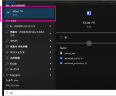  

KiCad が起動するので、`ファイル` -> `新規プロジェクト` を選択

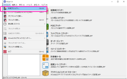  

`新規プロジェクトを作成` メニューが起動するので、任意のディレクトリを選択してプロジェクト名称を指定する。  

今回は例として、 `D:\` 配下に `test` という名称でプロジェクトを作成する。  
すると、以下の様な構成でプロジェクトファイルが作成される。  

```
D:\test\test.kicad_pcb
D:\test\test.kicad_pro
D:\test\test.kicad_sch
```

# 回路図を作る

回路図を作成するには、`回路図エディター` を起動する。  

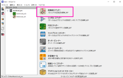  

下図のように回路図エディター ([Schematic Editor](https://docs.kicad.org/master/ja/eeschema/eeschema.html)) が起動する。  

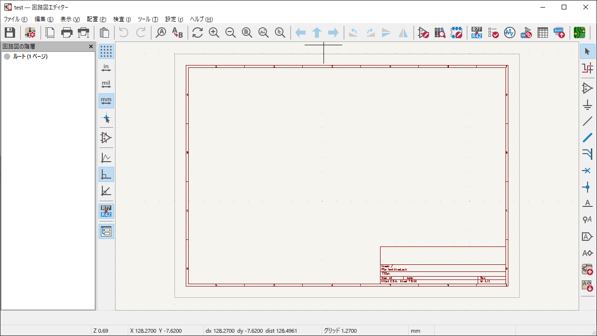  

画面にはあらかじめ、枠とタイトル名等を指定できる領域が定義される。この領域の事を、"図面シート" という。  
図面シートにタイトル名等を指定するには、`ファイル` -> `ページ設定` -> `ページ設定` 画面から指定する。  

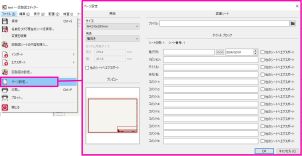  

図面シート自体のサイズ定義、図面シート自体を削除する等するには、回路図エディターを閉じて、
KiCad -> `図面シート エディター` ([Pl_Editor](https://docs.kicad.org/master/ja/pl_editor/pl_editor.html)) を起動する。  

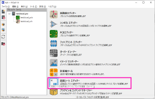  

## 図面シートの編集

今回は例として、枠、タイトル名等を省いたプレーンな図面シートを作成する。  

KiCad -> `図面シート エディター` を起動して、デフォルトで読み込まれた図面シートが表示された状態で、  
右ツールバー ->  (アイテムを選択) を選択してから、  
描画領域内のアイテムをドラッグして全選択

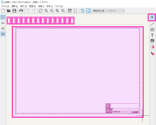  

ドラッグを解除すると、画面表示がもとに戻るが、そのまま Del キーを押下。  
枠等のアイテムが削除される。  

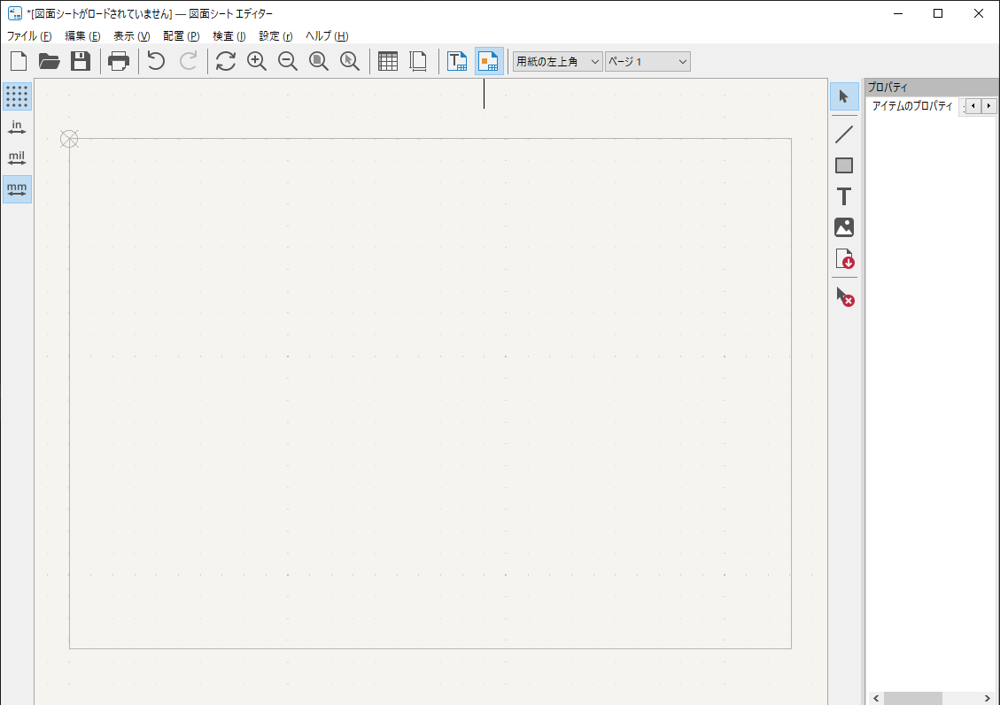

この状態で、`ファイル` -> `名前を付けて保存` を選択。  

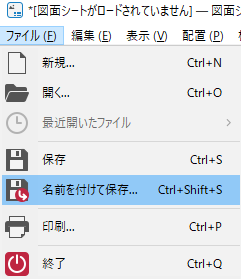

ファイル保存先選択ダイアログが表示されるので、任意のディレクトリ・ファイル名を指定して新しい図面シートとして保存する。  
今回の例では、デフォルト保存先ディレクトリの `C:\Users\<USERNAME>\Documents\KiCad\7.0\template` に `plane` として保存する。  

すると、図面シートファイル `"C:\Users\<username>\Documents\KiCad\7.0\template\plane.kicad_wks"` が保存される。  

## 図面シートを回路図に反映

作成した図面シートファイルは、回路図エディターから反映させる。  
回路図エディター -> `ファイル` -> `ページ設定` -> 図面シート欄の `ファイル`   から先程作成した "plane.kicad_wks" を指定する。  
すると下図のように枠が無くなった図面シートが反映される。  

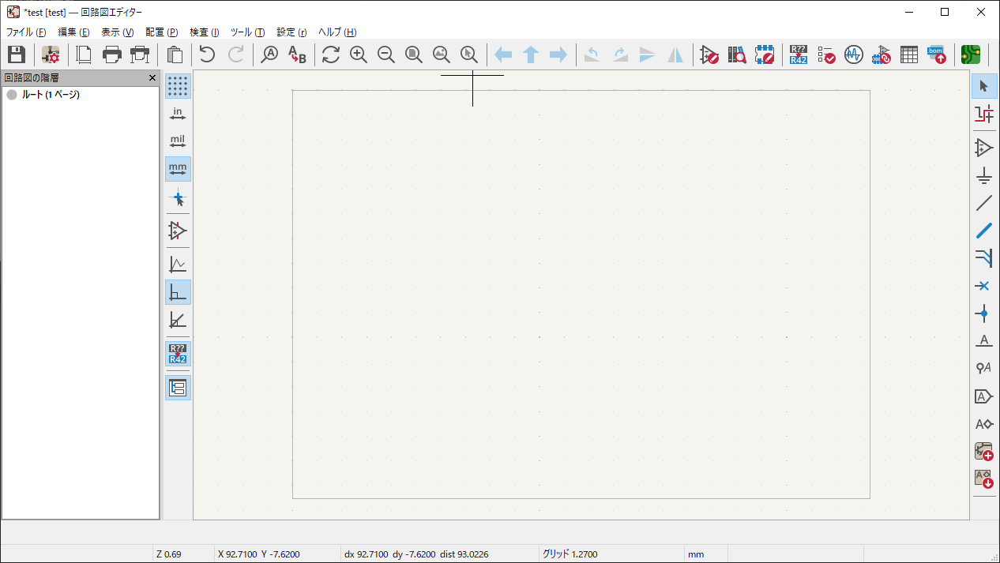  

## シンボルの追加

電源や抵抗等の部品を回路図に追加することを、 "シンボルを追加する" という。  
シンボルを追加するには、回路図エディター -> 右ツールバー ->  (シンボルを追加) を選択。  
`シンボルを選択` ダイアログが表示される。  
今回は例として、Arduino Uno (R3) と 3端子電圧計を用いた回路を記述する。  

まずは Arduino を回路図に追加するため、 (フィルター) 欄に "arduino" とタイプする。  
インクリメンタルサーチで `Item` 欄が更新され、下図のようになる。  

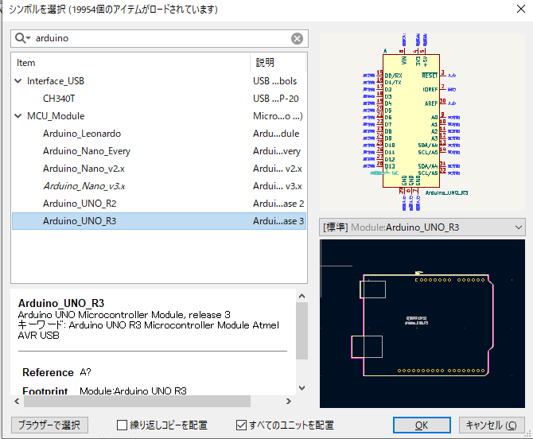  

を選択して `OK` を押下すると、シンボルを選択ダイアログが閉じて、回路図エディターに戻り、マウス位置に Arduino が表示される。  

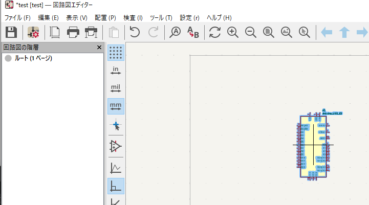  

任意の位置をクリックすると、Arduino が回路図に配置される。  

