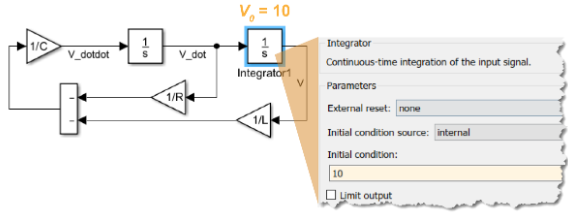

# 10.1 連続システム:  (2/3) 概要

## 概要 - 連続方程式のモデル化

連続システム (微分方程式) のモデル化は、離散システムのモデル化と似たプロセスに従います。
 
たとえば、次の微分方程式について考えます。

  

方程式の項を並べ替え、最高次の微分項だけが左辺に、残りの項が右辺に来るようにします。

  

必要な Integrator ブロックの数を特定します。この場合、方程式には 2 つの積分があるため、2 つの Integrator ブロックが必要になります。

  

Integrator ブロックを追加し、信号にラベルを付けます。

  

方程式の右辺を構築します。

  

必要に応じて残りの信号を接続して、等式を完成させます。

最後に、初期条件を設定します。

  

  