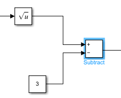
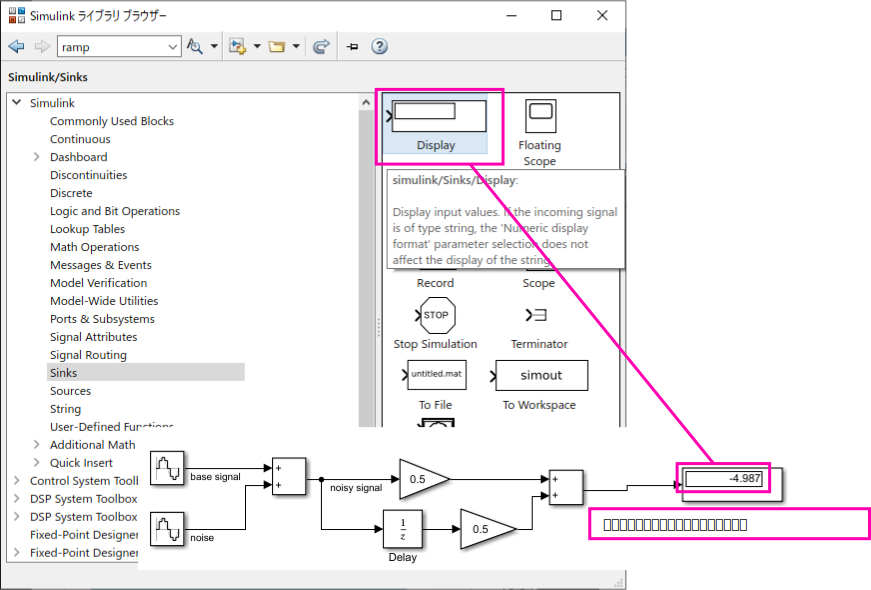

# Sources

入力信号を表すブロックが含まれています。  

 - Sine Wave

  

 - Ramp

ブロック パラメーターで指定されたとおりに一定の勾配で増加する信号を出力します。このランプの勾配は 2 です。すなわち、u(t)=2t となります。  

 - Step

単位ステップ (指定した時間に値が 0 から 1 に移行する関数)   
Simulink では、Step ブロックは既定で t=1 の単位ステップがあります。  
  

# Math Operations

 - squre root (平方根)

  

 - Subtract

  

 - Add

Add ブロックと Subtract ブロックは実際には 1 つの同じブロックですが、既定のパラメーターが異なります。  
以下は `sin(0.5t) + sin(2t) -t` を得る例  

  

`(2)^(1/2) - 3` の例  
  

 - Gain

パラメーターの値でスケーリングするインライン演算

  

 - constant (定数)

  

 - Math Function

ダブルクリックすると、パラメーターとして使用できる数学関数を確認できます。

  

- Abs

絶対値を取得  

  

 - Product

  

# Sinks

 - Display

  

 - Scope

処理された結果が、Scope ウィンドウに表示される。  
  

複数の入力を表示させることもできる。  
以下は `noisy signal` を追加してシミュレーション実行した例。  
  

凡例を表示する例

  

# Logic and Bit Operations

 - Compare to Zero

入力信号とゼロの間でのブール比較を評価  
以下は入力が 0 より大きい場合に 1 を出力する例

  

 - Compare to Constant
定数と比較する   
以下は入力が 0.1 以上の場合に 1 を出力する例  

  

 - Logical Operator

既定の [Operator] は AND です。  
両方とも true の場合に Signal Assessment ブロックが 1 を出力する例  

  

 - Relational Operator

  

# Signal Routing

 - Switch

  

# User-Defined Functions

 - MATLAB Function

Simulink では、MATLAB 変数の読み取りや作成の他に、MATLAB "関数" を使用することもできます。Simulink ブロックは、入力に対して特定の演算を行い、出力を返します。これはテキストベースのコードでの関数と同様です。MATLAB Function ブロック ([Simulink] > [User-Defined Functions]) を使用すると、MATLAB 関数を直接モデルに組み込めます。

  

MATLAB Function ブロックをダブルクリックすると、MATLAB エディターが開きます:

  

関数の入力 uと出力 yは、それぞれブロックの入力と出力にマッピングされます。入力や出力を追加すると、ブロックの端子の数が変わります。

  

MATLAB Function ブロックは、既存の MATLAB コードを組み込む場合や、複雑なアルゴリズムをモデル化する場合に便利です。

# Discrete

 - Unit Delay

Unit Delay ブロック (Simulink > Discrete) は入力信号を取り、その値を指定したサンプル時間の間保持します。そして、次のタイム ステップで、前の入力値を出力します。ブロックには、Z 変換ドメイン内の 1 つのタイム ステップの遅延を表すシンボル (1/z) があります。  

  

# Continuous

 - Integrator

  

