# MATLAB 入門を始めるまで

https://jp.mathworks.com/?s_tid=gn_logo  

  

  

  

  

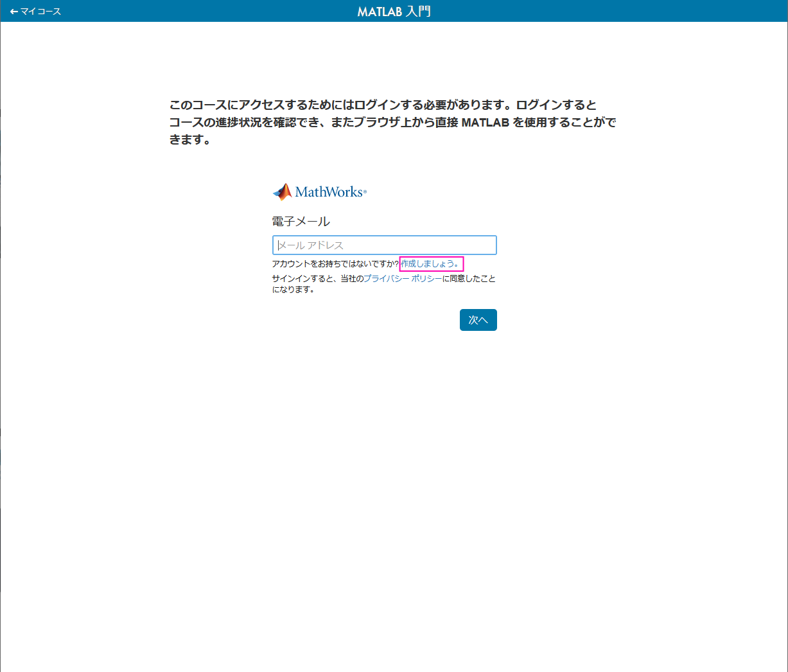  

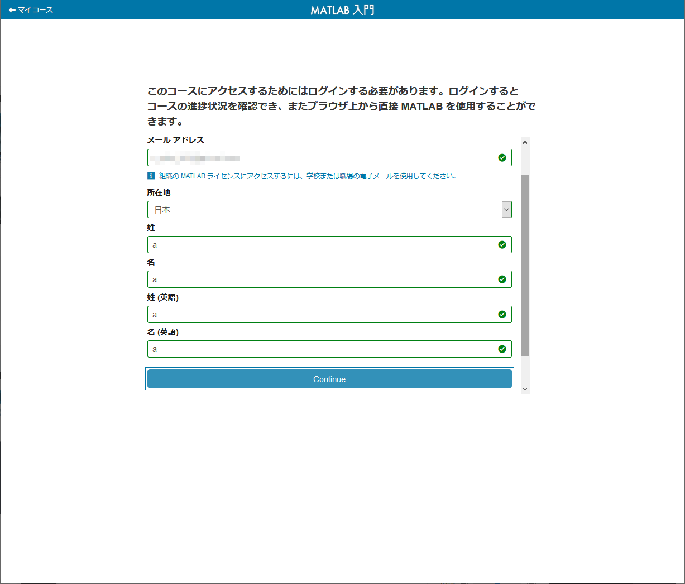  

  

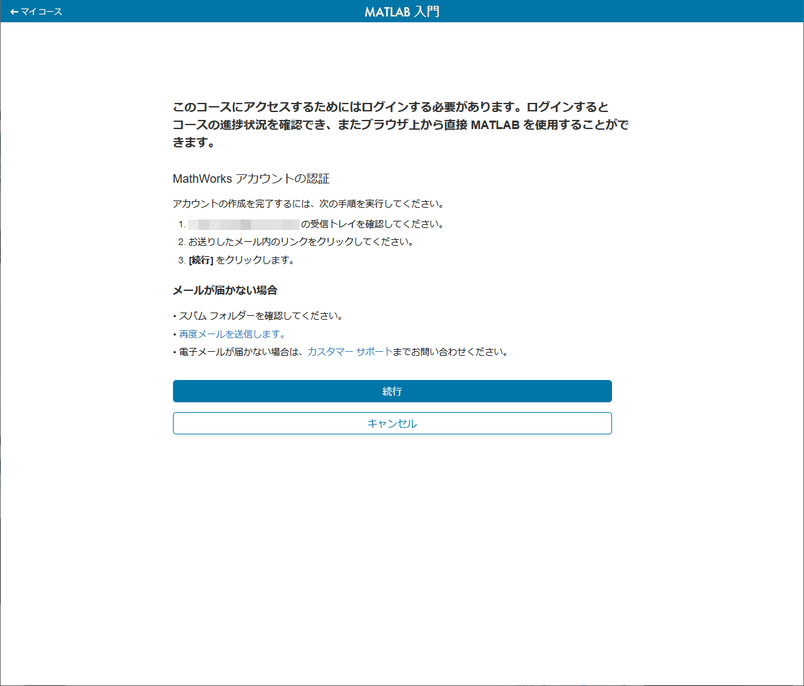  

メールが来るので、`電子メールの認証` を開く。Web ブラウザに `確認` 画面が表示される。    

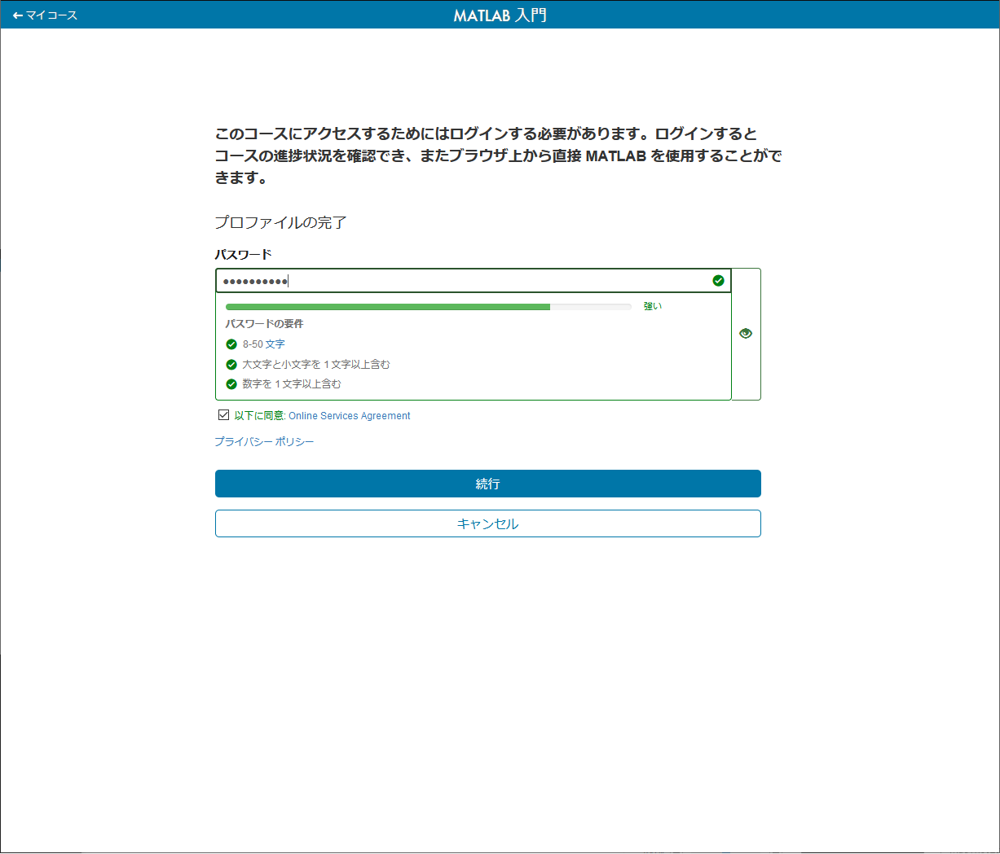

# Setting

## Simulink 入門を始めるには

Simulink 入門をアプリから立ち上げようとすると、以下のように、`システムの一時フォルダーのサブフォルダーではなくなるよう、\CascheFolder を変更してください` と出る。  

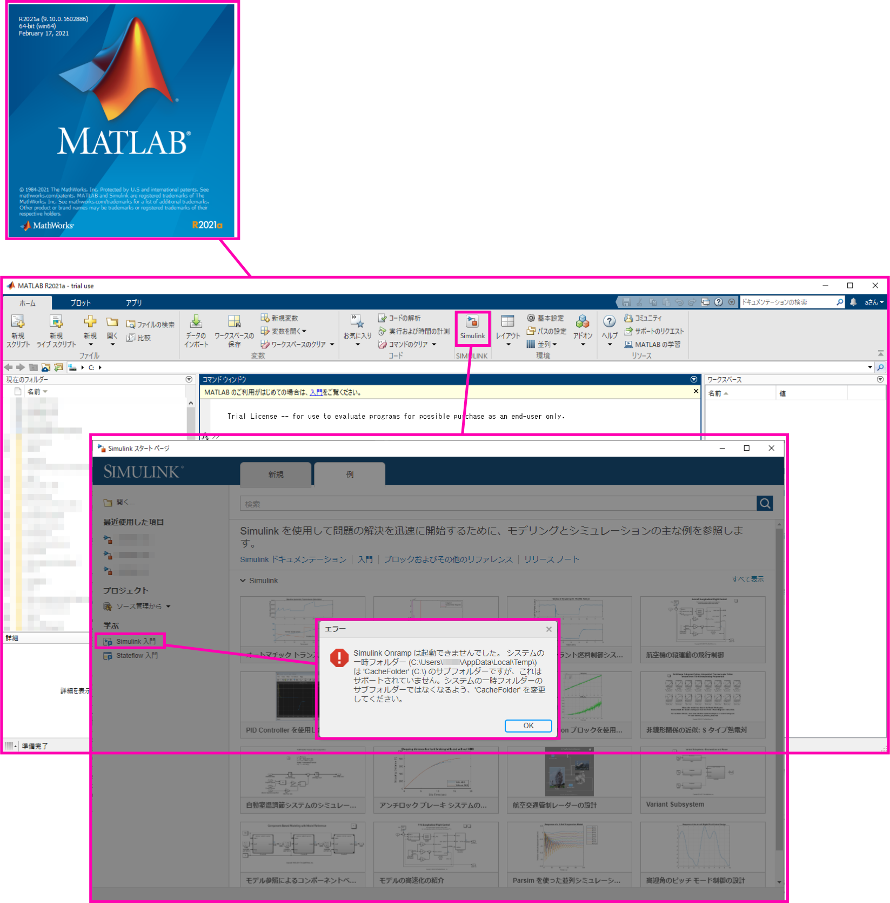  

[Simulink 基本設定] ダイアログ ボックスを開くには、次の手順に従います。

 - Simulink エディターのメニューから、[モデル化] タブで、[環境] 、 [Simulink 基本設定] を選択します。  
または、  
 - MATLAB® コマンド ウィンドウで次を入力します。  
`slprivate('showprefs')`  

以下の様に編集(例)  

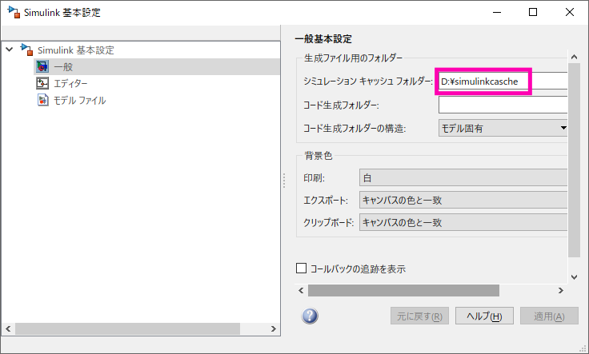  


# 画面構成

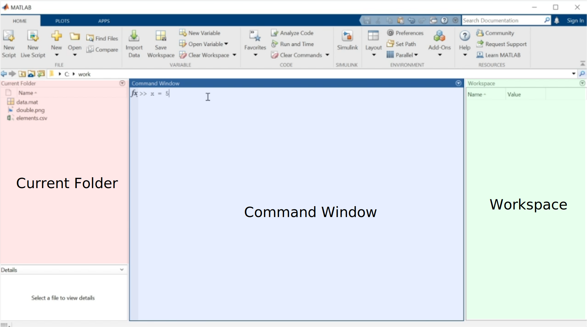  

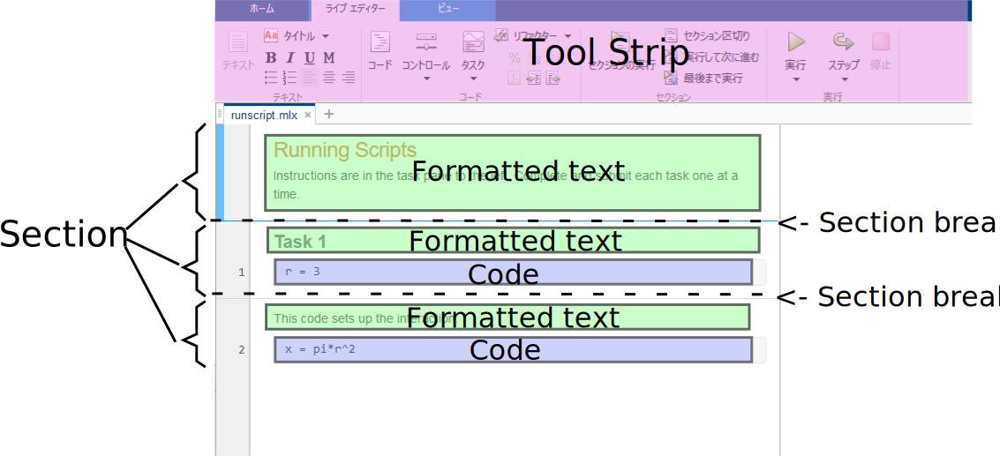  

# キーワード

 - ライブスクリプト
 - 配列

MATLAB 変数はすべて "配列" です。つまり、各変数に複数の要素を含めることができます。配列を使用すると、関連するデータを 1 つの変数に保存できます。

配列はプログラミングのたびに使用します。配列について、またその説明で出てくる用語について理解しておくことは重要です

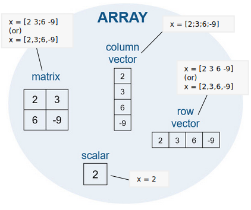  

 - 等間隔のベクトル

長いベクトルの場合、数値を個々に入力することは現実的ではありません。等間隔のベクトルを作成するための簡潔な代替方法は、: 演算子を使用して開始点と終了点のみを指定することです。
```
y = 5:8
y = 
    5    6    7    8
```
独自の間隔を指定する
```
x = 20:2:26
x = 
    20    22    24    26
```

コロン演算子を使用する場合、大かっこは必要ありません。

要素間の間隔ではなく、ベクトルに含める要素数がわかっている場合は、代わりに関数 linspace を使用します。

linspace(first,last,number_of_elements)

関数 linspace への入力を区切るためにコンマ (,) が使用されます。

```
x = linspace(0,1,5)
x = 
    0    0.250    0.500    0.750    1.000
```

 - transpose operator (転置演算子) `'`

行ベクトルを列ベクトルに変換
```
x = 1:3;
x = x'
x = 
    1
    2
    3
```

行ベクトルの作成と転置を1 行で実行することにより、単一のコマンドで列ベクトルを作成できます。ここでは、演算の順序を指定するためにかっこが使用されています。


```
x = (1:2:5)'
x = 
    1
    3
    5
```

配列要素の参照と代入

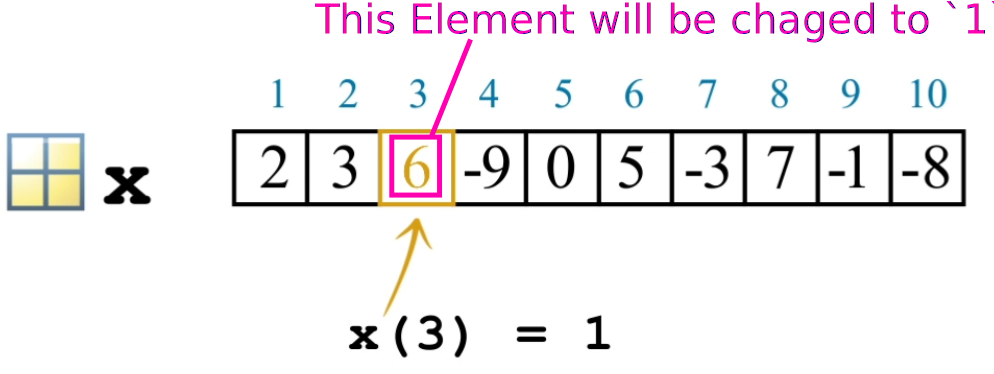  

2次元配列の参照

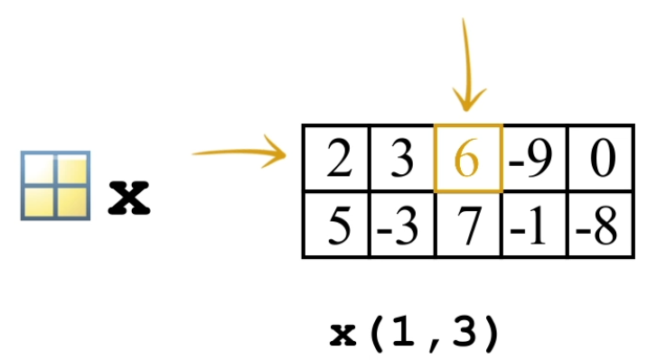  

すべての行

  

すべての列

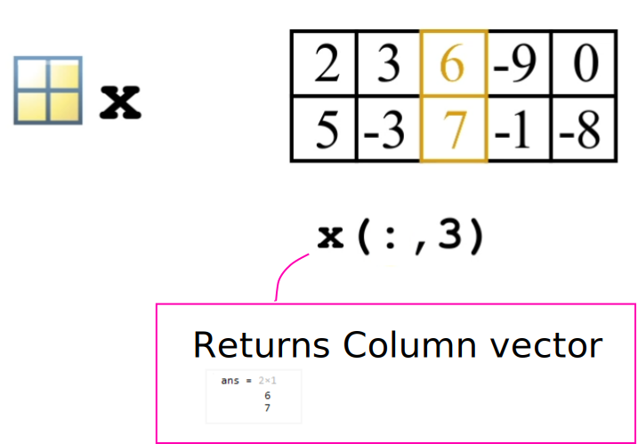  

2次元配列にインデックス番号を1つだけ指定した場合  

参照は縦方向 (列方向) に増加し、行の数を超えると次の列を参照する

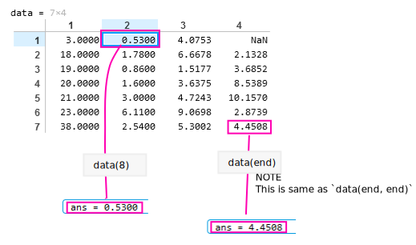 

インデックス番号の範囲指定

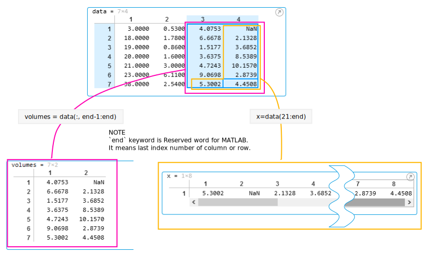  

インデックス番号を飛び飛びの値で指定

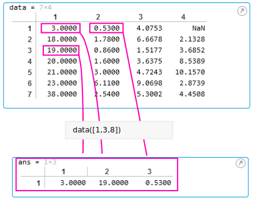  

 - `.*` operator

前提として、数学的に行列の乗算は以下のように行われる。

$$
\begin{bmatrix} 3 & 4 \end{bmatrix} \times \begin{bmatrix} 10 \\ 20 \end{bmatrix} = \left( 3 \times 10 + 4 \times 20 \right) = 110
$$

つまり、掛けられる行列の行数をR, 列数をC とすると、  
掛ける行列の行列の数は、行数 C, 列数 R でなければならない。  
なので、以下のような Row vector を得たい場合、  

$$
\begin{bmatrix} \left( 3 \times 10 \right) & \left( 4 \times 20 \right) \end{bmatrix} \left( = \begin{bmatrix} 30 & 80 \end{bmatrix} \right)
$$

`.*` を使う。  

```
[3 4] .* [10 20]
```
returns follows
```
ans = 1x2
      30    80
```
`.*` は Column vector に対しても使える。  
以下のような Column vector を得たい場合、  
$$
\begin{bmatrix} \left( 3 \times 10 \right) \\ \left( 4 \times 20 \right) \end{bmatrix} \left( = \begin{bmatrix} 30 \\ 80 \end{bmatrix} \right)
$$

```
[3;4] .* [10;20]
```
returns follows
```
ans = 2x1
      30
      80
```
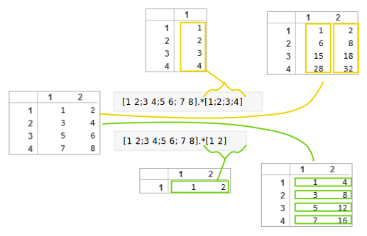  

 - `.` (dot notation (ドット表記))  

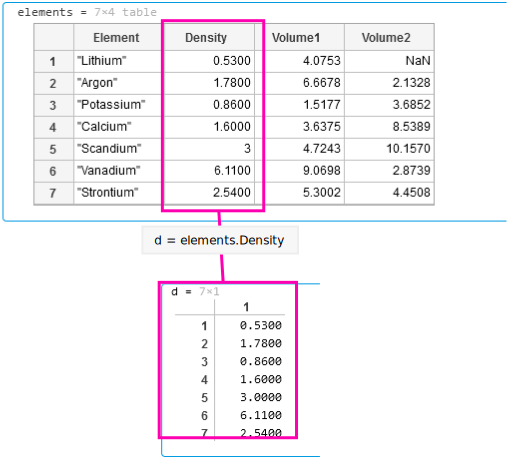  
