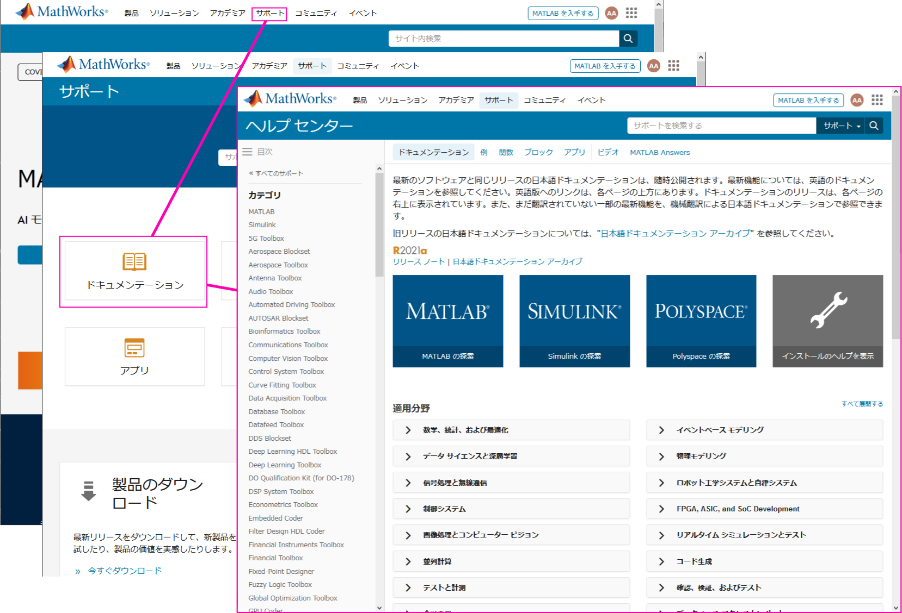
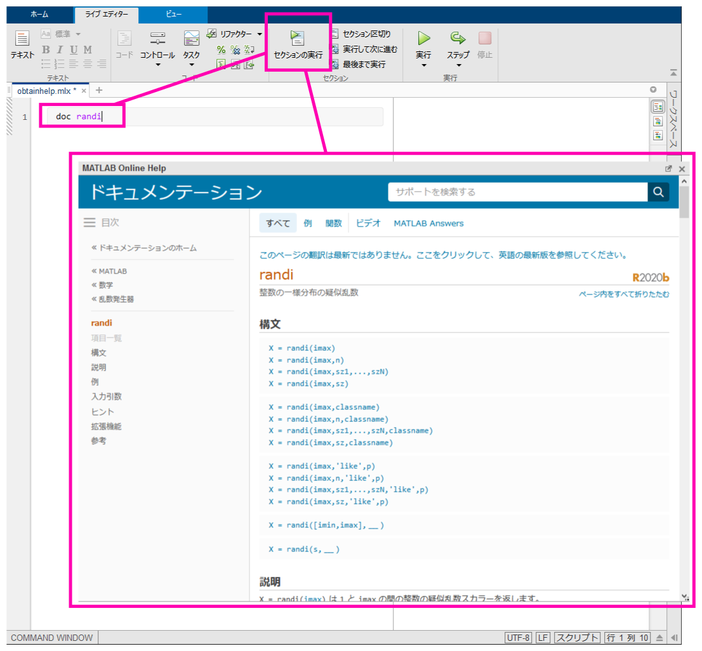
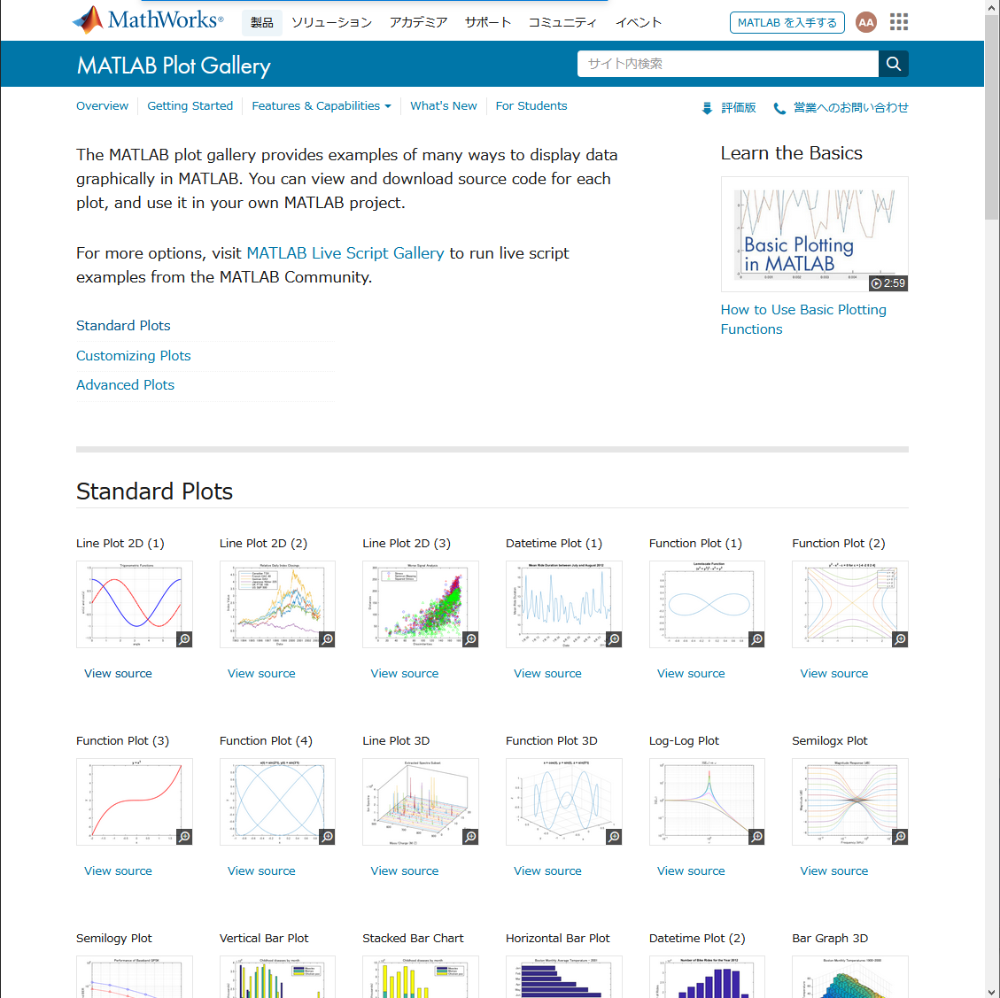

# MATLAB 入門を始めるまで

https://jp.mathworks.com/?s_tid=gn_logo  

  

  

  

  

  

  

  

  

メールが来るので、`電子メールの認証` を開く。Web ブラウザに `確認` 画面が表示される。    

  

## Simulink 入門を始めるには

Simulink 入門をアプリから立ち上げようとすると、以下のように、`システムの一時フォルダーのサブフォルダーではなくなるよう、\CascheFolder を変更してください` と出る。  

  

[Simulink 基本設定] ダイアログ ボックスを開くには、次の手順に従います。

 - Simulink エディターのメニューから、[モデル化] タブで、[環境] 、 [Simulink 基本設定] を選択します。  
または、  
 - MATLAB® コマンド ウィンドウで次を入力します。  
`slprivate('showprefs')`  

以下の様に編集(例)  

  

# 画面構成

  

  

## ドキュメント

  

または

  

### いろいろなプロット方法

https://jp.mathworks.com/products/matlab/plot-gallery.html  
  
