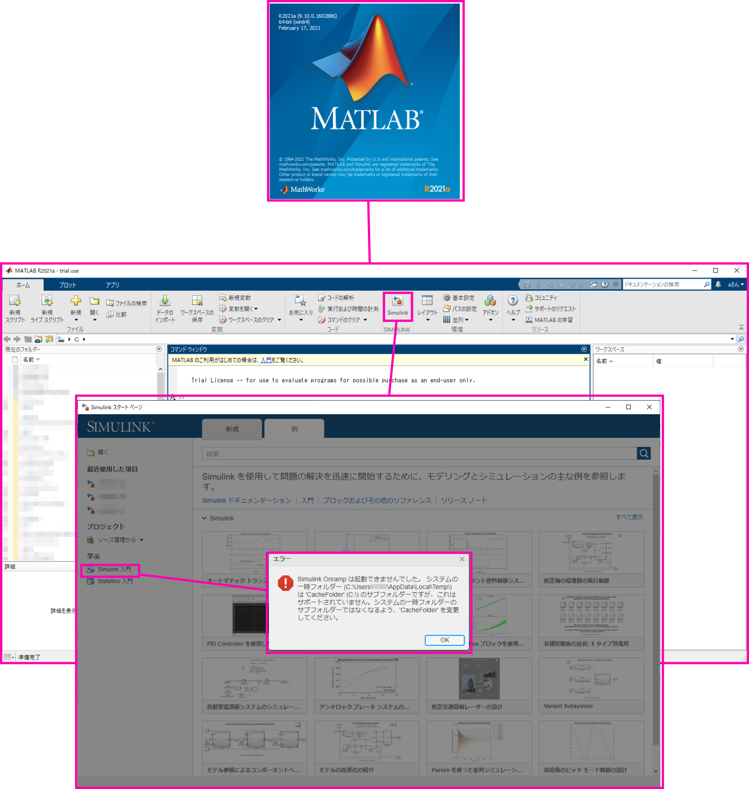
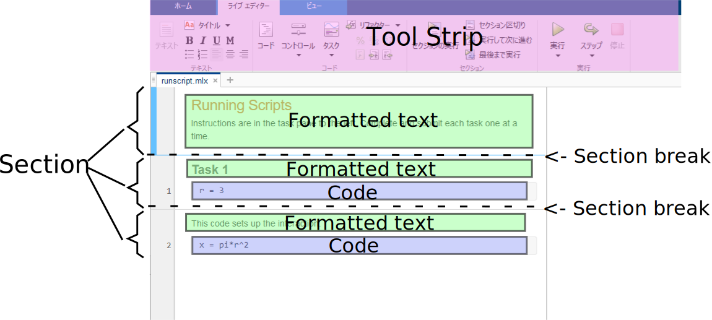
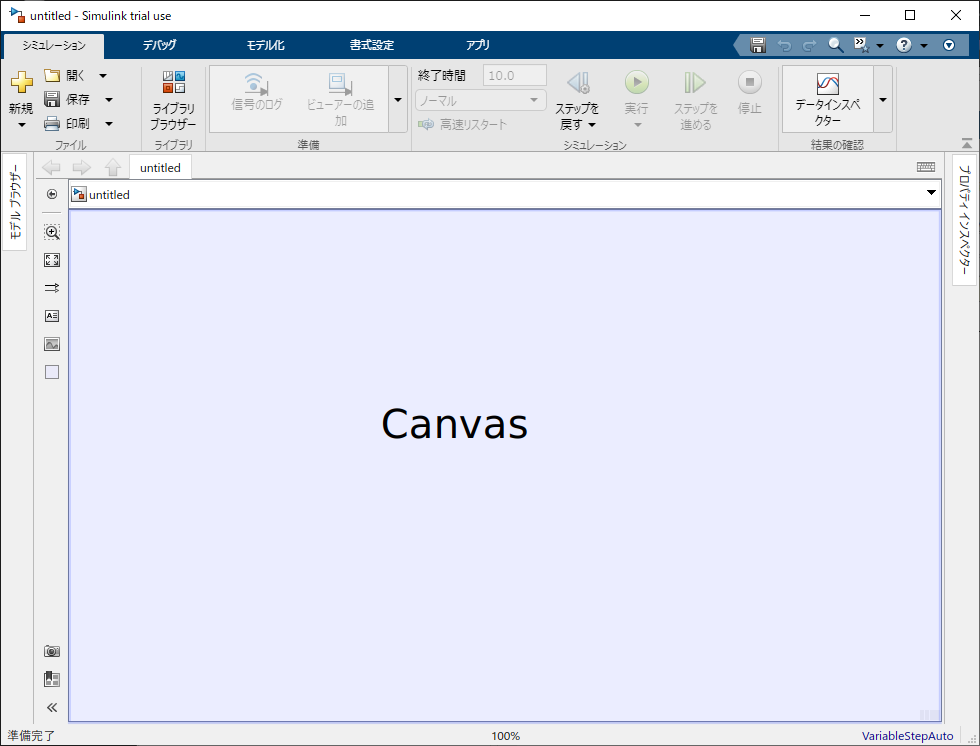

# MATLAB 入門を始めるまで

https://jp.mathworks.com/?s_tid=gn_logo  

  

  

  

  

  

  

  

  

メールが来るので、`電子メールの認証` を開く。Web ブラウザに `確認` 画面が表示される。    

  

## Simulink 入門を始めるには

Simulink 入門をアプリから立ち上げようとすると、以下のように、`システムの一時フォルダーのサブフォルダーではなくなるよう、\CascheFolder を変更してください` と出る。  

  

[Simulink 基本設定] ダイアログ ボックスを開くには、次の手順に従います。

 - Simulink エディターのメニューから、[モデル化] タブで、[環境] 、 [Simulink 基本設定] を選択します。  
または、  
 - MATLAB® コマンド ウィンドウで次を入力します。  
`slprivate('showprefs')`  

以下の様に編集(例)  

  

# 画面構成

## MATLAB

  

### Live Script

  

## Simulink

  
  
  

### クイック挿入メニュー

キャンバスの空白部分をクリックしてから目的のブロック名をタイプする  

各ライブラリは、独立したブロックのコレクションです。ライブラリによっては、同じまたは類似した名前のブロックが含まれていることがあります。しかし、各ブロックの機能は著しく異なる場合があります。クイック挿入メニューの使用時は、ブロックのライブラリがブロック名の下にリストされます。

  

### 信号の分岐

信号を左クリックしてから、ctrl を押しながらドラッグ  
もしくは  
右クリックを使ってドラッグ  

  

### Continuous system and Discrete system (連続システムと分散システム)

  

## ドキュメント

  

または

  

### Simulink ブロック毎のヘルプ

  

または  

  

### いろいろなプロット方法

https://jp.mathworks.com/products/matlab/plot-gallery.html  
  
