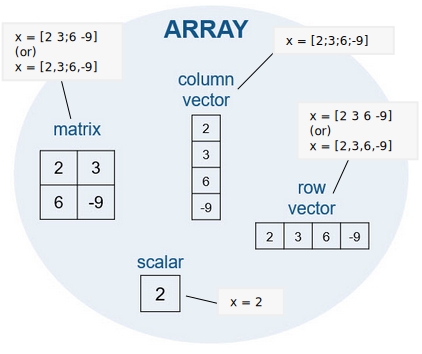
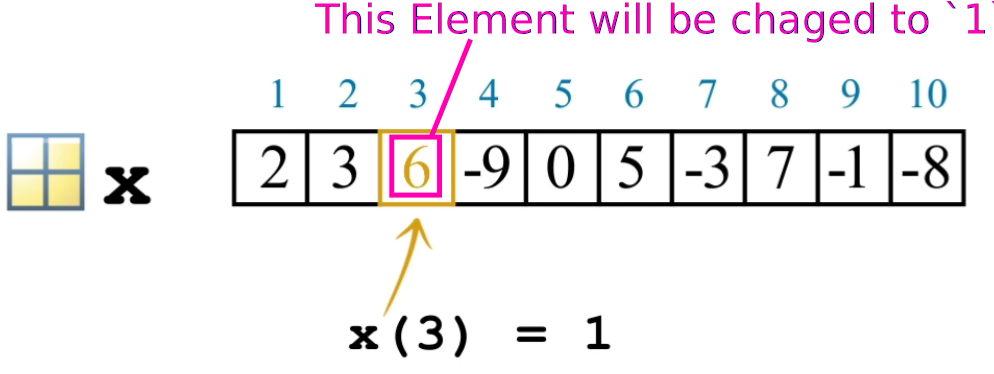
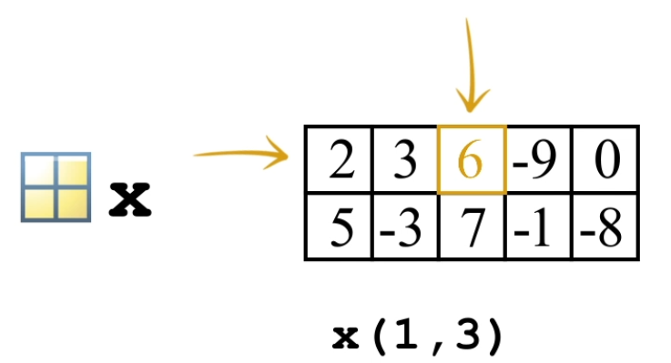
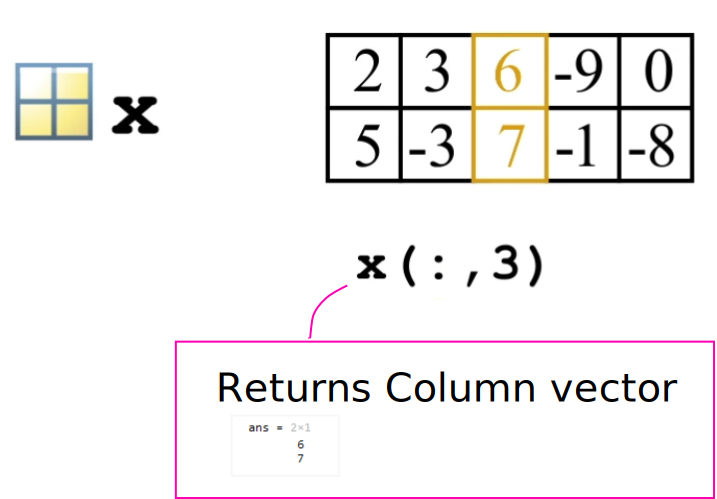
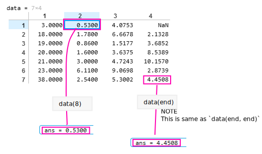
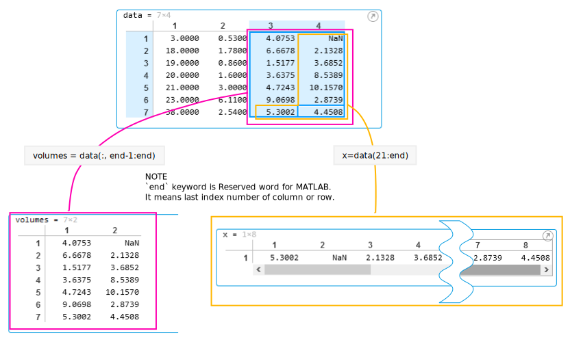
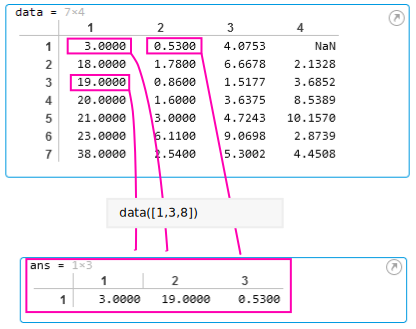
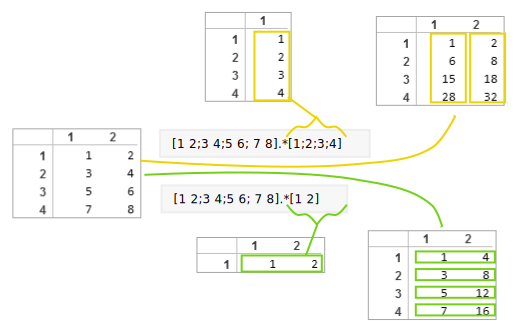
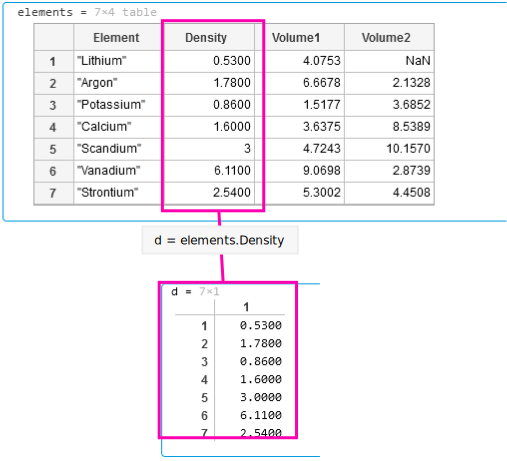
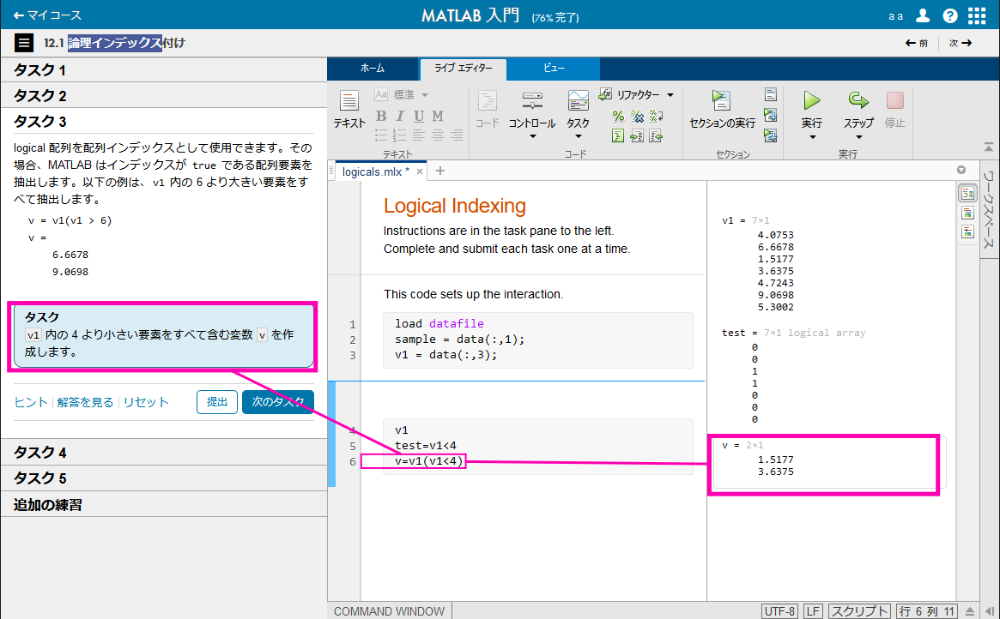

# Scalar, Column vector, Row vector, matrix の定義

  

# 等間隔のベクトル

`:` 演算子を使用して開始点と終了点のみを指定する( `[]` (大かっこ)は不要)
```
y = 5:8
y = 
    5    6    7    8
```
独自の間隔を指定する
```
x = 20:2:26
x = 
    20    22    24    26
```

要素間の間隔ではなく、ベクトルに含める要素数がわかっている場合は、代わりに関数 `linspace` を使用します。

linspace(first,last,number_of_elements)

関数 linspace への入力を区切るためにコンマ (,) が使用されます。

```
x = linspace(0,1,5)
x = 
    0    0.250    0.500    0.750    1.000
```

# transpose operator (転置演算子) `'`

行ベクトルを列ベクトルに変換する
```
x = 1:3;
x = x'
x = 
    1
    2
    3
```
行ベクトルの作成と転置を1 行で実行することにより、単一のコマンドで列ベクトルを作成できます。ここでは、演算の順序を指定するためにかっこが使用されています。
```
x = (1:2:5)'
x = 
    1
    3
    5
```

# 配列要素の参照と代入

  

# 2次元配列の参照

  

# すべての行

  

# すべての列

  

# 2次元配列にインデックス番号を1つだけ指定した場合  

参照は縦方向 (列方向) に増加し、行の数を超えると次の列を参照する

 

# インデックス番号の範囲指定

  

# インデックス番号を飛び飛びの値で指定

  

# `.*` operator

前提として、数学的に行列の乗算は以下のように行われる。

$$
\begin{bmatrix} 3 & 4 \end{bmatrix} \times \begin{bmatrix} 10 \\ 20 \end{bmatrix} = \left( 3 \times 10 + 4 \times 20 \right) = 110
$$

つまり、掛けられる行列の行数をR, 列数をC とすると、  
掛ける行列の行列の数は、行数 C, 列数 R でなければならない。  
なので、以下のような Row vector を得たい場合、  

$$
\begin{bmatrix} \left( 3 \times 10 \right) & \left( 4 \times 20 \right) \end{bmatrix} \left( = \begin{bmatrix} 30 & 80 \end{bmatrix} \right)
$$

`.*` を使う。  

```
[3 4] .* [10 20]
```
returns follows
```
ans = 1x2
      30    80
```
`.*` は Column vector に対しても使える。  
以下のような Column vector を得たい場合、  
$$
\begin{bmatrix} \left( 3 \times 10 \right) \\ \left( 4 \times 20 \right) \end{bmatrix} \left( = \begin{bmatrix} 30 \\ 80 \end{bmatrix} \right)
$$

```
[3;4] .* [10;20]
```
returns follows
```
ans = 2x1
      30
      80
```
掛ける行列の行数または列数がかけられる行列のそれに一致している場合、以下の様に計算される。  

  


# `.` (dot notation (ドット表記))  

  


# Logical Indexing (論理インデックス)

  

論理インデックスを使用して、値を配列に代入し直すことができます。たとえば、配列 x 内の 999 に等しい値をすべて値 1 に置き換える場合は、以下の構文を使用します。

```
x(x==999) = 1
```
