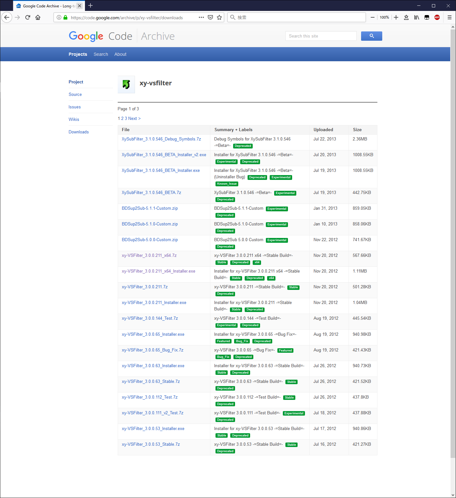
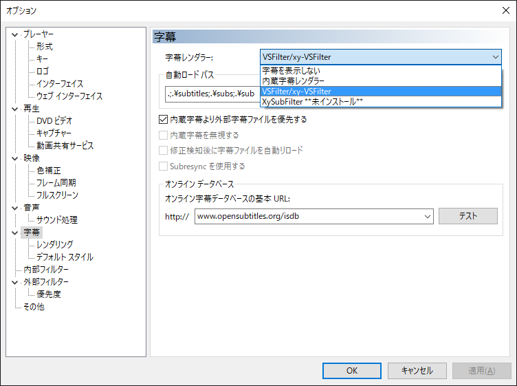
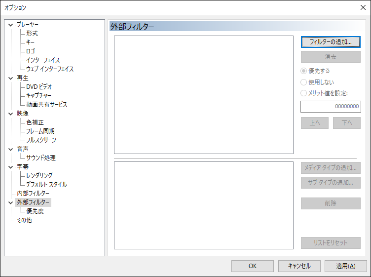
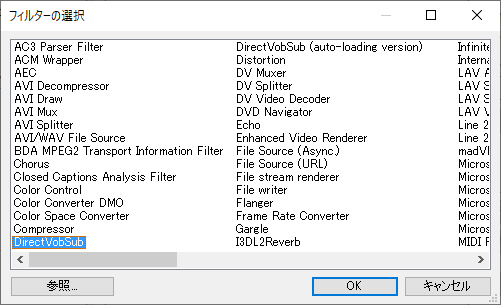
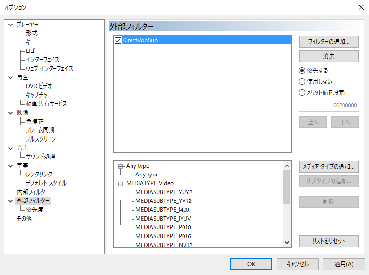
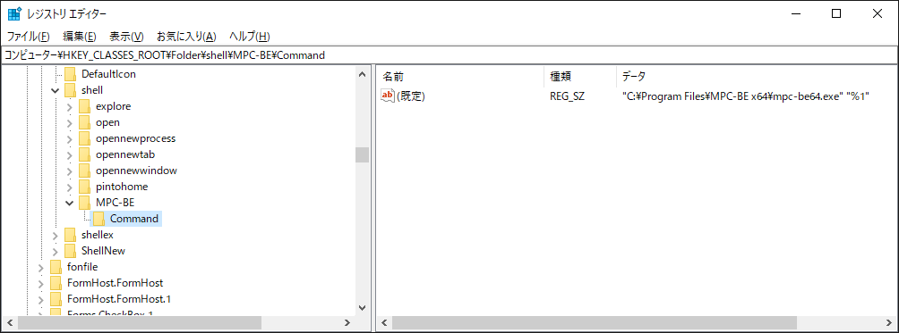

# 字幕が表示されない場合

## 外部フィルターDirectをインストールする。

↓ダウンロード先↓  
https://code.google.com/archive/p/xy-vsfilter/downloads  

Installerをダウンロード&実行すればいい。  

  

MPCを起動して、字幕レンダラーをVS-Filterに指定  

  

外部フィルターのフィルターの追加を選択  

  

DirectVovSubを選択。OK  

  

優先するにチェック。OK  

  

# Windows Exploerer 上で、フォルダを右クリックした時のメニューから MPC を起動できるようにする

レジストリに Command キーを以下の様に追加する

# #1 フォルダを右クリックした時のメニュー追加

Path : \HKEY_CLASSES_ROOT\Folder\shell\  
Data : "<MPCの実行ファイルのフルパス>" "%1"  

  

# #2 何もない所を右クリックした時のメニュー追加

Path : \HKEY_CLASSES_ROOT\Directory\Background\shell\  
Data : "<MPCの実行ファイルのフルパス>" "%V"  
※↑ '%V' である事に注意 ↑※  

  

参考元Web資料

右クリックメニューのショートカットキーをレジストリで変更設定する方法
https://boukenki.info/migi-click-menu-shortcut-key-registry-settei-houhou/

エクスプローラの右クリックメニューをカスタマイズする
https://qiita.com/tueda/items/0036ee8e9280f70f04f0