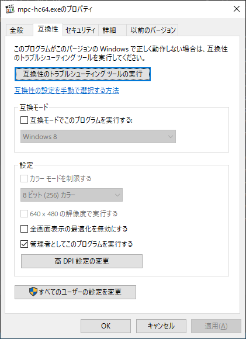
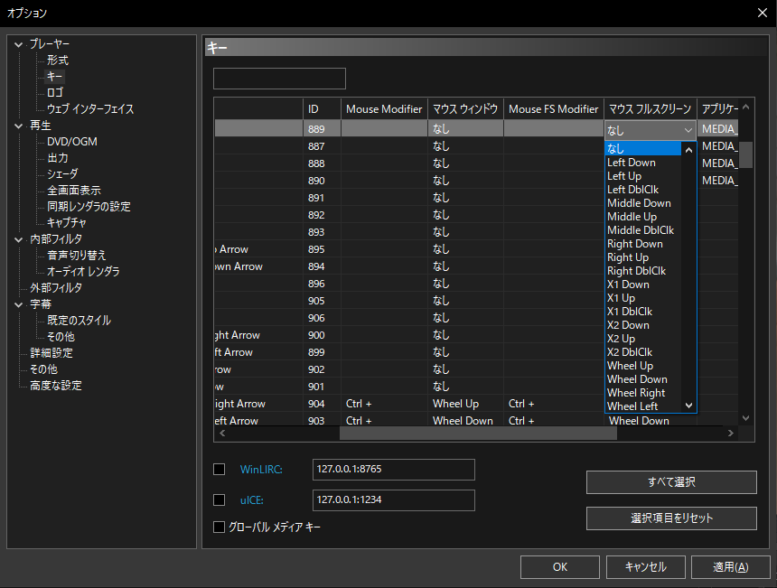
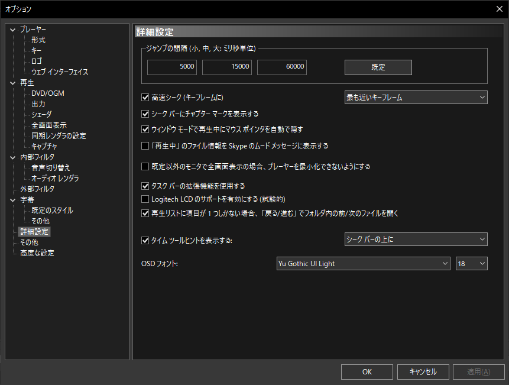

"C:\Program Files\MPC-HC"
┗mpc-hc64.exe

を右クリックしてプロパティを開く。
`互換性` タブ -> `管理者としてこのプログラムを実行する` にチェックを入れる。

  

## オススメ設定

### ダークテーマ

  

※ MPC-HC を再起動すると有効になる。  

### オプションメニュー

#### プレーヤー

  

 - `キー` 設定  

  

※フルスクリーンでは別の割当がある点に注意。画面を右にスクロールして任意に設定する。
以下は `マウス フルスクリーン` 列の設定を `なし` に変更している例。  
(`マウス ウィンドウ` 列の設定内容と一致させておくのが、混乱しなくてオススメ)  

  

#### 詳細設定

  
