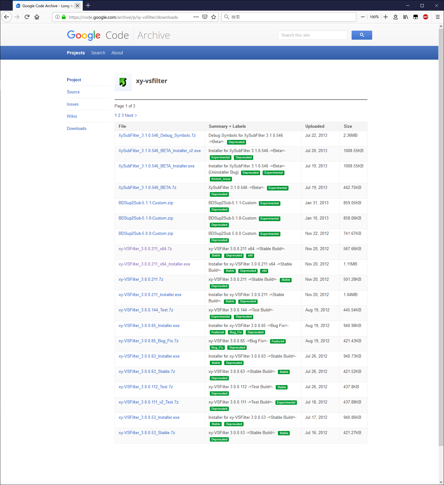
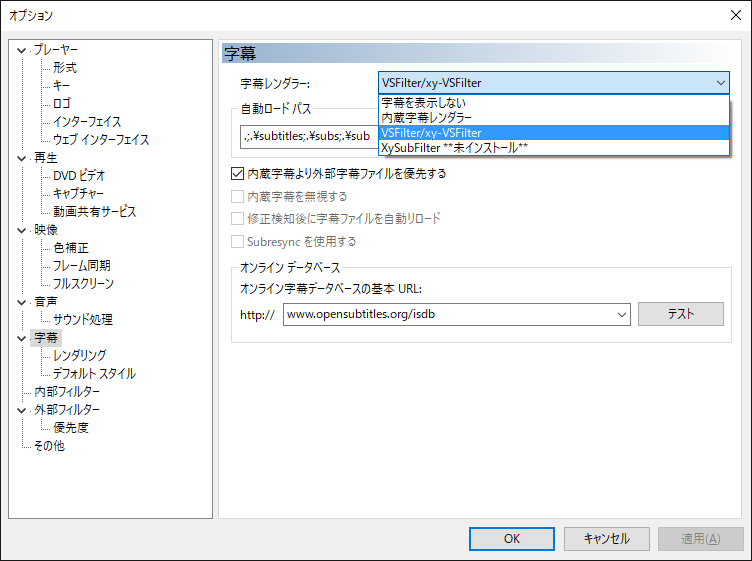
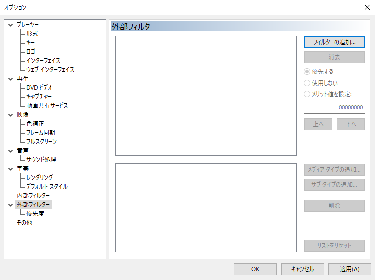
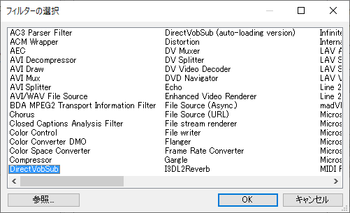
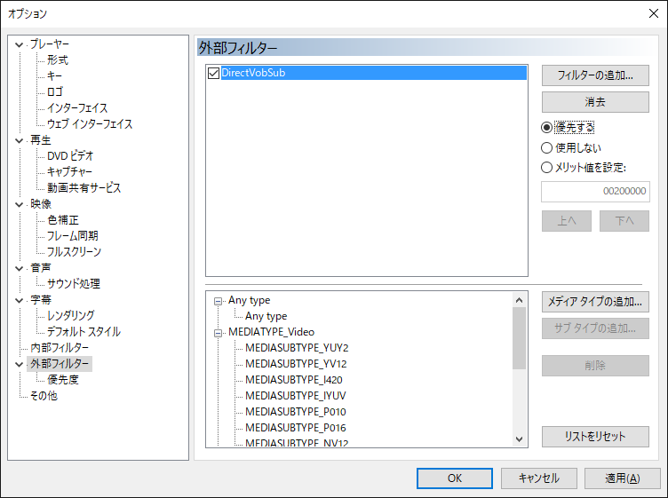
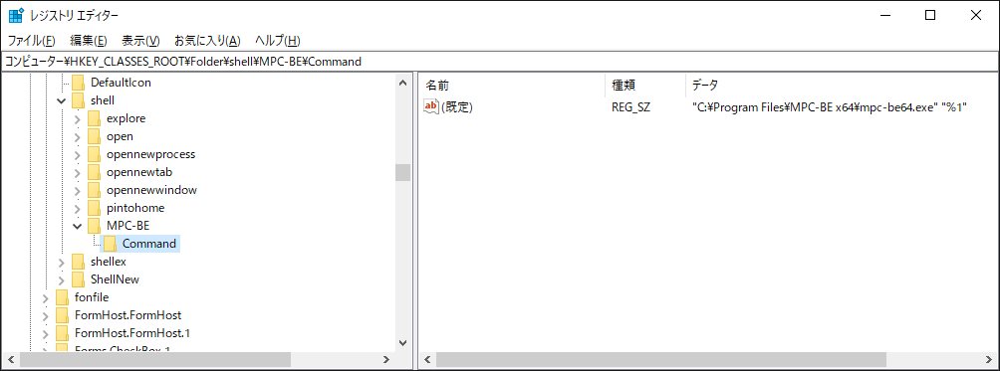
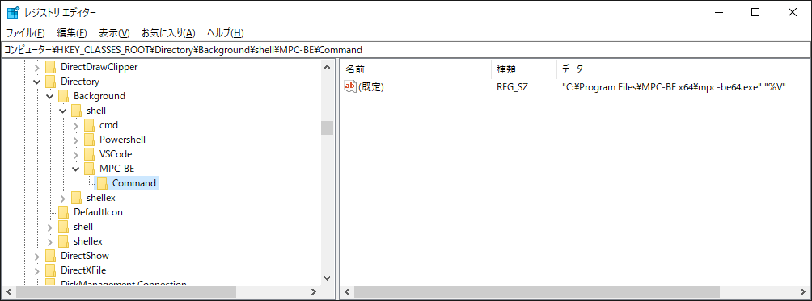
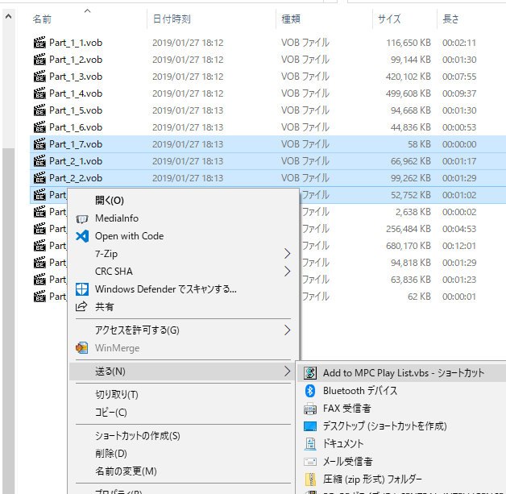
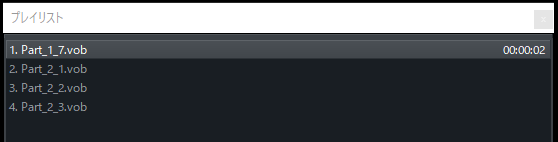

# 字幕が表示されない場合

字幕フィルターに `xy-VSFilter`,  外部フィルターに `Direct` をインストールする。

↓ダウンロード先↓  
[https://code.google.com/archive/p/xy-vsfilter/downloads](https://code.google.com/archive/p/xy-vsfilter/downloads)  

Installerをダウンロード&実行すればいい。  
  

MPCを起動して、  
`字幕レンダラー`を`VS-Filter`に指定  
  

`外部フィルター`の`フィルターの追加`を選択  


`DirectVovSub`を選択。`OK`  


`優先する`にチェック。`OK`  


# Windows Exploerer 上で、フォルダを右クリックした時のメニューから MPC を起動できるようにする

## #1 フォルダを右クリックした時のメニュー追加

レジストリに `Command` キーを以下の様に追加する  

```
Path : \HKEY_CLASSES_ROOT\Folder\shell\
Data : "<MPCの実行ファイルのフルパス>" "%1"
```
  

## #2 何もない所を右クリックした時のメニュー追加

レジストリに `Command` キーを以下の様に追加する  

```
Path : \HKEY_CLASSES_ROOT\Directory\Background\shell\
Data : "<MPCの実行ファイルのフルパス>" "%V"
※↑ '%V' である事に注意 ↑※
```
  

## #3 ファイル名でソートした後にプレイリストに追加する

添付の `Add to MPC Play List.vbs` 内の MPC パス設定を環境にあわせて編集する

```
'設定
str_mpcPath = "C:\Program Files\MPC-BE x64\mpc-be64.exe"
```

編集したファイルを '送る' ディレクトリに配置して、  
Explorer上で右クリックして '送る' から実行する  






## 参考元Web資料  
右クリックメニューのショートカットキーをレジストリで変更設定する方法  
[https://boukenki.info/migi-click-menu-shortcut-key-registry-settei-houhou/](https://boukenki.info/migi-click-menu-shortcut-key-registry-settei-houhou/)

エクスプローラの右クリックメニューをカスタマイズする  
[https://qiita.com/tueda/items/0036ee8e9280f70f04f0](https://qiita.com/tueda/items/0036ee8e9280f70f04f0)
