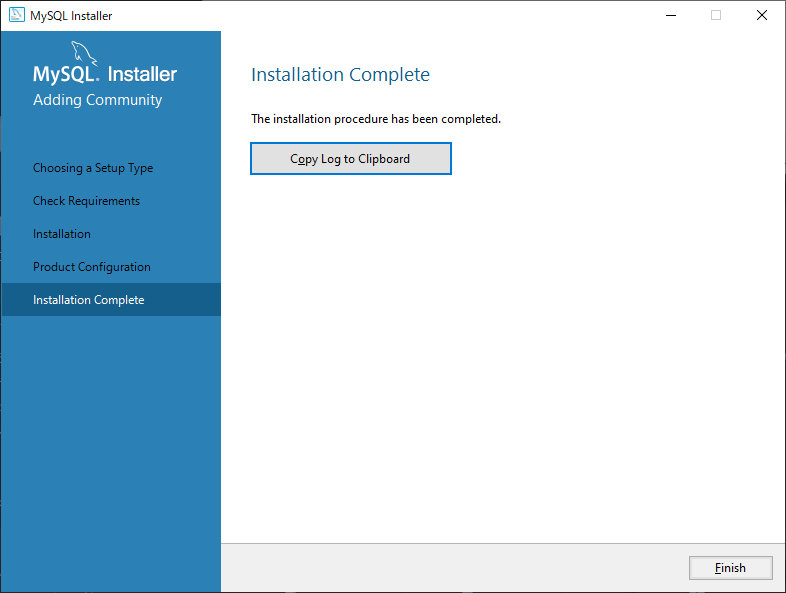

# Install

以下からインストーラーをダウンロード  
https://dev.mysql.com/downloads/windows/installer/5.7.html  

  

1つ目のと「mysql-installer-web-community」と2つ目の「mysql-installer-community-8.0.25.0.msi」があるが、違いは、前者がネット環境下でのダウンロード、後者がネットがつながっていない状態でのダウンロード。  
以下のようにダイアログが出るが、`No thanks, just start my download.` を選択でいい。  

  

インストーラーを叩く。  

  
  
  
  
  
  
  
  
  

  
  
  
  
  

# Edit environment variables

  

# Login / Logout

```
>mysql -u root -p
Enter password: *********
Welcome to the MySQL monitor.  Commands end with ; or \g.
Your MySQL connection id is 6
Server version: 5.7.37-log MySQL Community Server (GPL)

Copyright (c) 2000, 2022, Oracle and/or its affiliates.

Oracle is a registered trademark of Oracle Corporation and/or its
affiliates. Other names may be trademarks of their respective
owners.

Type 'help;' or '\h' for help. Type '\c' to clear the current input statement.

mysql> exit
Bye

>
```
