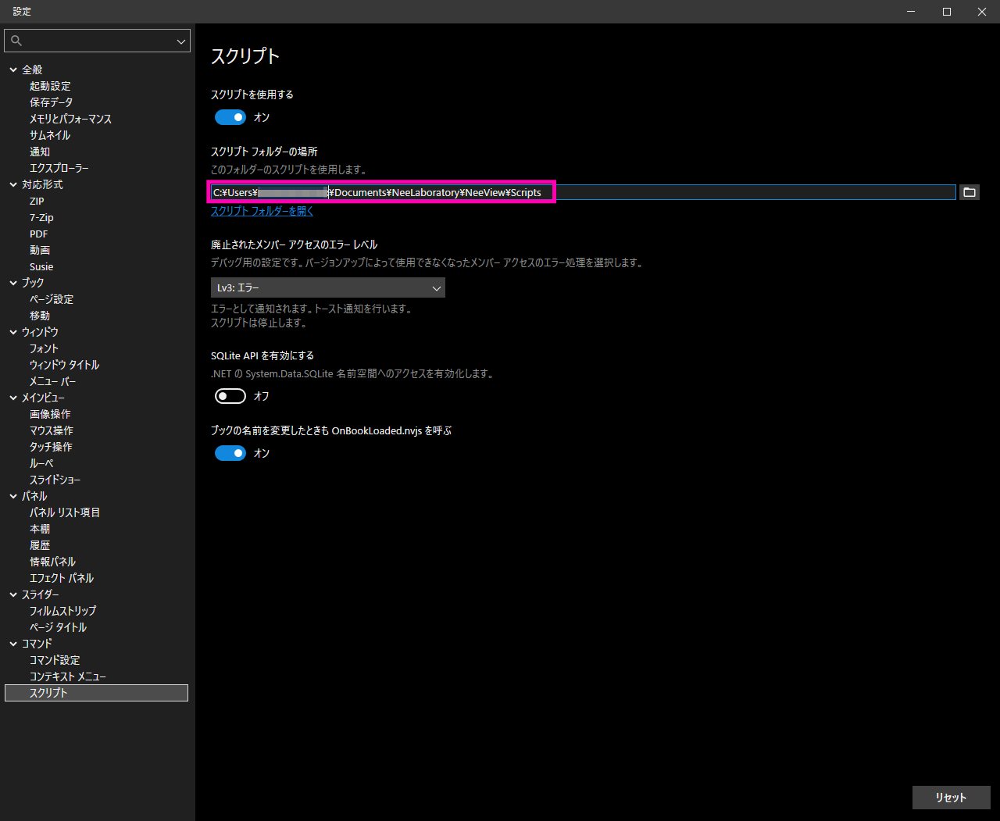

# デフォルト設定

1. 設定ファイル (UserSetting.json) の場所  
    `C:\Users\<username>>\AppData\Local\NeeLaboratory\NeeView\UserSetting.json`  
2. スクリプト フォルダーの場所  
      
    デフォルトは以下  
    `C:\Users\<username>\Documents\NeeLaboratory\NeeView\Scripts`  
