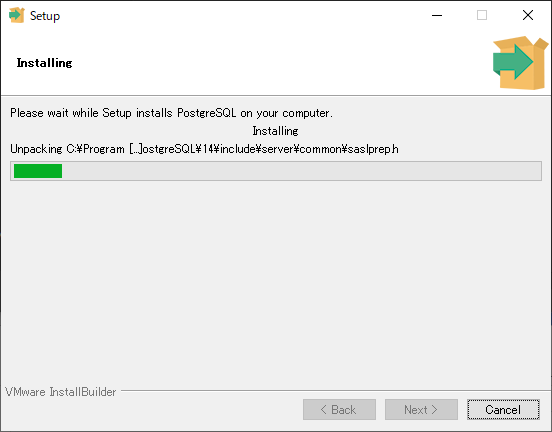

# Install

PostgreSQL Database Download  
https://www.enterprisedb.com/downloads/postgres-postgresql-downloads

  
  
  
  

スーパーユーザ postgres のパスワードを指定します。パスワードは確認のため、同じものを 2 回入力します。データベースへの接続時に必要になるので、忘れないように注意してください。  

  
  

デフォルトのロケールを選択します。ロケールは言語や国によって異なる文字の扱いや並び替え順を指定するものです。デフォルトの [Default locale] では OS の設定に基づくロケール、日本語の環境であれば Japanese_Japan.932 が選択されます。日本語ではロケールを使う必要があまりなく、ロケールを使うと文字の処理が遅くなり、インデックスの作成時にオプションを指定しないと、LIKE でインデックスも使えなくなるので、ロケールを使わないことを示す C を選択しておきましょう。  

  
  
  
  

インストーラの終了後に Stack Builder を起動するかを選択します。デフォルトでは選択されています。あとでいつでも起動できるので、選択は外しておきましょう。  

  

# PostgreSQL サービスの起動と停止

Win + R で `services.msc` で Windows 管理ツールのサービスを起動。  
`postgresql-x64-xx` を右クリックしたメニューから選択。 

  

# データベースへの接続確認

Windows スタートメニューから `SQL Shell (psql)` を選択して起動。  

接続先のホスト名 Server、データベース名 Database、ポート番号 Port、ユーザ名 Username、クライアント側のエンコーディング Client Encoding、パスワードの入力を求めるプロンプトが順番に表示されます。角カッコ内がデフォルト値を表している。  
Server, Database, Port Username はデフォルト値のまま何も入力せず、Enter キーを押す。  
Client Encoding は そのまま `SJIS` が無難。使用可能な Client Encoding の一覧は以下参照。    
`<TIPS>`  
23.3. 文字セットサポート  
https://www.postgresql.jp/document/10/html/multibyte.html  
`</TIPS>`  
パスワードはインストール時に指定したものを入力。  
psql を終了するには `\q` を入力した後に何かキーを押す。  

  

