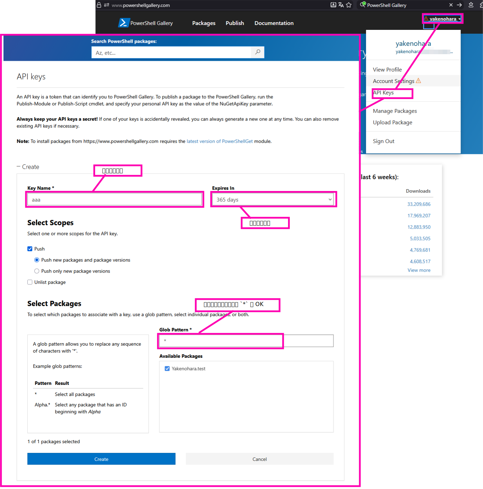

# 開発者向け

## PowerShell Gallery 用 API Key の作成

PowerShell Gallery にログインして、下図の通りに API Key を作成する  

  

API Key が作成されるので、Copy しておく。(この時に Copy しておかないと、あとで Copy できない)  

## PowerShell モジュールの作成

1. モジュール名の決定

    PowerShell Gallery で公開する前提で決定するのが無難。(将来公開する必要がなくても、モジュール名が他と被らないようにするため)  
    モジュール名は以下のように決定するのが一般的
    ```
    Yakenohara.COM.iTunes.Track
    │           │        │
    │           │        └─ 機能・対象
    │           └─ 製品 / ドメイン
    └─ 作成者 / 組織プレフィックス
    ```
    以降この説明ではモジュール名を `Yakenohara.COM.iTunes.Track` を例に説明する。  

2. モジュール名でフォルダを作成

    「1. モジュール名の決定」で決めたモジュール名で PJ フォルダを作成

3. モジュールマニフェストを作成

    ```powershell
    New-ModuleManifest -Path Yakenohara.COM.iTunes.Track.psd1
    ```

    ファイル `Yakenohara.COM.iTunes.Track.psd1` が作成される。  

    3-1. 必須のメタデータ  

    PowerShell Gallery に公開するためには、最低限以下のメタデータを指定する  

    | メタデータ名  | 説明                                                                   |
    | ------------- | ---------------------------------------------------------------------- |
    | ModuleVersion | x.y.z 形式で記載。デフォルトの x.y 形式では不可。 Note1                |
    | Description   | 概ね 1, 2 文程度。                                                     |
    | Author        | 作成者を表すが、何を指定しても `Publish-Module` でエラーになる事は無い |

    Note1:  
    x.y 形式で指定した場合は `Publish-Module` 実行時に以下エラーとなる。(この例では `ModuleVersion = '1.0'` と指定)  
    ```powershell
    > Publish-Module -Path . -Repository PSGallery -NuGetApiKey '********'
    Publish-PSArtifactUtility : モジュール 'Yakenohara.COM.iTunes.Track': 'File does not exist (C:\Users\***\AppData\Local\Temp\***
    **\Yakenohara.COM.iTunes.Track\Yakenohara.COM.iTunes.Track.1.0.nupkg).
    ' を発行できませんでした。
    発生場所 C:\Program Files\WindowsPowerShell\Modules\PowerShellGet\1.0.0.1\PSModule.psm1:1227 文字:17
    +                 Publish-PSArtifactUtility -PSModuleInfo $moduleInfo `
    +                 ~~~~~~~~~~~~~~~~~~~~~~~~~~~~~~~~~~~~~~~~~~~~~~~~~~~~~
        + CategoryInfo          : InvalidOperation: (:) [Write-Error]、WriteErrorException
        + FullyQualifiedErrorId : FailedToPublishTheModule,Publish-PSArtifactUtility
    ```

## PowerShell Gallery に公開

モジュールのトップディレクトリで PowerShell を起動し、「PowerShell Gallery 用 API Key の作成」で作成した API Key を使って以下のように実行する事で公開される。  
(`********` は API Key の内容)  
```powershell
Publish-Module -Path . -Repository PSGallery -NuGetApiKey '********'
```
