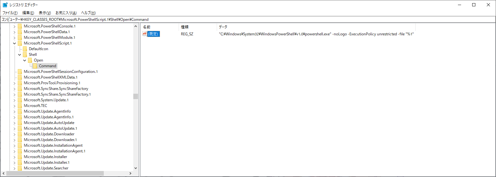

# .ps1 ファイルをダブルクリックして実行させる

1. レジストリに以下キーを作る  

```
HKEY_CLASSES_ROOT\Microsoft.PowerShellScript.1\Shell\Open\Command
```

2. 既定値を以下にする  

```
"C:\Windows\System32\WindowsPowerShell\v1.0\powershell.exe" -noLogo -ExecutionPolicy unrestricted -file "%1"
```

以下のようになれば OK  

  
