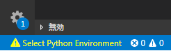
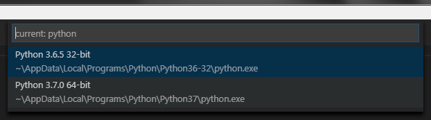

# Pythonのインストール

インストーラを実行するだけ

# VS Code 上の開発環境を作る

## Python のインストール場所をメモる

コマンドプロンプトを開いて `py` 。Pythonターミナルが起動する  
起動したPythonターミナル内で、以下を入力する

```
import sys
sys.path
```

Pythonのインストール場所情報が出力される  
以下のように沢山場所が表示されるけれど、`～python\\python37`迄は共通のハズ。  
これをメモしておく。

```
['', 'C:\\Users\\<username>\\AppData\\Local\\Programs\\Python\\Python37\\python37.zip', 'C:\\Users\\<username>\\AppData\\Local\\
Programs\\Python\\Python37\\DLLs', 'C:\\Users\\<username>\\AppData\\Local\\Programs\\Python\\Python37\\lib', 'C:\\Users\\<username>\\
AppData\\Local\\Programs\\Python\\Python37', 'C:\\Users\\<username>\\AppData\\Local\\Programs\\Python\\Python37\\lib\\s
ite-packages']
```

## `VS Code 用拡張機能 "Python"` をインストールする

VS Code を起動する。  
適当なファイルを新規作成して、`～.py` の拡張子で保存する。  
すると画面右下に、以下のポップアップが出現する。  

  

`インストール` をクリック。
サイドバーに拡張機能が表示され、以下画面のように `Python` の項目が `インストールしています` になる。　　

  

インストールが完了すると、`インストールしています` から `再読込み` に変化する。  

  

`再読込み` をクリック。  

## Linter `Pylint`をインストールする

**<!Caution!>**  
PCがプロキシ環境下の場合は以下を確認します。  
VS Code 内の Settings.json で、以下のようなプロキシ設定がされている事を確認します。  

```
    "http.proxy": "http://<ProxyID>:<ProxyPassword>@<ProxyURI>:<PortNo>",
    "http.proxyStrictSSL": false
```

**</!Caution!>**  

VS Code 用拡張機能`Python`のインストールが完了して再読込みすると、  
画面右下に以下のポップアップが出現する。  

  

`Install` をクリック。

画面左下に以下警告が表示されることがある。  

  

警告をクリックすると、画面上部に以下選択肢が表示される。  

  

Pythonインストールにメモしたディレクトリの方の `python.exe` を選択する。  
もう1度画面右下に `Linter pylint is not installed.` が表示されるので、`Install` をクリックする。  

ターミナルが起動し、`Pylint`をインストールするコマンドが実行される。  
以下は実行結果例。  

```
C:\Users\<username>\Desktop\test>C:/Users/<username>/AppData/Local/Programs/Python/Python37/python.exe -m pip install -U pylint --user
Collecting pylint
  Downloading https://files.pythonhosted.org/packages/6e/c2/1e97c238877b6a86562d32297eb33a6670b6220e8ec0ca85f67b66dc893f/pylint-2.1.1-py3-none-any.whl (737kB)
    100% |████████████████████████████████| 747kB 867kB/s
Collecting colorama; sys_platform == "win32" (from pylint)
  Downloading https://files.pythonhosted.org/packages/0a/93/6e8289231675d561d476d656c2ee3a868c1cca207e16c118d4503b25e2bf/colorama-0.4.0-py2.py3-none-any.whl
Collecting astroid>=2.0.0 (from pylint)
  Downloading https://files.pythonhosted.org/packages/19/92/6f6d3591c429dbdb31c18d8476ba1af08d5973d7cc09f66346109e9de7fb/astroid-2.0.4-py3-none-any.whl (172kB)
    100% |████████████████████████████████| 174kB 745kB/s
Collecting isort>=4.2.5 (from pylint)
  Downloading https://files.pythonhosted.org/packages/1f/2c/22eee714d7199ae0464beda6ad5fedec8fee6a2f7ffd1e8f1840928fe318/isort-4.3.4-py3-none-any.whl (45kB)
    100% |████████████████████████████████| 51kB 707kB/s
Collecting mccabe (from pylint)
  Downloading https://files.pythonhosted.org/packages/87/89/479dc97e18549e21354893e4ee4ef36db1d237534982482c3681ee6e7b57/mccabe-0.6.1-py2.py3-none-any.whl
Collecting wrapt (from astroid>=2.0.0->pylint)
  Downloading https://files.pythonhosted.org/packages/a0/47/66897906448185fcb77fc3c2b1bc20ed0ecca81a0f2f88eda3fc5a34fc3d/wrapt-1.10.11.tar.gz
Collecting lazy-object-proxy (from astroid>=2.0.0->pylint)
  Downloading https://files.pythonhosted.org/packages/55/08/23c0753599bdec1aec273e322f277c4e875150325f565017f6280549f554/lazy-object-proxy-1.3.1.tar.gz
Collecting six (from astroid>=2.0.0->pylint)
  Downloading https://files.pythonhosted.org/packages/67/4b/141a581104b1f6397bfa78ac9d43d8ad29a7ca43ea90a2d863fe3056e86a/six-1.11.0-py2.py3-none-any.whl
Installing collected packages: colorama, wrapt, lazy-object-proxy, six, astroid, isort, mccabe, pylint
  Running setup.py install for wrapt ... done
  Running setup.py install for lazy-object-proxy ... done
  The script isort.exe is installed in 'C:\Users\<username>\AppData\Roaming\Python\Python37\Scripts' which is not on PATH.
  Consider adding this directory to PATH or, if you prefer to suppress this warning, use --no-warn-script-location.
  The scripts epylint.exe, pylint.exe, pyreverse.exe and symilar.exe are installed in 'C:\Users\<username>\AppData\Roaming\Python\Python37\Scripts' which is not on PATH.
  Consider adding this directory to PATH or, if you prefer to suppress this warning, use --no-warn-script-location.
Successfully installed astroid-2.0.4 colorama-0.4.0 isort-4.3.4 lazy-object-proxy-1.3.1 mccabe-0.6.1 pylint-2.1.1 six-1.11.0 wrapt-1.10.11
You are using pip version 10.0.1, however version 18.1 is available.
You should consider upgrading via the 'python -m pip install --upgrade pip' command.

```

警告 `which is not on PATH` が発生した場合は、以下の方法で Path を追加する。  

Winの場合、
[マイコンピューターを右クリック]→[プロパティ]→[詳細設定]→[環境変数]
のところで、  変数 `PYTHONPATH` を編集する。(変数 `PYTHONPATH` が存在しなければ、追加する。)  
以下が例。`変数値(V):` に、警告で言われた、
`C:\Users\<username>\AppData\Roaming\Python\Python37\Scripts` を設定している。


# (Optional) 追加パッケージをインストールする

コマンドプロンプト(VS Codeのターミナルでもいい)で、`pip install <package_name>` を実行する。  
以下は `lxml` をインストールする例。　　

```
py -m pip install lxml
```
PCがプロキシ環境下の場合は以下のコマンド。  

```
py -m pip install lxml --proxy=<ProxyID>:<ProxyPassword>@<ProxyURI>:<PortNo>
```
