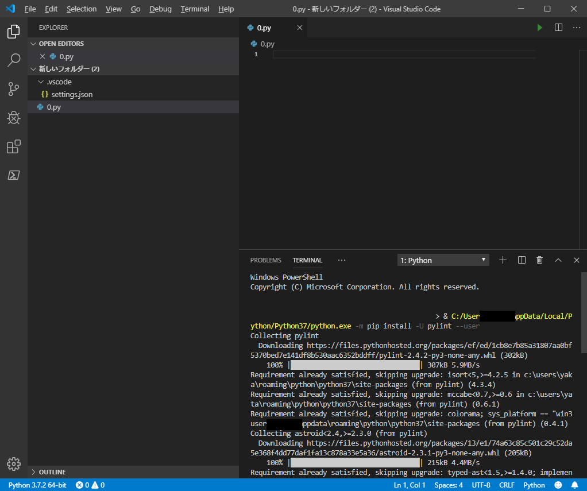

## `Linter pylint is not installed` ダイアログで `Install` しても、 `There is no Pip installer available in the selected environment.` といわれる

### 症状

.py ファイルを保存する度に、画面右下に `Linter pylint is not installed` が出てくる  


ここで、 `Install` を選択しても、`There is no Pip installer available in the selected environment.` といわれてしまう


### 原因

vscode が python のインストール場所を把握できていない為。  

### 解決方法

`F1` キーか、`ctrl` +  `shift` + `P` を押して コマンドパレットを起動する。  
`Python: Select Interpreter` を選択する。  


インストールされている Python のリストが表示されるので、  
使用する Python を選択する。  


すると、プロジェクトディレクトリに、 `.vscode\settings.json` が作られ、  
`settings.json` 内に `"python.pythonPath": "<選択した Python のパス>"` が定義される。  


この状態で、 `Linter pylint is not installed` ダイアログの `Install` を押す。  
ターミナルにインストール状況が表示される。  



↓ インストール状況の例 ↓

```
Windows PowerShell
Copyright (C) Microsoft Corporation. All rights reserved.


                                              > & C:/Users/*****/AppData/Local/Prython/Python37/python.exe -m pip install -U pylint --user
Collecting pylint
  Downloading https://files.pythonhosted.org/packages/ef/ed/1cb8e7b85a31807aa0bff5370bed7e141df8b530aac6352bddff/pylint-2.4.2-py3-none-any.whl (302kB)
    100% |████████████████████████████████| 307kB 5.9MB/s
Requirement already satisfied, skipping upgrade: isort<5,>=4.2.5 in c:\users\*****\roaming\python\python37\site-packages (from pylint) (4.3.4)
Requirement already satisfied, skipping upgrade: mccabe<0.7,>=0.6 in c:\users\*****\roaming\python\python37\site-packages (from pylint) (0.6.1)
Requirement already satisfied, skipping upgrade: colorama; sys_platform == "win32users\*****\appdata\roaming\python\python37\site-packages (from pylint) (0.4.1)
Collecting astroid<2.4,>=2.3.0 (from pylint)
  Downloading https://files.pythonhosted.org/packages/13/e1/74a63c85c501c29c52da55e368f4dd77daf1fa13c878a33e5a36/astroid-2.3.1-py3-none-any.whl (205kB)
    100% |████████████████████████████████| 215kB 4.4MB/s
Requirement already satisfied, skipping upgrade: typed-ast<1.5,>=1.4.0; implementme == "cpython" and python_version < "3.8" in c:\users\*****\appdata\roaming\pythn37\site-packages (from astroid<2.4,>=2.3.0->pylint) (1.4.0)
Collecting lazy-object-proxy==1.4.* (from astroid<2.4,>=2.3.0->pylint)
  Downloading https://files.pythonhosted.org/packages/01/b0/467ad69cd8adfe2be737c9b69c5809c7098a7aa337adda2542b7259bc0/lazy_object_proxy-1.4.2-cp37-cp37m-win_amd6whl
Requirement already satisfied, skipping upgrade: wrapt==1.11.* in c:\users\*****\*****\appdata\roaming\python\python37\site-packages (from astroid<2.4,>=2.3.0->pyylint) (1.11.1)
Requirement already satisfied, skipping upgrade: six==1.12 in c:\users\*****\appddata\roaming\python\python37\site-packages (from astroid<2.4,>=2.3.0->pylint) (11.12.0)
Installing collected packages: lazy-object-proxy, astroid, pylint
  Found existing installation: lazy-object-proxy 1.3.1
    Uninstalling lazy-object-proxy-1.3.1:
      Successfully uninstalled lazy-object-proxy-1.3.1
  Found existing installation: astroid 2.2.5
    Uninstalling astroid-2.2.5:
      Successfully uninstalled astroid-2.2.5
  Found existing installation: pylint 2.3.1
    Uninstalling pylint-2.3.1:
      Successfully uninstalled pylint-2.3.1
  The scripts epylint.exe, pylint.exe, pyreverse.exe and symilar.exe are installeed in 'C:\Users\*****\AppData\Roaming\Python\Python37\Scripts' which is not on PTATH.
  Consider adding this directory to PATH or, if you prefer to suppress this warniing, use --no-warn-script-location.
Successfully installed astroid-2.3.1 lazy-object-proxy-1.4.2 pylint-2.4.2
You are using pip version 18.1, however version 19.2.3 is available.
You should consider upgrading via the 'python -m pip install --upgrade pip' commaand.
PS C:\Users\*****\Desktop\新しいフォルダー (2)>
```