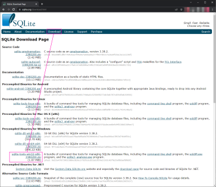

# Download

[https://www.sqlite.org/](https://www.sqlite.org/)  

  

ダウンロードした zip ファイルを解凍する。  
今回は以下ディレクトリ構造になるように解凍したものとして説明を続ける。  

```
"C:\Manually Installed\sqlite-tools"
┣sqldiff.exe
┣sqlite3.exe
┗sqlite3_analyzer.exe
```

# 既存の DB を覗く

```
"D:\yakenohara\KnowHow\Django\example\08-rest-api\main"
┗db.sqlite3
```
という DB ファイルがあったとして、以下の様に実行する。  

```
D:\yakenohara\KnowHow\Django\example\08-rest-api\main>"C:\Manually Installed\sqlite-tools\sqlite3.exe" db.sqlite3
SQLite version 3.38.2 2022-03-26 13:51:10
Enter ".help" for usage hints.
sqlite> .tables
accounts_tokenforrestapi    auth_user_user_permissions
auth_group                  django_admin_log
auth_group_permissions      django_content_type
auth_permission             django_migrations
auth_user                   django_session
auth_user_groups            editors_editor
sqlite> select * from accounts_tokenforrestapi;
fe69d43cf7cc21aa2257785dc35002af7aeba7a7|2022-04-04 08:48:33.078969||7 days|1
sqlite> PRAGMA table_info('auth_user');
0|id|INTEGER|1||1
1|password|varchar(128)|1||0
2|last_login|datetime|0||0
3|is_superuser|bool|1||0
4|username|varchar(150)|1||0
5|last_name|varchar(150)|1||0
6|email|varchar(254)|1||0
7|is_staff|bool|1||0
8|is_active|bool|1||0
9|date_joined|datetime|1||0
10|first_name|varchar(150)|1||0
sqlite> .exit

```

`PRAGMA table_info('<テーブル名>');` はテーブル内に存在するカラムの名前やデータ型などを取得する。取得して表示される情報の意味は左から順番に以下の通り。  

| カラム名   | 意味                                                                   |
| ---------- | ---------------------------------------------------------------------- |
| cid        | カラムのインデックス番号です。0 から始まる通し番号になる               |
| name       | カラム名                                                               |
| type       | カラムのデータ型                                                       |
| notnull    | NULL が許可されていないカラムの場合に 1 が、そうでなければ 0           |
| dflt_value | カラムの初期値です。指定されていない場合は NULL となっているようです。 |
| pk         | 主キーとして設定されているカラムの場合に 1 が、そうでなければ 0        |
