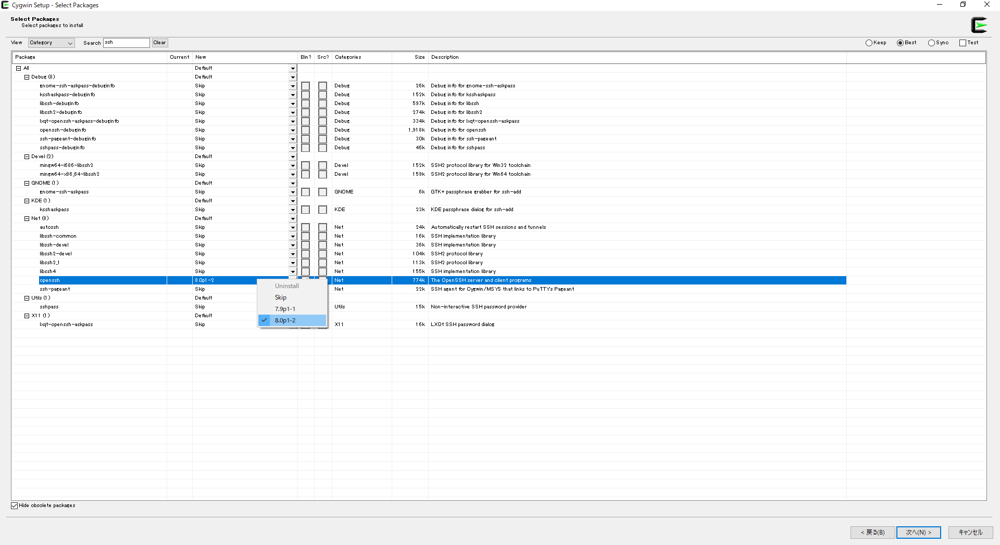

# CygwinとOpenSSHのインストールをする

CygwinInstallerをつかって、opennsshをインストールする



# Cyg-run serviceのインストール&起動

「Windows」→「スタート」から、「Cygwin64 Terminal」を管理者権限で実行します。

「ssh-host-config」とタイプしてEnter。質問がくるので、以下のように回答します。

```
*** Query: Should StrictModes be used? (yes/no) yes
*** Query: Should privilege separation be used? <yes/no>: yes
*** Query: New local account 'sshd'? <yes/no>: yes
*** Query: Do you want to install sshd as a service?
*** Query: <Say "no" if it is already installed as a service> <yes/no>: yes
*** Query: Enter the value of CYGWIN for the deamon: [] binmode ntsec
*** Query: Do you want to use a different name? (yes/no) no
*** Query: Create new privileged user account 'cyg_server'? (yes/no) no
*** Query: Do you want to proceed anyway? (yes/no) yes
```

その後、`cygrunsrv -S sshd`とタイプしてEnter。
その後、`netsh advfirewall firewall add rule name="sshd" dir=in action=allow protocol=TCP localport=22`とタイプしてEnter。

以上で、他PCからSSHでログインできます。

# ※Cyg-run Serviceを削除する場合

以下のようにします

## 現在の動作中のサービスを確認

```
#cygrunsrv -L
sshd
```

## サービスの停止・削除

```
#cygrunsrv --stop sshd
#cygrunsrv --remove sshd
```

## ユーザから削除

```
#net user sshd /delete
```