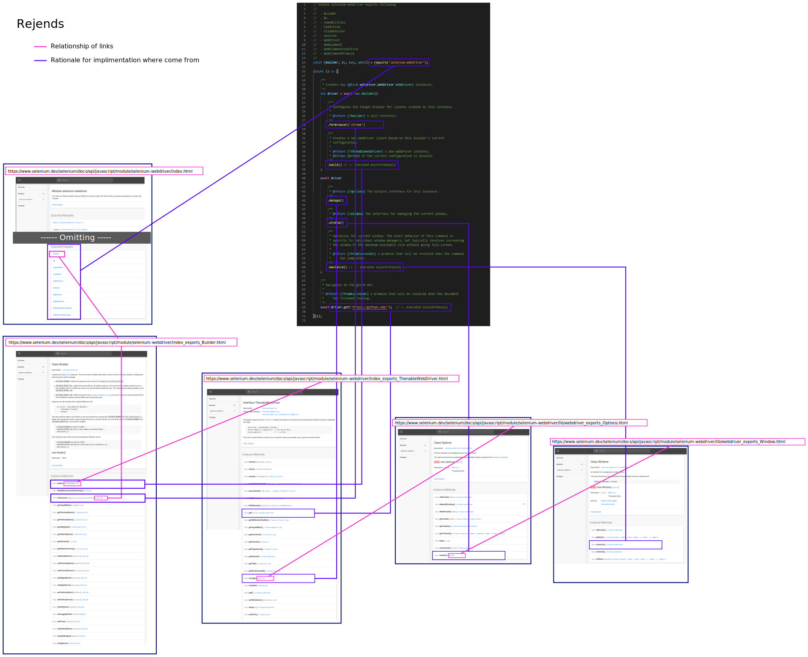

# Way of walking through API document

セットアップの確認に使った以下コードの各処理内容が、API ドキュメントのどこにかかれているのか。  

```javascript
const {Builder, By, Key, until} = require('selenium-webdriver');

(async () => {
  let driver = await new Builder().forBrowser('internet explorer').build(); // create a driver instance
  await driver.manage().window().maximize(); // maximize browser window
  await driver.get('https://github.com/'); // navigate to github.com
})();
```

このコードの各処理内容に、selenium--webdriver 自体のソースコードコメントを抜粋して貼り付けた内容が以下。  

```javascript
// Module selenium-webdriver exports following
// 
//  - Builder
//  - By
//  - Capabilities
//  - Condition
//  - FileDetector
//  - Session
//  - WebDriver
//  - WebElement
//  - WebElementCondition
//  - WebElementPromise
//
const {Builder, By, Key, until} = require('selenium-webdriver');

(async () => {
    
    /**
     * Creates new {@link webdriver.WebDriver WebDriver} instances.
     */
    let driver = await new Builder()
    
        /**
         * Configures the target browser for clients created by this instance.
         * 
         * @return {!Builder} A self reference.
         */
        .forBrowser('chrome')    

        /**
         * Creates a new WebDriver client based on this builder's current
         * configuration.
         * 
         * @return {!ThenableWebDriver} A new WebDriver instance.
         * @throws {Error} If the current configuration is invalid.
         */
        .build() // <- executed asynchronously
    ;

    await driver
        
        /**
         * @return {!Options} The options interface for this instance.
         */
        .manage()

        /**
         * @return {!Window} The interface for managing the current window.
         */
        .window()

        /**
         * Maximizes the current window. The exact behavior of this command is
         * specific to individual window managers, but typically involves increasing
         * the window to the maximum available size without going full-screen.
         *
         * @return {!Promise<void>} A promise that will be resolved when the command
         *     has completed.
         */
        .maximize() // <- executed asynchronously
    ;

    /**
     * Navigates to the given URL.
     * 
     * @return {!Promise<void>} A promise that will be resolved when the document
     *     has finished loading.
     */
    await driver.get('https://github.com/');  // <- executed asynchronously

})();

```

このコードと API ドキュメントの関係は以下。  

  
