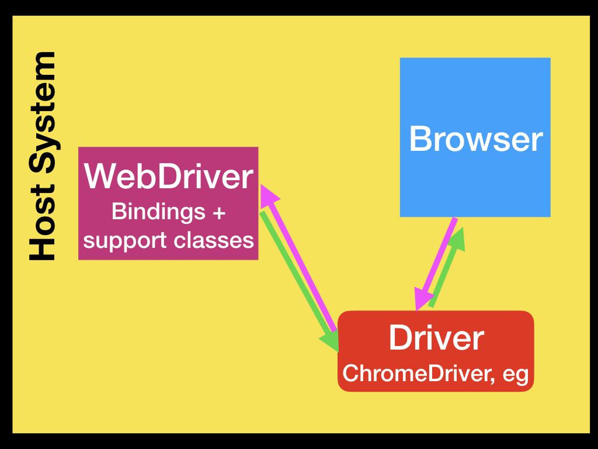

# Setup Driver and WebDriver for JavaScript

Selenium WebDriver 動作環境をセットアップする。  
セットアップは大きく分けて 2段階。

1. 操作対象の Web ブラウザに対応する Driver をインストール (下図 `Driver` の部分)  
2. Web ブラウザに対する操作の定義をするためのプログラミング言語に合わせた WebDriver をインストール (下図 `WebDriver` の部分)  

ここでは、上記 2. で使用する言語に JavaScript を使用する想定をしたセットアップを行う。

  
※  

## Install Driver

操作対象の Web ブラウザ 毎にインストール方法が異なる。  
常に最新の情報をもとにインストール方法を確認するのが良い。  

安全なのは、 Selenium の 公式ドキュメントの説明に従うこと。  
2020/03 時点では、 以下ページに Driver の入手先リンク表がある。  
ここでいう `Driver` は、公式ドキュメントでは、
`browser-specific WebDriver binaries` とか、`WebDriver binary` とかいった言葉で説明されている。
もし Driver の入手先リンク表 が見つからなければ、この言葉か、`Browser` とか、`Maintainer` とか、 `Maintained by` とかいった言葉で検索してみるといい。  

[https://www.selenium.dev/documentation/en/webdriver/driver_requirements/#quick-reference](https://www.selenium.dev/documentation/en/webdriver/driver_requirements/#quick-reference)


とはいっても、(このドキュメントを見ればわかるように) あまりにも不親切な内容。  
Selenium 公式ドキュメントと、各ブラウザの Driver 導入ドキュメントのリンク関係を、  
執筆時点で調査した結果が以下。  
(※ Opera は調査していない)


このドキュメントを頼りに、ブラウザ毎の Driver をインストールする。  
具体的な手順はブラウザ毎に以下に記事を書いた。  
(※ Opera は調査していない)

 - [Chrome](./setup_webdriver_bin_chrome.html)  
 - [Edge](./setup_webdriver_bin_edge.html)  
 - [Firefox](./setup_webdriver_bin_firefox.html)  
 - [IE](./setup_webdriver_bin_ie.html)  
 - [Safari](./setup_webdriver_bin_safari.html)  

## Install WebDriver

プログラミング言語毎に異なる。  
ここでは、JavaScript で動かすための手順を説明する。  

これに関わる Selenium の公式ドキュメントと、API ドキュメントのリンク関係は以下の通り。  
(Selenium のホームページからこれらにたどり着くルートが見当たらない! It's nonsense!)  

  

ここからわかるように、WebDriver は Node.js のパッケージとして提供されている。  
Node.js をインストールして、`npm install selenium-webdriver` だけで OK。  
`C:\example` をカレントディレクトリとした場合、以下のようになるはずだ。  

```
C:\example>npm install selenium-webdriver
npm WARN saveError ENOENT: no such file or directory, open 'C:\example\package.json'
npm notice created a lockfile as package-lock.json. You should commit this file.
npm WARN enoent ENOENT: no such file or directory, open 'C:\example\package.json'
npm WARN example No description
npm WARN example No repository field.
npm WARN example No README data
npm WARN example No license field.

+ selenium-webdriver@4.0.0-alpha.7
added 27 packages from 22 contributors and audited 32 packages in 9.071s
found 0 vulnerabilities
```
カレントディレクトリ配下のツリー構造は以下の様になる。  
```
example
│  package-lock.json
│  
└─node_modules
    ├─.bin
    │      rimraf
---------------- Omitting ----------------
    │      
    └─wrappy
            LICENSE
            package.json
            README.md
            wrappy.js
```

## 確認

早速動かしてみよう。  
`npm install selenium-webdriver` したときの `C:\example` がカレントディレクトリのままとなっている前提で説明していく。  

### Launch Browser

以下内容の `launch.js` を作成してカレントディレクトリに配置する。  

```javascript
const {Builder, By, Key, until} = require('selenium-webdriver');

(async () => {
  let driver = await new Builder().forBrowser('chrome').build(); //※2
  await driver.manage().window().maximize();
  await driver.get('https://github.com/');
})();
```
配置後のツリー図は以下のようになっていればいい。  
```
example
│  launch.js    // <- 作成した `launch.js`
│  package-lock.json
│  
└─node_modules
    ├─.bin
    │      rimraf
---------------- Omitting ----------------
    │      
    └─wrappy
            LICENSE
            package.json
            README.md
            wrappy.js
```
`node launch.js` すると、Chrome が起動して 全画面表示 -> GitHub のページが表示されるだろう。  
もしそうならなければ、 エラーメッセージがでているはずだ。  
たいていは Driver が見つからないとか、Driver とブラウザの組み合わせが間違っている(Chrome のバージョンが 80 だけど、ChromeDriver のバージョンが 81 など。)とかいった内容だ。  


### ※2 .forBrowser()

上の例では、Chrome を起動させた。  
他のブラウザを起動させたいなら、`.forBrowser()` にわたす文字列を変更すればいい。  
どんな文字列が有効なのかは、`require('selenium-webdriver')` が返す `webdriver` object の `Browser` の中に定義されている。簡単に確認したいなら、Node.js の インタラクティブシェルを起動して、`require('selenium-webdriver').Browser` とタイプすればいい。  

```
C:\example>node
> require('selenium-webdriver').Browser
{ CHROME: 'chrome',
  EDGE: 'MicrosoftEdge',
  FIREFOX: 'firefox',
  IE: 'internet explorer',
  INTERNET_EXPLORER: 'internet explorer',
  SAFARI: 'safari' }
>
```

※  
Some image is the part of documentation originating from the Selenium project is licensed under the Apache 2.0 license.  