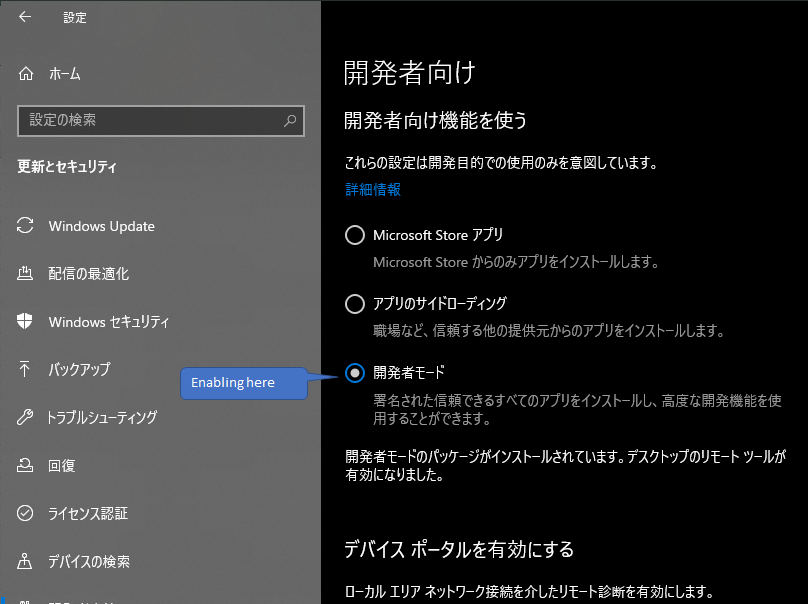

# Install Driver for Edge

↓ にしたがう。↓  
https://developer.microsoft.com/en-us/microsoft-edge/tools/webdriver/

※node  
 - Edge の バージョン確認方法は下図の通り。  

## EdgeHTML version 18 の例

Windows 10 の 開発者モードを有効にするだけでいい。  

開発者モードを有効にするには、下図のようにする。  

