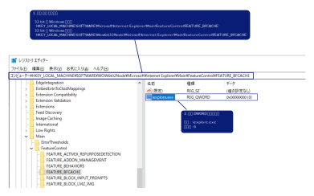

# Install Driver for IE

[SeleniumHQ の GitHub wiki](https://github.com/SeleniumHQ/selenium/wiki/InternetExplorerDriver) の `Required Configuration` の項目(以下)を実施する。  

```
Required Configuration

 - The IEDriverServer exectuable must be downloaded and placed in your PATH.
 - On IE 7 or higher on Windows Vista or Windows 7, you must set the Protected Mode settings for each zone to be the same value. The value can be on or off, as long as it is the same for every zone. To set the Protected Mode settings, choose "Internet Options..." from the Tools menu, and click on the Security tab. For each zone, there will be a check box at the bottom of the tab labeled "Enable Protected Mode".
 - Additionally, "Enhanced Protected Mode" must be disabled for IE 10 and higher. This option is found in the Advanced tab of the Internet Options dialog.
 - The browser zoom level must be set to 100% so that the native mouse events can be set to the correct coordinates.
 - For Windows 10, you also need to set "Change the size of text, apps, and other items" to 100% in display settings.
 - For IE 11 only, you will need to set a registry entry on the target computer so that the driver can maintain a connection to the instance of Internet Explorer it creates. For 32-bit Windows installations, the key you must examine in the registry editor is HKEY_LOCAL_MACHINE\SOFTWARE\Microsoft\Internet Explorer\Main\FeatureControl\FEATURE_BFCACHE. For 64-bit Windows installations, the key is HKEY_LOCAL_MACHINE\SOFTWARE\Wow6432Node\Microsoft\Internet Explorer\Main\FeatureControl\FEATURE_BFCACHE. Please note that the FEATURE_BFCACHE subkey may or may not be present, and should be created if it is not present. Important: Inside this key, create a DWORD value named iexplore.exe with the value of 0.
```

## `The IEDriverServer exectuable ~`


※note  
 - 動作対象の IE の Bit 数(32bit or 64bit)を確認するするには、[確認くん](https://www.ugtop.com/spill.shtml) が便利。  
このページに IE でアクセスして、 `現在のブラウザー` 項目の内容を確認する。  
以下は、 Win10 64bit の IE 11 32 bit / 64 bit でアクセスした場合の違い。  
32bit なら、 `WOW64;` 、 64 bit なら `Win64; x64;` と違いが出る。  

|          Browser type           |                      `現在のブラウザー` 項目の判定内容                       |
| :-----------------------------: | :--------------------------------------------------------------------------: |
| IE 11 32 bit (Windows 10 64bit) |   `Mozilla/5.0 (Windows NT 10.0; WOW64; Trident/7.0; rv:11.0) like Gecko`    |
| IE 11 64 bit (Windows 10 64bit) | `Mozilla/5.0 (Windows NT 10.0; Win64; x64; Trident/7.0; rv:11.0) like Gecko` |

 - ダウンロードする Driver バージョンで迷ったら、  
オススメ版(安定版) なら、↓↓  
[SeleniumHQ (Official Website of Selenium) の Download page](https://www.seleniumhq.org/download/)  
┗ `The Internet Explorer Driver Server`  
  ┗ `32 bit Windows IE` or `64 bit Windows IE`  
任意のバージョンなら、↓↓ (※ `IEDriverServer_~.zip` を選択する)  
[SeleniumHQ の GitHub wiki](https://github.com/SeleniumHQ/selenium/wiki/InternetExplorerDriver)  
┗ `Installing`  
  ┗ [`Downloads`](https://selenium-release.storage.googleapis.com/index.html)


## `On IE 7 or higher on ~, you must set the Protected Mode settings ~`

`インターネットオプション` -> `セキュリティタブ` -> `このゾーンのセキュリティのレベル(L)` -> `保護モードを有効にする` を Enabled にする。  

<CAUTION!>  
この項目は、Windows10でも必要。  
設定しないと、以下エラーが発生して IE が起動しなかった。  
```
> node ie.js
(node:9276) UnhandledPromiseRejectionWarning: Error: Server terminated early with status 4
    at earlyTermination.catch.e (C:\Users\xxxx\node_modules\selenium-webdriver\remote\index.js:251:52)
    at process._tickCallback (internal/process/next_tick.js:68:7)
(node:9276) UnhandledPromiseRejectionWarning: Unhandled promise rejection. This error originated either by throwing inside of an async function without a catch block, or by rejecting a promise which was not handled with .catch(). (rejection id: 2)
(node:9276) [DEP0018] DeprecationWarning: Unhandled promise rejections are deprecated. In the future, promise rejections that are not handled will terminate the Node.js process with a non-zero exit code.
```
</CAUTION!>  

Windows をインストール後、特に設定を変更していなければ、変更前の状態は以下の様になっているはず。  

|        設定項目        | 変更前 | 変更後 |
| :--------------------: | :----: | :----: |
|     インターネット     |  yes   |  yes   |
| ローカルイントラネット |   no   |  yes   |
|     信頼済みサイト     |   no   |  yes   |
|     制限付きサイト     |  yes   |  yes   |


## `Additionally, "Enhanced Protected Mode" must be disabled ~`


## `The browser zoom level must be set to 100% ~`


## `~ "Change the size of text, apps, and other items" to 100% ~`


## `~ set a registry entry ~`



