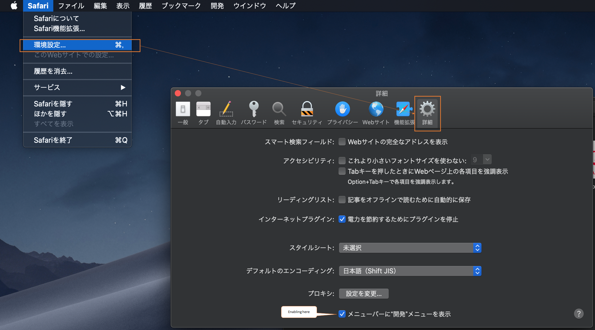
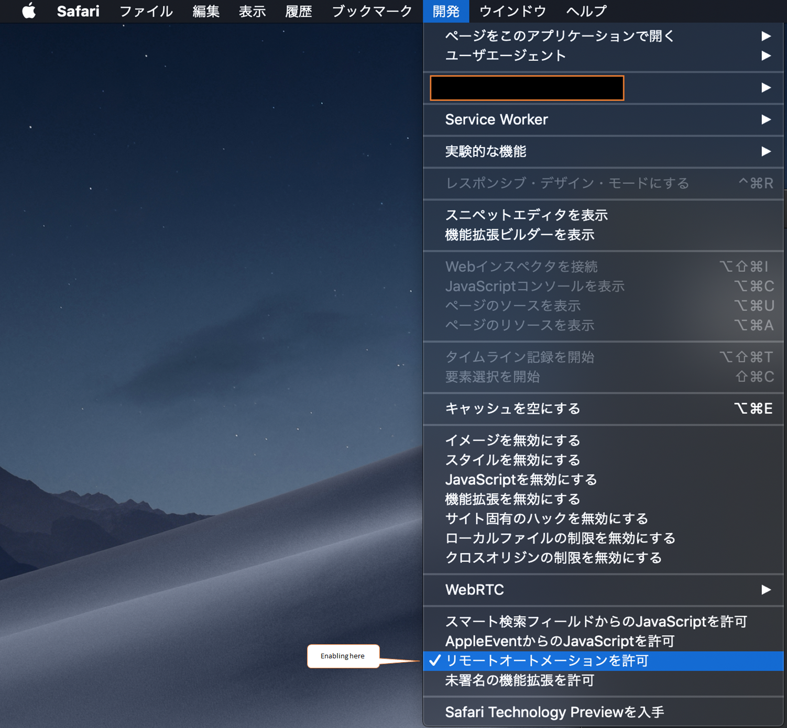

# Install Driver for Safari

[webkit の公式ドキュメント](https://webkit.org/blog/6900/webdriver-support-in-safari-10/) の以下を実施する。

```
 - Ensure that the Develop menu is available. It can be turned on by opening Safari preferences (Safari > Preferences in the menu bar), going to the Advanced tab, and ensuring that the Show Develop menu in menu bar checkbox is checked.
 - Enable Remote Automation in the Develop menu. This is toggled via Develop > Allow Remote Automation in the menu bar.
 - Authorize safaridriver to launch the webdriverd service which hosts the local web server. To permit this, run /usr/bin/safaridriver once manually and complete the authentication prompt.
```

## `Ensure that the Develop menu is available ~`



## `Enable Remote Automation in the Develop menu`



