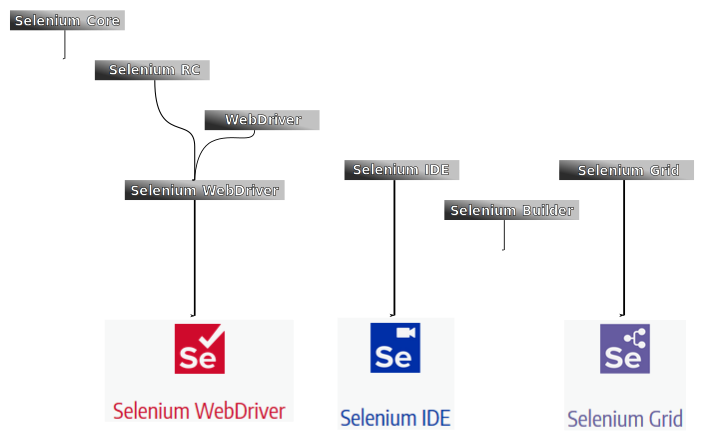
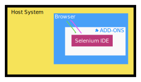

# Selenium いろいろ

Selenium には、Selenium WebDriver やら IDE やらいろいろある。  
現状主な仕組みは以下3つ。  

 - Selenium WebDriver
 - Selenium IDE
 - Selenium Grid

それ以外のキーワード(Selenium RC とか、Slenium Builder とか)は、  
上記 3 つの仕組みができるまでの、過去の仕組みと考えていい。  
これから Selenium を始めるなら、*Selenium は以下の様な遷移で成り立ってきた* くらいの認識で
十分かもしれない。  

  
※  

# WebDriver, IDE, Grid どれを使うべきか

Webブラウザに対する操作を 自動で行ってくれるという点ではどれも同じ。  
*どんな環境でそれをやりたいか* によって判断するのがいい。 

## Selenium WebDriver

操作対象の Web ブラウザは 1つ  
操作の定義をプログラミング言語を使って定義する  
定義した操作内容を、下図中の `WebDriver` に対して行うイメージ。  

  
※  

## Selenium IDE
操作対象の Web ブラウザは 1つ  
操作の定義をプログラミング言語ではなくリッチな GUI を使って定義する  
下図中の `Selenium IDE` 内で、操作の定義も行う。  
非エンジニアにとってはとっつきやすいけど、Selenium WebDriver にくらべて以下の制約がある。 
 - 提供形式が firefox か chrome のプラグインであるため、他のブラウザでは使えない。
 - マクロで if などの制御構造を定義できるけど、Selenium WebDriver にくらべるとできることが少ない。  

  

## Selenium Grid
操作対象の Web ブラウザは 複数  
操作の定義をプログラミング言語を使って定義する

  
※  

※  
Some image is the part of documentation originating from the Selenium project is licensed under the Apache 2.0 license.  
