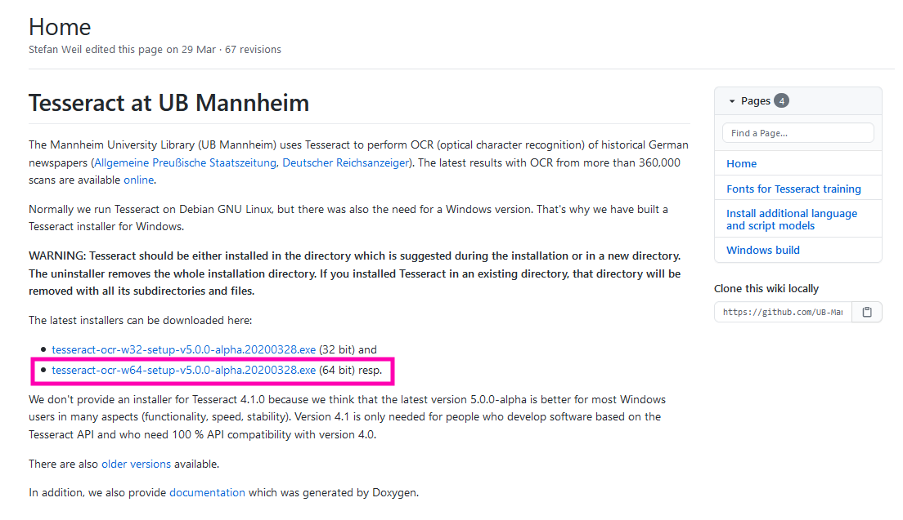
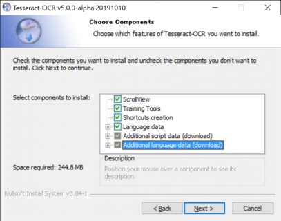
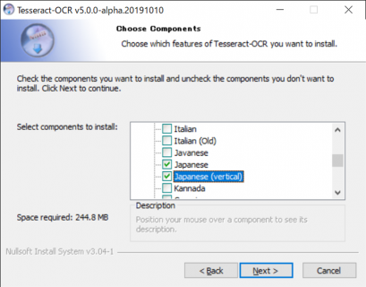
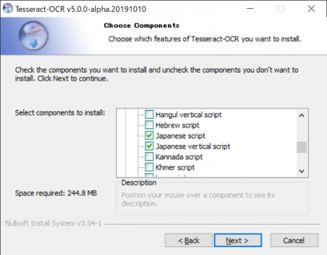
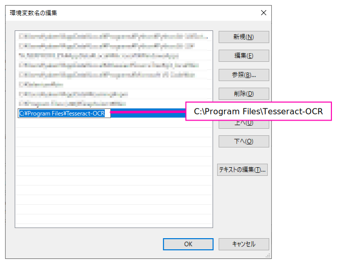
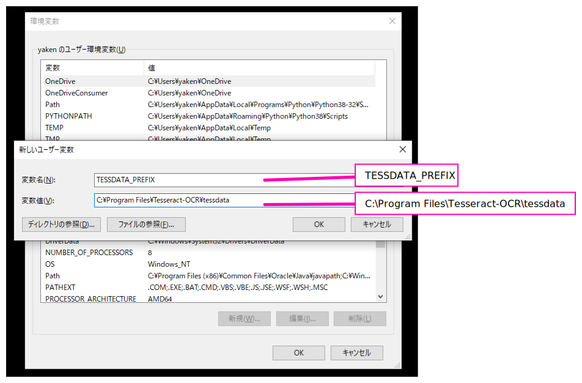

# Install

## Download 
https://github.com/UB-Mannheim/tesseract/wiki  
  

`Additionalscript data` と `Additional language data` ので日本語データを追加する  
  

`Additionalscript data` を開いて `Japanese` と `Japanese(vertical)` (<- 縦書き用) にチェック  
  

`Additional language data` を開いて `Japanese` と `Japanese(vertical)` (<- 縦書き用) にチェック  
  

あとはすべて OK でいい。

## 環境変数設定

`PATH` に以下を追加(Tesseract のインストールディレクトリ)
  

`TESSDATA_PREFIX` を以下のように追加定義( `~\Tesseract-OCR\` は Tesseract のインストールディレクトリ)  
(※この環境変数は コマンドプロンプト上での -l オプションで言語を指定する時に必要。この環境変数がないと `-l` を入力ファイルパスと解釈してしまう)  
  

