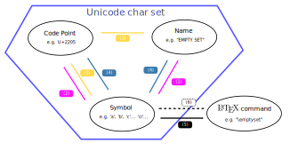
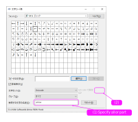

# To know specified character

下図から目的操作を決める。  

  

## (1), (2)

charmap.exe (Windows -> `charmap.exe` or `文字コード表` で起動できる)  

  

## (3), (4)

Python で 以下を実行した後、  
(3) なら `byCodePoint()`、(4) なら `bySymbol()` で取得できる  

```python
import unicodedata

def bySymbol(char_c):
    dict_toRet = {
        'symbol':char_c,
        'code_point':'U+{:04X}'.format(ord(char_c)),
        'name':unicodedata.name(char_c)
    }
    return dict_toRet

def byCodePoint(int_codePoint):
    char_c = chr(int_codePoint)
    return bySymbol(char_c)

```

## (5)

Scott Pakin:The Comprehensive LATEX Symbol List ([Ref.1](#ref-1)) (pdf file) 内を検索して、目的の LaTeX command を見つける。  

## (6)

`<Caution!>`  
Render した結果の Symbol すべてが Unicode 文字集合のいづれかになるわけではない。  
e.g.   
(LaTex が表現できる Symbol set は Unicode set より広いから)  
`</Caution!>`

`mathjax/index.html` をブラウザで開いて、`<textarea>` に LaTeX command を入力する。  
(note. `$` or `$$` でコマンドを囲む)  

# References

{:#ref-1}  
[Scott Pakin:The Comprehensive LATEX Symbol List](http://ftp.yz.yamagata-u.ac.jp/pub/CTAN/info/symbols/comprehensive/) ([Ref.2](#ref-2))  
┗[symbols-a4.pdf](http://ftp.yz.yamagata-u.ac.jp/pub/CTAN/info/symbols/comprehensive/symbols-a4.pdf)

{:#ref-2}  
LaTex 公式ドキュメントからは以下の関係でたどり着ける。  
[LaTex 公式ドキュメント](https://www.latex-project.org/help/documentation/)  
┗[はやわかり LaTeX で数式組版 (Short Math Guide for LaTeX)](https://www.latex-project.org/help/documentation/short-math-guide_jpn.pdf) ([Ref.3](#ref-3))  
┗[`[[CLSL]Scott Pakin:The Comprehensive LATEX Symbol List,`](http://mirror.ctan.org/tex-archive/info/symbols/comprehensive/)  

{:#ref-3}  
オリジナルの英語版は以下  
Short Math Guide for LaTeX
http://www.ams.org/publications/authors/tex/amslatex  
┗[Short Math Guide for LaTeX](http://ftp.yz.yamagata-u.ac.jp/pub/CTAN/info/short-math-guide/short-math-guide.pdf)  

