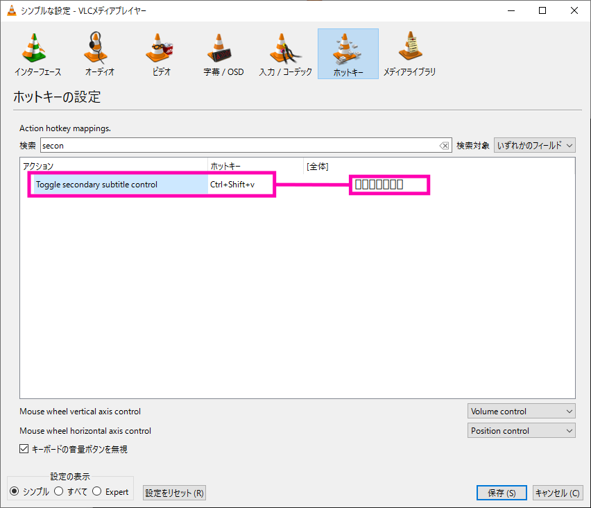

## 第2字幕の表示方法

#### NOTE 第2字幕機能があるかどうかの確認
VLC media player の下図ホットキー画面で、 `Toggle secondary subtitle control` が存在することを確認する  
(この図は Version 4.0.0-dev 版の例)  
  

### 概要

設定方法はキーボードショートカットのみ。  
デフォルトでは以下の設定。  

| Action                            | Hotkey       |
| --------------------------------- | ------------ |
| Toggle secondary subtitle control | Ctrl+Shift+v |
| 字幕トラックの切り替え            | v |

### 手順

1. 「Toggle secondary subtitle control」 で 「Primary subtitle control」 表示  
    1. 「字幕トラックの切り替え」 で目的の字幕を選択  
2. 「Toggle secondary subtitle control」 で 「Secondary subtitle control」 表示  
    1. 「字幕トラックの切り替え」 で目的の字幕を選択  
