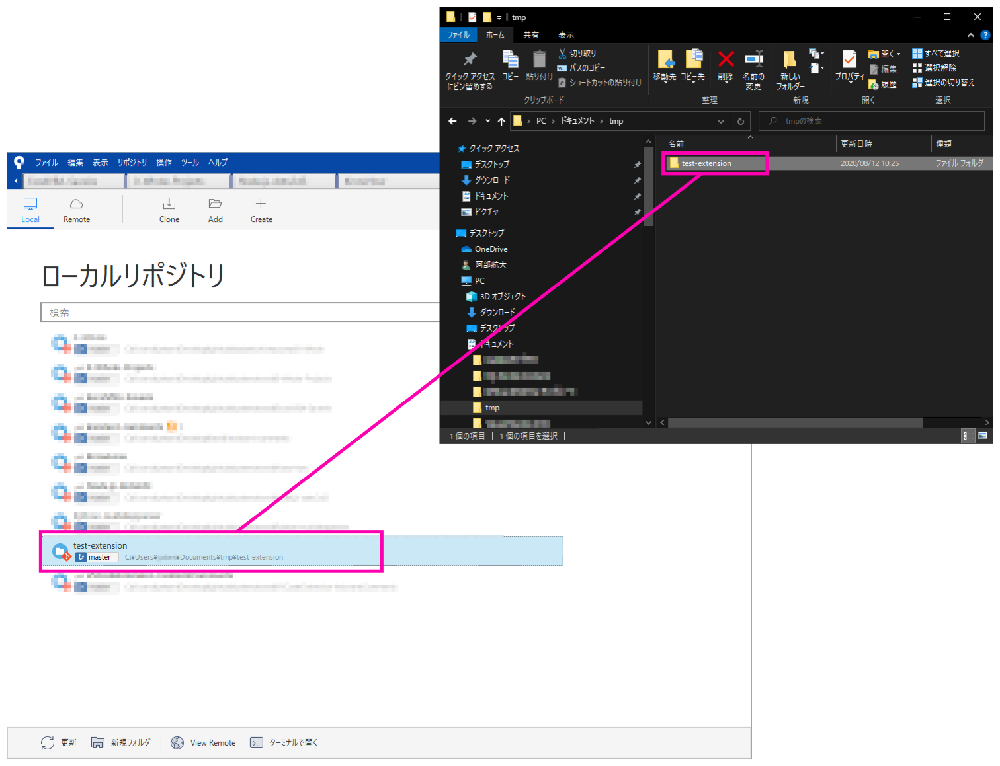
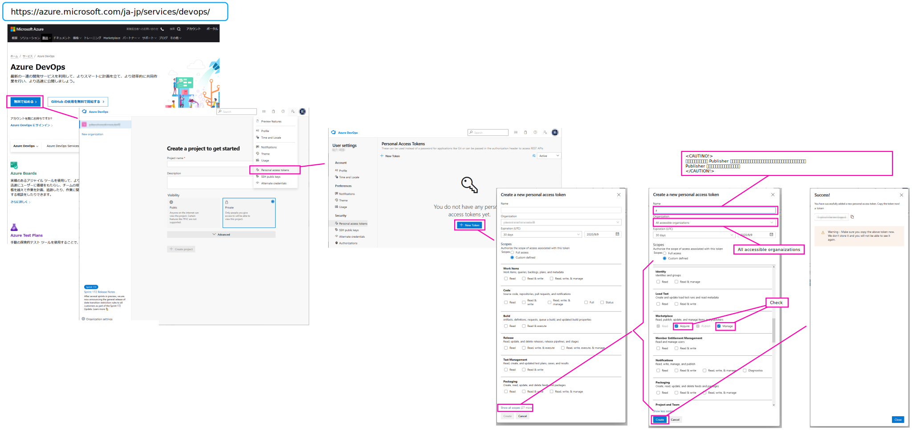
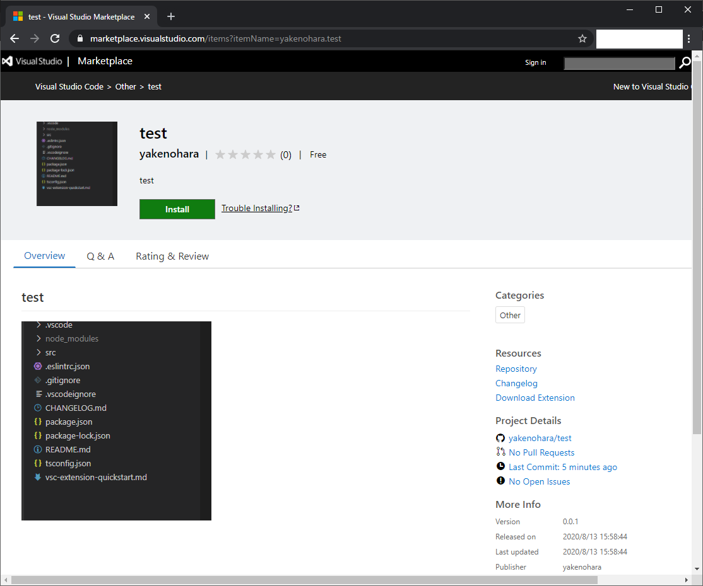

# Install

※ Node.js がなければ事前にインストールしておく  

1. Extension PJ を作るだけなら、以下コマンドでインストールする  

```
npm install -g yo generator-code
```

2. 作った Extension を 公開するなら、以下コマンドも追加で実行する  

```
npm install -g vsce
```

# `yo code` ~Extension PJ を作る~

PJ を作成したいディレクトリでターミナルを開いて `yo code` するだけでいい。  
以下は TypeScript で PJ を作成する例  

```
>yo code

     _-----_     ╭──────────────────────────╮
    |       |    │   Welcome to the Visual  │
    |--(o)--|    │   Studio Code Extension  │
   `---------´   │        generator!        │
    ( _´U`_ )    ╰──────────────────────────╯
    /___A___\   /
     |  ~  |
   __'.___.'__
 ´   `  |° ´ Y `

? What type of extension do you want to create? New Extension (TypeScript)
? What's the name of your extension? Test Extension
? What's the identifier of your extension? test-extension
? What's the description of your extension? Description of Test Extension
? Initialize a git repository? Yes
? Which package manager to use? npm
   create test-extension\.vscode\extensions.json
   create test-extension\.vscode\launch.json
   create test-extension\.vscode\settings.json
   create test-extension\.vscode\tasks.json
   create test-extension\src\test\runTest.ts
   create test-extension\src\test\suite\extension.test.ts
   create test-extension\src\test\suite\index.ts
   create test-extension\.vscodeignore
   create test-extension\.gitignore
   create test-extension\README.md
   create test-extension\CHANGELOG.md
   create test-extension\vsc-extension-quickstart.md
   create test-extension\tsconfig.json
   create test-extension\src\extension.ts
   create test-extension\package.json
   create test-extension\.eslintrc.json


I'm all done. Running npm install for you to install the required dependencies. If this fails, try running the command yourself.


npm notice created a lockfile as package-lock.json. You should commit this file.
npm WARN optional SKIPPING OPTIONAL DEPENDENCY: fsevents@~2.1.1 (node_modules\chokidar\node_modules\fsevents):
npm WARN notsup SKIPPING OPTIONAL DEPENDENCY: Unsupported platform for fsevents@2.1.3: wanted {"os":"darwin","arch":"any"} (current: {"os":"win32","arch":"x64"})
npm WARN test-extension@0.0.1 No repository field.
npm WARN test-extension@0.0.1 No license field.

added 235 packages from 175 contributors and audited 238 packages in 7.442s

31 packages are looking for funding
  run `npm fund` for details

found 0 vulnerabilities


Your extension test-extension has been created!

To start editing with Visual Studio Code, use the following commands:

     cd test-extension
     code .

Open vsc-extension-quickstart.md inside the new extension for further instructions
on how to modify, test and publish your extension.

For more information, also visit http://code.visualstudio.com and follow us @code.

```

するとディレクトリ配下に PJ が作成される。  
(フォルダ名は、`What's the identifier of your extension?` で指定した `test-extension` という名前で作られる)  

このフォルダを以下のように SourceTree に追加すれば、あとは好きに開発できる    

  

'<CAUTION!>`

この状態では、Initial Commit が存在しない(`yo code` は `git init` 後に必要ファイルを生成してくれるだけで、コミットまではしてくれない) ので、まずこのコミットをしておくのが無難。  
(既存の変更内容を `全てインデックスに追加` -> `コミット`)  

`<TIPS>`  
ここでコミットされる内容は、`node_modules` などを除外したファイルたち。  
(`yo code` した時点で `node_modules` などを ignore する `.gitignore` が生成されている)  
`</TIPS>`  

'</CAUTION!>`

## GitHub に POST するなら

`<TIPS>`  
後に VS Code Marketplace で公開するとき、リモートの git URL を PJ 内の package.json に定義しておかないと README.md が参照する PJ 内の画像参照が壊れてしまう。  
なので GitHub に POST しておいたほうがいい。  
(git bucket などの GitHub 以外の git ホスティングサービスでもいいはずだけど、調べていないので省略)  
`</TIPS>`  

GitHub で空の repository を作成する  
(※ `Initialize this repository with a README` のチェックは **外す**)  

作成した GitHub 上の repository と `yo code` したローカルの repository を紐付けて push する  
↓↓Source Tree からターミナルを開いて以下を実行する例↓↓  
```
$ git remote add origin https://github.com/yakenohara/Test-Extension.git

$ git push -u origin master
Enumerating objects: 23, done.
Counting objects: 100% (23/23), done.
Delta compression using up to 8 threads
Compressing objects: 100% (22/22), done.
Writing objects: 100% (23/23), 27.85 KiB | 4.64 MiB/s, done.
Total 23 (delta 0), reused 0 (delta 0)
To https://github.com/yakenohara/Test-Extension.git
 * [new branch]      master -> master
Branch 'master' set up to track remote branch 'master' from 'origin'.

```

## 別 PC でクローンしたときは

ターミナルで `npm install` するだけでいい  

# Extension を公開する

## アクセストークンを作成する

以下手順でアクセストークンを作る。作ったトークン(文字列)はメモっておく  
https://azure.microsoft.com/ja-jp/services/devops/  
  


## アクセストークンを使って publisher を作成する

(Note. すでに作成ずみの pulisher をつかって公開するなら、この手順は不要)  

ターミナルで `vsce create-publisher (publisher-name)` する  

以下は `yakenohara` という pusblisher 名で作る例。  
ここで `Personal Access Token` に作ったアクセストークンを指定する  
(※ なぜかE-mail は指定しなくてもイケた)

```
>vsce create-publisher yakenohara
Publisher human-friendly name: (yakenohara)
E-mail:
Personal Access Token: ****************************************************

 DONE  Created publisher 'yakenohara'.
```

## package.json を編集する

package.json には以下項目を定義しておく。  
詳細は (https://code.visualstudio.com/api/references/extension-manifest)  

```
	"publisher":"yakenohara",
	"repository": {
		"type": "git",
		"url": "https://github.com/yakenohara/test.git"
	},
	"icon": "assets/images/icon.png",
```

Note.  
 - `publisher`  
   必須。  
   
 - `repository`  
   任意。  
   README.md の中で画像を相対参照している場合は、この設定がないと `vsce package` or `vsce publish` の時に以下のように言われるので、設定しておいたほうがいい。  

```
 ERROR  Couldn't detect the repository where this extension is published. The image 'assets/images/all-line.gif' will be broken in README.md. Please provide the repository URL in package.json or use the --baseContentUrl and --baseImagesUrl options.
```

 - `icon`  
   任意。  
   Marketplace で表示されるアイコン画像。  
   なぜか `./assets/images/icon.png` のように (`./`を使って) 設定すると、  
   ` ERROR  The specified icon 'extension/./assets/images/icon.png' wasn't found in the extension.` といわれる  


## vsce コマンドで公開する

ターミナルで `vsce publish` する  

<CAUTION!>  
1. この作業をする前に、 Extension PJ 配下の README.md をデフォルト状態からなにかしら変更する。  
(もしこれをやらずに `vsce package` を実行すると、`ERROR  Make sure to edit the README.md file before you package or publish your extension.` といわれる)  

2. 2回目以降の `vsce publish` のときは、package.json 内の `version` の内容を最後に publish した時より大きい数字に設定しておく  
   (もしこれをやらずに `vsce publish` を実行すると、 `ERROR  xxxtest.test@0.0.1 already exists. Version number cannot be the same.` といわれる)  

</CAUTION!>

```
>vsce publish
Executing prepublish script 'npm run vscode:prepublish'...

> test@0.0.1 vscode:prepublish D:\test\test
> npm run compile


> test@0.0.1 compile D:\test\test
> tsc -p ./

Publishing yakenohara.test@0.0.1...
 DONE  Published yakenohara.test@0.0.1
Your extension will live at https://marketplace.visualstudio.com/items?itemName=yakenohara.test (might take a few minutes for it to show up).


```
数分後、、  
↓ ↓ ↓ ↓  

  

# Extension, Publisher, Token の削除

## publish した Extension の削除

(https://marketplace.visualstudio.com/) にアクセス  

`sign in` -> `Publish extensions`  

目的の Extension を選んで `Unpublish` or `Remove`  
(`Unpublish` は PJ を非公開状態にする。`Remove` は PJ を削除する。)  
※ `Remove` しても GitHub から PJ が削除されるわけではない)  

## publisher の削除

ターミナル で`vsce ls-publishers` して、対象の publisher 名があるかどうかを確認する。  
もし無い場合は、`vsce login (publisher-name)` で 対象の publisher に login する。  

`vsce logout (publisher-name)` する  

`vsce delete-publisher (publisher-name)` する


## パーソナルアクセストークンの削除

`<EXTREMELY DANGEROUS!>`  

この手順を実行すると削除したトークンを使ってログインしていた Publisher に対してログインできなくなる。  
なので必ず、紐づく Publisher とその PJ を削除してから実施すること。  

`</EXTREMELY DANGEROUS!>`  

(https://azure.microsoft.com/ja-jp/services/devops/)にアクセス  

画面右上メニューを開いて `Personal Acceess Tokens`  

対象のトークンを選択(画面右側にチェックが入っている状態) で `Revoke`  

