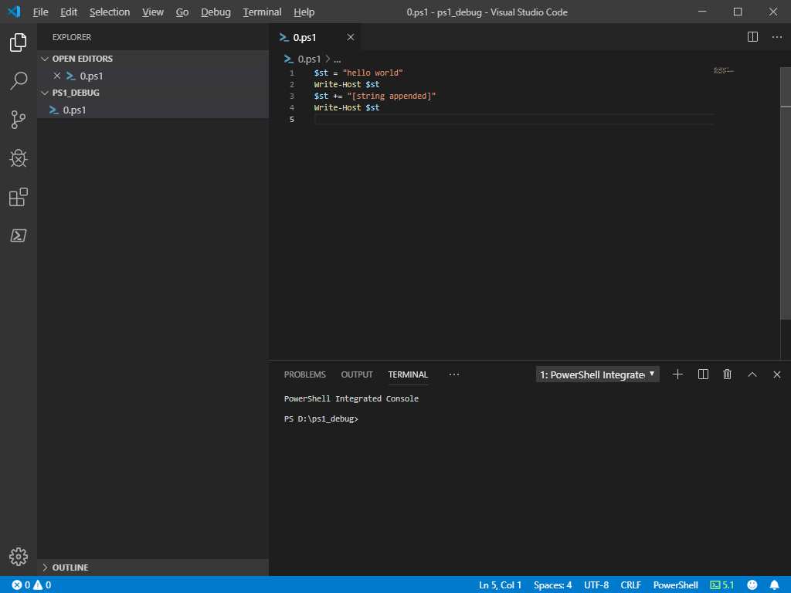
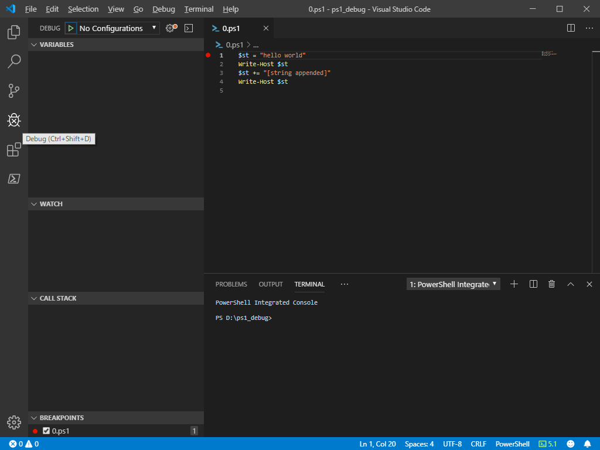
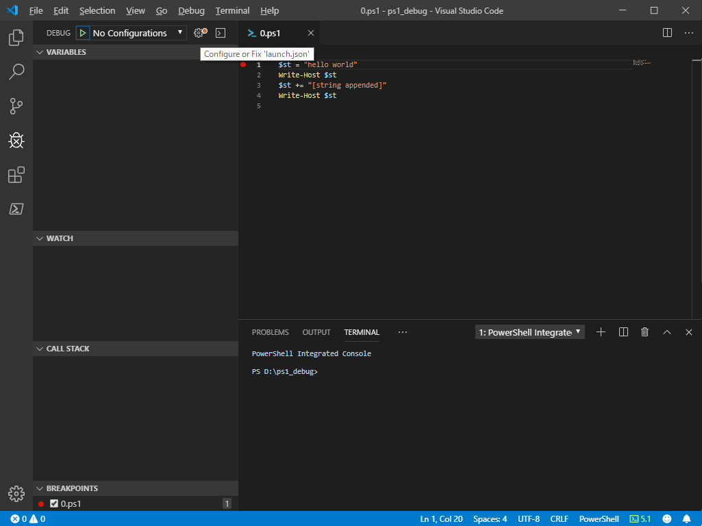
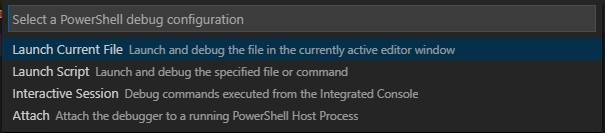
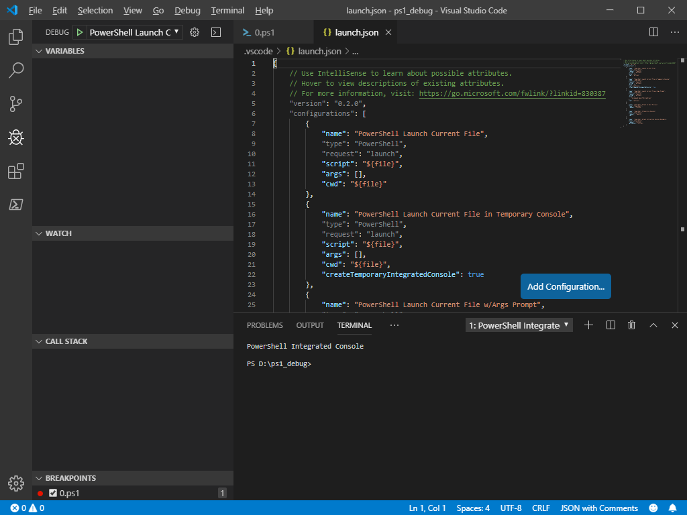
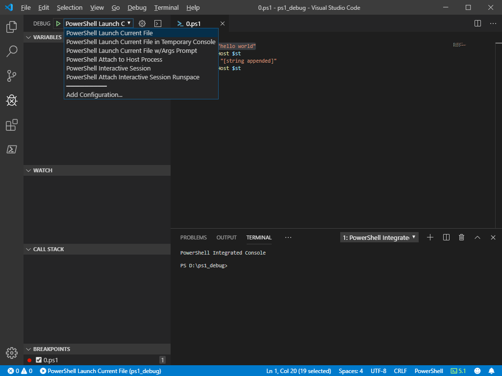
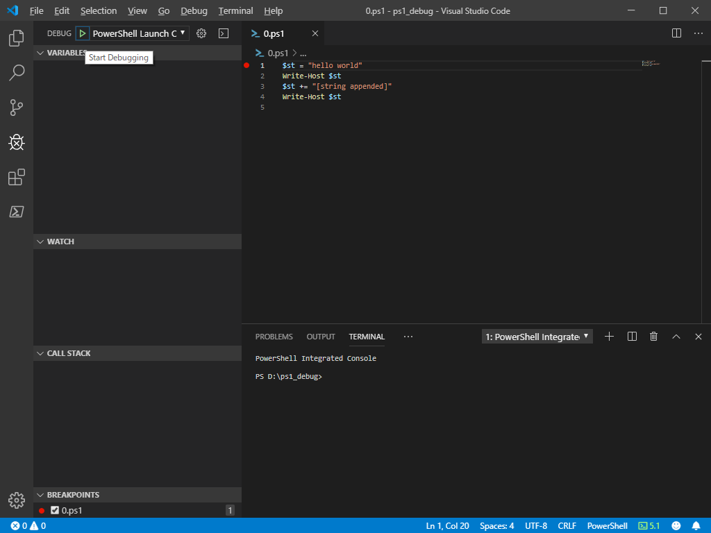
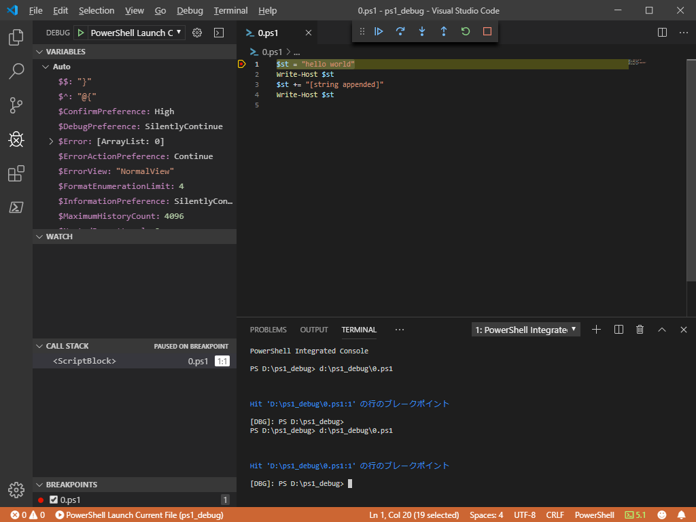
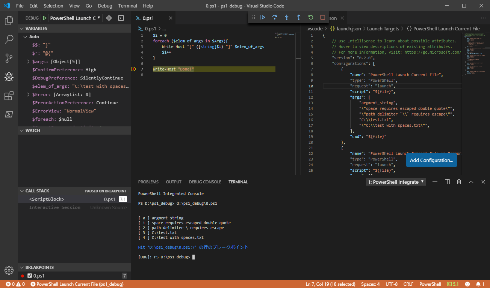

# 現在開いているスクリプトをデバッグ起動する(Powershellスクリプトの例)

以下のようなスクリプトに対するデバッグ起動をしたいとき、  

  

エディタ左部分の行数表示されている部分の更に左側をクリックすると、  
ブレークポイントを設定できる  
(赤い点がつく)  

  

アクティビティーバーの `Debug` (虫のマーク)を選択  

  

サイドバー上部の `Configure or Fix 'launch.json'` (歯車のマーク)を選択  

  

※ 以下のダイアログが表示された場合は、`Launch Current File` を選択 ※  



PJ ディレクトリに `.vscode\launch.json` が作成される。  

  


デバッグ対象の スクリプトを エディタに表示させる。  
(`launch.json` は閉じても閉じなくてもいい。デバッグ対象の スクリプトがエディタ最前面にくればいい。  
 エディタ画面を分割している場合は、デバッグ対象の スクリプト を表示している領域を一度クリックして、  
 編集状態にしておく。
)  
そのあと、サイドバー上部のプルダウンから、 `Powershell Launch Current File` を選択する。  

  

サイドバー上部の `Start Debugging` を押す

  

エディタ上部に `Continue` , `Step Into` 等のデバッグ用機能が表示される。  
あとは好きなように。  

  

## 起動時に引数を設定する

`launch.json` を開く  
( Windows Explorer から `launch.json` を vscode に D&D してもいいし、  
  アクティビティバーで `Explorer` を選択してから `.vscode\launch.json` を選択してもいいし、  
  アクティビティバーで `Debug` を選択してから サイドバー上部の `Open launch.json` を選択してもいい。  
)

`configurations` の値配列の内、  
`"name": "PowerShell Launch Current File"` となっている要素の `args` の値を編集する。  
(`args` が存在しなければ追加すればいい)  

編集が終わったら `launch.json` を保存する。  

↓ 5つの引数を指定する例

```
        {
            "name": "PowerShell Launch Current File",
            "type": "PowerShell",
            "request": "launch",
            "script": "${file}",
            "args": [
                "argment_string",
                "\"space requires escaped double quote\"",
                "\"path delimiter `\\` requires escape\"",
                "C:\\test.txt",
                "\"C:\\test with spaces.txt\"",
            ],
            "cwd": "${file}"
        },
```

### note

 - スペースを含む文字列を指定する場合は、全体を `\"` `\"` で囲む  
   `"\"space requires escaped double quote\""` が良い例。  
   全体を `\"` `\"` で囲む事を忘れると、  
   `space` , `requires` , `escaped` , `double` , `quote` が別の引数として認識される

 - パス指定時の `\` は、 `\` でエスケープが必要  
   例えば `C:\test.txt` を指定したいなら、  
   `C:\\test.txt` とする

↓ 上記引数設定を反映させた コンフィグでデバッグ実行した例。  
  スペースはスペースとして解釈され、`\\` は `\` と解釈されている。

  

