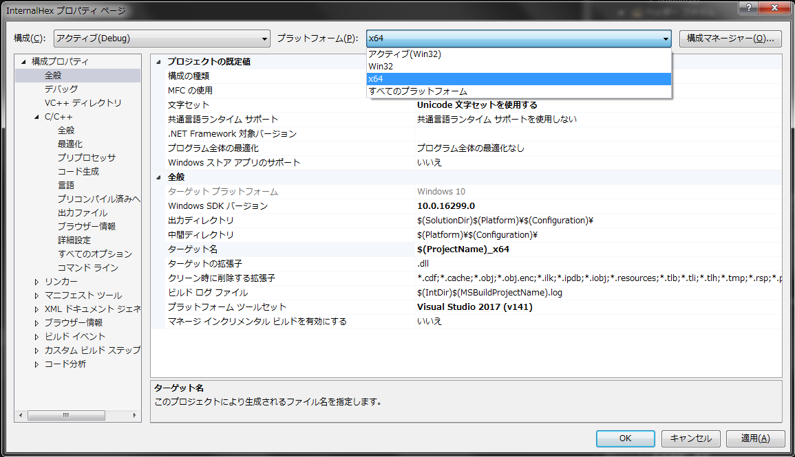
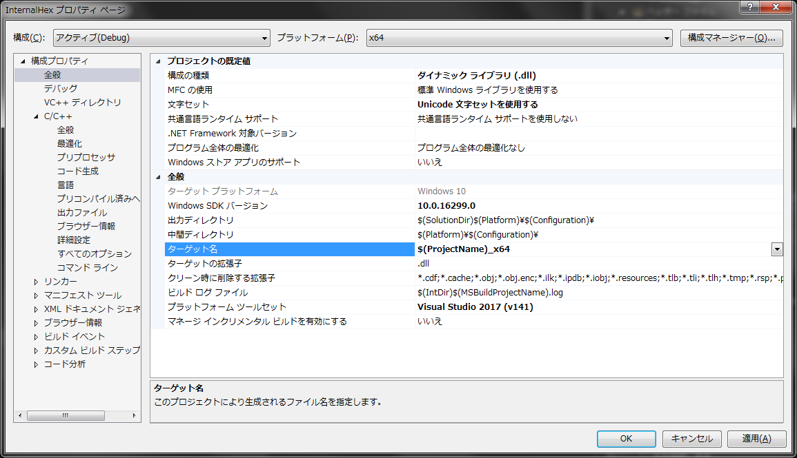
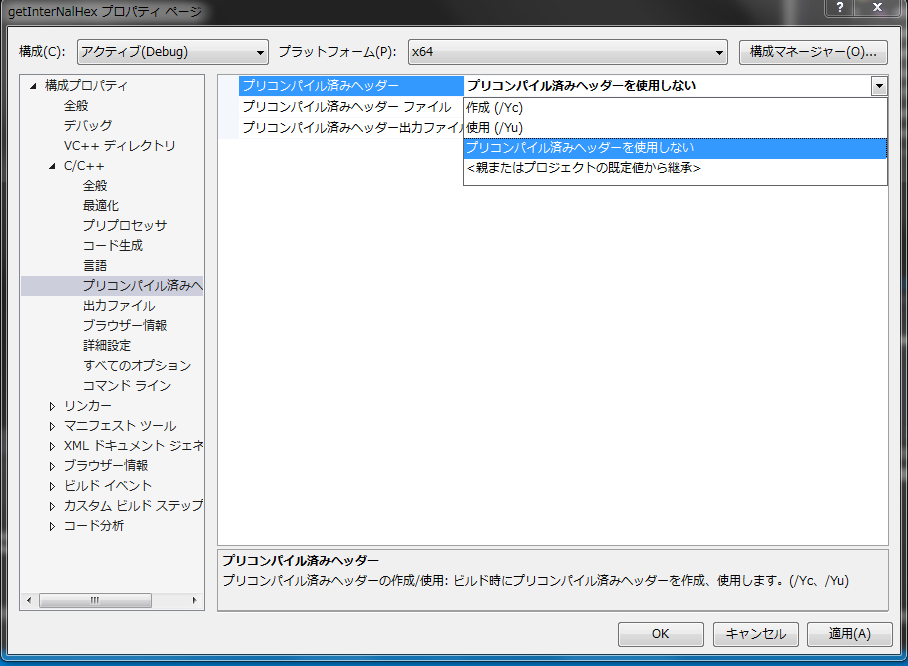
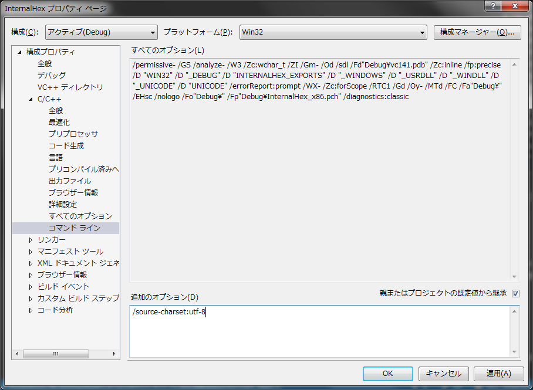
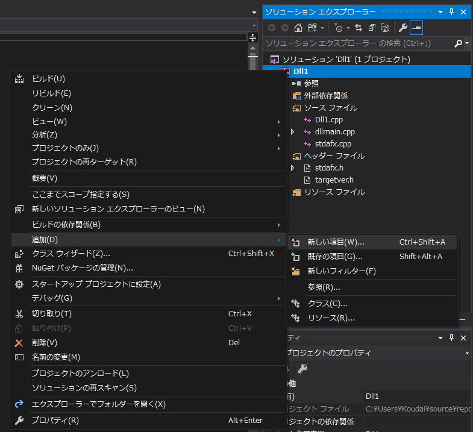
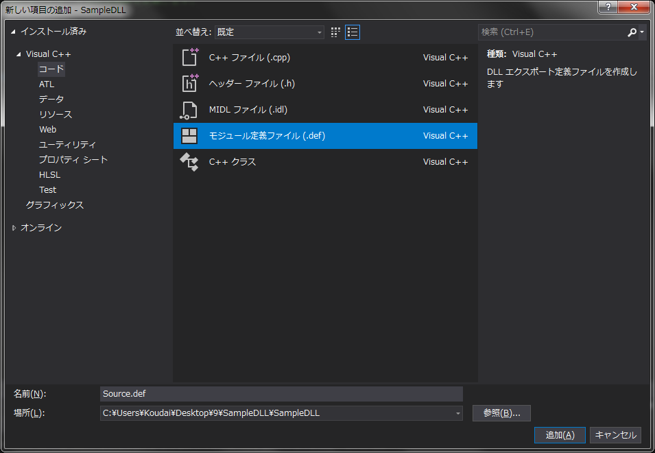
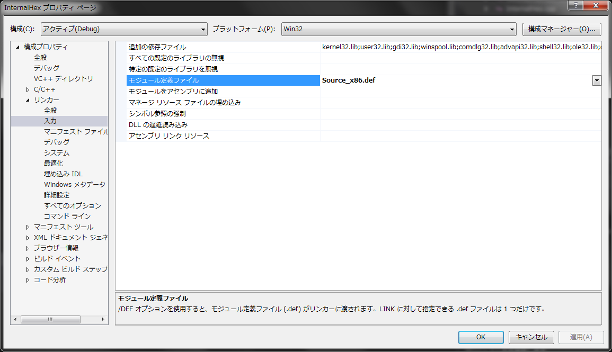
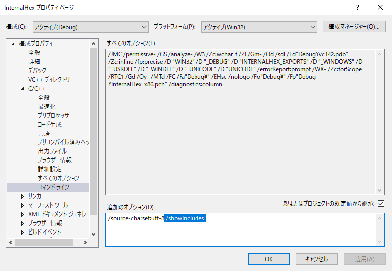

## 新規PJ作成時の名前を作成dll名にする

## ターゲット実行環境毎の設定



### 出力ファイル名変更



### VS未インストールマシンで動作可能にする

※ x86, x64用それぞれで同じ設定をする  


### #include "stdafx.h"は消せる

「stdafx.c」と「stdafx.h」をPJから削除する  



dllmain.cppのBOOL は「#include <Windows.h>」で対処  
x86, x64用それぞれで同じ設定をする  

### UTF-8(BOMなし)のソースコードをコンパイル可能にする



### モジュール定義ファイル

PJ 右クリック -> `新しい項目` を選択  


`モジュール定義ファイル` を選択  


プロパティに追加される  


# ソースコードがインクルードするファイルリストを得る

`プロジェクト` -> `プロパティ` を選択


`コマンドライン` -> `追加のオプション` の欄に、 以下のように `/showIncludes` を追加する。



すると、ビルド時に以下の様に、Visual Studio の出力ウィンドウにコンパイルした .c ファイルとそのファイルがインクルードした .h ファイルがリストアップされる。

```
1>------ ビルド開始: プロジェクト: InternalHex, 構成: Debug Win32 ------
1>CheckNumeralString.c
1>メモ: インクルード ファイル:  C:\Program Files (x86)\Windows Kits\10\Include\10.0.18362.0\ucrt\stdlib.h
1>メモ: インクルード ファイル:   C:\Program Files (x86)\Windows Kits\10\Include\10.0.18362.0\ucrt\corecrt.h
# -------------- omitting --------------
0\shared\stralign.h
1>メモ: インクルード ファイル:   C:\Program Files (x86)\Windows Kits\10\Include\10.0.18362.0\um\winsvc.h
1>メモ: インクルード ファイル:   C:\Program Files (x86)\Windows Kits\10\Include\10.0.18362.0\um\mcx.h
1>メモ: インクルード ファイル:   C:\Program Files (x86)\Windows Kits\10\Include\10.0.18362.0\um\imm.h
1>メモ: インクルード ファイル:    C:\Program Files (x86)\Windows Kits\10\Include\10.0.18362.0\um\ime_cmodes.h
1>コードを生成中...
1>   ライブラリ E:\test\DLL-InternalHex\Debug\InternalHex_x86.lib とオブジェクト E:\test\DLL-InternalHex\Debug\InternalHex_x86.exp を作成中
1>InternalHex.vcxproj -> E:\test\DLL-InternalHex\Debug\InternalHex_x86.dll
========== ビルド: 1 正常終了、0 失敗、0 更新不要、0 スキップ ==========
```
