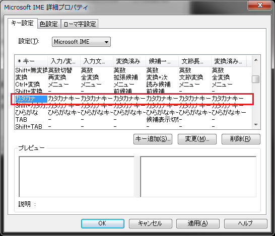
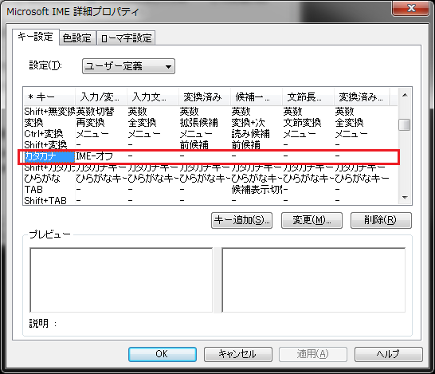
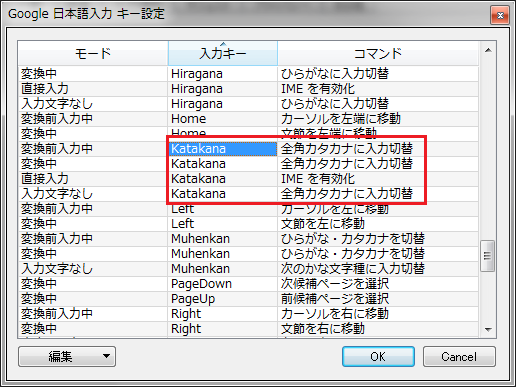
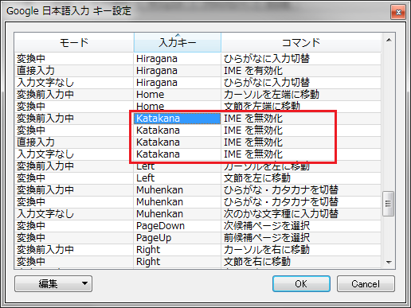

# Alt+CapsLock で IME:OFF にする

## MS-IME

プロパティ → `編集操作`タブ → `編集操作` → `キー設定` → `変更`ボタン

変更前  
  

変更後  
  

## Google日本語入力

プロパティ → `一般`タブ → `キー設定` → `キー設定の選択` → `編集`ボタン

編集前  
  

編集後  
  

# 【Windows10 1909】レジストリをいじってJIS配列とUS配列を共存させる

【Windows10 1909】レジストリをいじってJIS配列とUS配列を共存させる  
[https://qiita.com/n_bando/items/6679494e5a931425641f](https://qiita.com/n_bando/items/6679494e5a931425641f)  
↑システムのキーボードレイアウトを英語にして、内蔵キーボードをレジストリからJIS配列に変更する↑  
