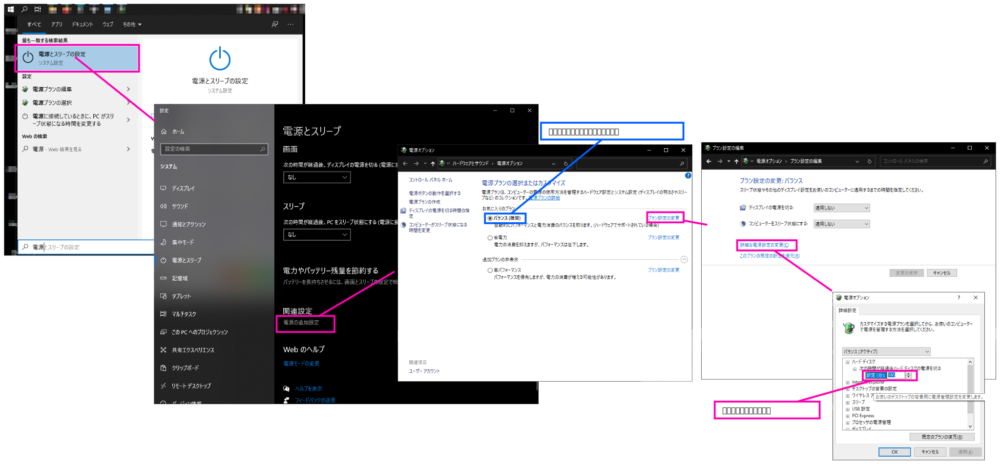
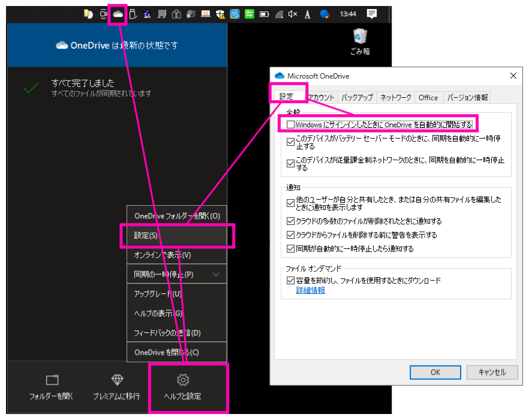

# ユーザーアカウント制御の設定

# HDD のスリープ時間延長




# 起動時の PIN 入力スキップ

1. レジストリの変更

ユーザーアカウント設定で、「ユーザーがこのコンピューターを使うには、ユーザー名とパスワードの入力が必要」のチェックボックスを表示させる為、以下レジストリ値の変更を行う。

`コンピューター\HKEY_LOCAL_MACHINE\SOFTWARE\Microsoft\Windows NT\CurrentVersion\PasswordLess\Device`  
┗ `DevicePasswordLessBuildVersion` の値を `2` -> `0` に変更する

再起動する。

2. ユーザーアカウント設定

`Windows` キー+ `R` を押して`netplwiz` と入力する。  
`ユーザーアカウント` 画面が表示されたら、`ユーザー` タブで `ユーザーがこのコンピューターを使うには、ユーザー名とパスワードの入力が必要` のチェックボックスのチェックを外す。  

3. サインインオプション

`設定` -> `アカウント` -> `サインインオプション` -> `Windows Hello 暗証番号 (PIN)` -> `削除` を選択する。  

# ログイン時のパスワード入力のスキップ

`設定` -> `アカウント` -> `サインインオプション` -> `サインインを求める` のプルダウンメニューから、 `常にオフ` を選択する。

# Windowsの設定

```
システム
┃┗ディスプレイ
┃  ┗拡大縮小とレイアウト
┃
┗マルチタスク
  ┗ウィンドウをスナップしたときに横に配置できるものを表示する

アカウント
┗サインイン オプション
  ┗Windows Hello 暗証番号(PIN)

個人用設定
┣タスクバー
┃ ┗小さいタスクバーボタンを使う
┗通知領域
  ┗タスクバーに表示するアイコンを選択します
    ┗常にすべてのアイコンを通知領域に表示する

# ファイルを指定して実行系

## マウス設定
main.cpl

## キーボード設定
control KEYBOARD

## サウンドコントロールパネル
mmsys.cpl

```
# Explorer のフォルダーオプション

```
全般
┗プライバシー

```

# OneDrive を自動起動させない

  
